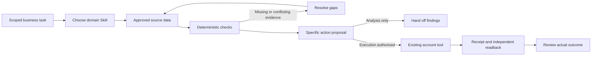

# Jingqiu · Operator Skills

把运营里需要判断的事情，写成能交给 Agent 执行、也能由人检查的任务。

这里按平台和业务分工，不用一套“增长流程”覆盖所有场景。首页展示作品，具体方法、研究和工具留在这个仓库。每个 Skill 说明该读什么、如何判断、交付什么、什么时候停止，以及完成后怎样核查。

## 从具体工作进入

|领域|方法与 Skill|重点|
|---|---|---|
|TikTok Shop|[tiktok-shop-operations](skills/tiktok-shop-operations/SKILL.md)|商品、达人匹配、样品、素材授权与成交；上下架 / Listing / 视频 / 广告|
|Amazon|[amazon-operations](skills/amazon-operations/SKILL.md)|可售报价、搜索词、点击与购买、SKU 利润、预算；四类商品操作|
|Shopify|[shopify-operations](skills/shopify-operations/SKILL.md)|DTC 网站设计归入 Shopify，包含商品、媒体、广告承接与购买路径|
|DTC 网站设计|[完整建站方法](skills/shopify-operations/references/storefront-design.md)|品牌目标 → 定位与替代方案 → 页面与交互 → Shopify 数据 → 桌面/移动验收|
|AliExpress / AE|[aliexpress-operations](skills/aliexpress-operations/SKILL.md)|卖家经营，不是采购代发；国家、属性、变体、配送模板与促销成本|
|美客多|[mercado-libre-operations](skills/mercado-libre-operations/SKILL.md)|目录竞争、库存履约、商品分组、Clips 购买问题与 Product Ads|
|Shopee|[shopee-operations](skills/shopee-operations/SKILL.md)|封面与变体承诺、已付订单转化、利润、当前广告模式|
|Web / App / SaaS 投放|[paid-acquisition](skills/paid-acquisition/SKILL.md)|搜索/社交/商店差异，创意与承接、归因对账、试用付费与回收|
|GEO|[geo-distribution](skills/geo-distribution/SKILL.md)|真实问题、答案证据、来源、授权账号分工、公开回查、引用与访问分开|
|北美用户增长|[north-america-growth](skills/north-america-growth/SKILL.md)|定位、广告/PR/社区、首次价值、重复使用、付费与团队职责|
|多模态制作|[multimodal-production](skills/multimodal-production/SKILL.md)|商品/人物参考、分镜、逐镜生成或实拍合成、声音、局部返修与整片验收|

每个 Skill 内有英文 Mermaid 流程图。方法之间可以转交明确任务，但不要默认把所有 Skill 都执行一遍。

## 能实际运行什么

一个零第三方依赖的 Python 3 本地工具：[scripts/review.py](scripts/review.py)。它读取 JSON，输出检查与候选动作，**不联网、不改账户、不发帖、不生成视频、不花钱**。

```bash
git clone https://github.com/meowdoone/jingqiu-operator-skills.git
cd jingqiu-operator-skills
python3 scripts/review.py examples.json --example paid
python3 scripts/review.py examples.json --example catalog
python3 scripts/review.py examples.json --example cohorts
python3 scripts/review.py examples.json --example distribution
python3 scripts/review.py examples.json --example shots
python3 -m unittest discover -s tests -v
```

真实任务传入已授权、脱敏且核实过的文件：`python3 scripts/review.py /absolute/path/to/input.json`。输入合同见 [examples.json](examples.json) 和相应函数；示例全部为合成数据，数值是演示参数，不是行业门槛。缺字段、错误类型与非法数据返回非零状态，不能把报错当作完成报告。

|模式|实际实现|不代表什么|
|---|---|---|
|`paid`|核账号、市场、币种、日期、收入/归因口径；匹配群体且成本完整后算广告后贡献；给观察、对账、停投/修改/放量**复核候选**，独立提示不可售/超支风险|没有预测 LTV、统计显著性、因果归因或竞价执行；不能把面板 GMV 当增量|
|`catalog`|精确 SKU 与远端 ID 的改动前后差异；检查变体/履约/权限证据；区分 update / publish / unpublish|没有上传或调用卖家 API；不支持删除；NO_CHANGE 只表示输入没有差异|
|`cohorts`|按固定观察期筛成熟批次；以 eligible 为共同分母算激活、留存、付费率|没有读取数据库或自动定义业务事件；不是激活后留存率；不同结果人数不能相加|
|`distribution`|检查账号授权声明、内容版本、提交、公开 URL、时区时间格式和回读声明；输出台账状态|不访问帖子证明声明，不查索引/引用，不把环境数量当独立用户|
|`shots`|整理审核者提供的带时码镜头检查，指出商品/身份/动作/声音/权利问题|不读取像素、不做视觉识别；READY_FOR_EDIT 不是成片通过|

贡献公式：同一组订单与花费下，`gross_revenue − refunds − cogs − fees − fulfillment − spend`。`contribution_roi = 广告后贡献 / spend`，不是平台 ROAS。费用不能重复扣；日期、退款范围、服务成本与时区先由数据提供者统一。已有支出超限的提示不依赖利润是否补齐，但数据无法确认时仍须人工核查。

## Agent 怎样使用

在仓库目录内给 Agent 指定对应 `skills/.../SKILL.md` 与本次输入。保留整个仓库，研究和工具通过相对路径引用；只复制一个 SKILL.md 会丢失配套资料。

1. 从本次业务目标与已有能力开始，不先造一层通用接口。
2. 用用户授权的导出、浏览器或现成连接器读取真实数据；字段不存在就记录缺口。
3. 模型整理问题、文案、分镜和候选解释；确定性代码负责计算和精确差异。
4. 输出具体对象、旧值、新值、证据、风险与完成条件。分析请求到此结束。
5. 只有任务允许真实执行、当前账号和权限明确时，才通过已有工具写入；部分成功逐项记录，未知提交先查询，不盲重试。
6. 重开目标页面/对象，核对实际值和状态。发布、被看见、被引用、被购买分别记录。



没有内置无人值守执行器或跨平台 API 框架。商品/广告/订单权限分开核实；生成引擎、剪辑器、CRM 和账号连接均复用当前环境已具备的能力，未连接的部分不能写成“已跑通”。

## 专家研究与来源

本轮实际读取 **24 条原始 YouTube 视频**的全部或明确片段字幕，另有作者文字材料。来源、已核日期、阅读范围、商业利益与局限在研究稿中标注；未核到的精确日期不猜。字幕研究不是逐帧观看，更没有审计视频中的账户收入。

- [TikTok Shop / Shopify](research/expert-tiktok-shopify-2026-09-08.md)：Michelle Barnum-Smith、Gracey Ryback、Shaun Brandt、Ezra Firestone。
- [Amazon / AliExpress](research/expert-amazon-aliexpress-2026-09-08.md)：Steven Pope、Mina Elias、Óscar Martín、Universidade Ecommerce。
- [美客多 / Shopee](research/expert-mercado-shopee-2026-09-08.md)：Bruno Gontijo、Lucas Schwichtemberg、Caue Oliveira、Vitor Miranda。
- [Web / App / SaaS 投放](research/expert-paid-growth-2026-09-08.md)：Aaron Young、Ben Heath、Thomas Petit。
- [GEO](research/expert-geo-2026-09-08.md)：Ethan Smith、Lily Ray。
- [北美用户增长](research/expert-north-america-growth-2026-09-08.md)：April Dunford、Elena Verna、Lauryn Isford。
- [多模态](research/expert-multimodal-2026-09-08.md)：Caleb Ward、Albert Bozesan、Robert Sladeczek。

采用的是可解释的经营判断，不照抄固定出价、预算增幅、关键词数或“算法秘诀”。官方资料只核当前权限和规则，不替代专家的方法研究。虚假包装、评论、独立背书或绕过限制的建议不采纳。

## 验证与尚未覆盖

本地代码包含 21 项测试；10 个 Skill 做格式校验，另用缺成本、主变体缺货、提交后 404 的场景独立检查。测试验证这些输入与判断行为，不证明商业有效性。

仍有明确缺口：AE 当代竞价与视频增量案例、Shopee 非巴西市场、美客多其他国家的完整运营、销售型 SaaS 独立实操证据、各平台真实账户连接。PR/社区分工与自动化技术方案是本次设计，不能冒充所有专家已经验证的做法。个人案例、外部专家观点、实现代码和待接入能力始终分开。

公开仓库只放方法、原始概括、来源链接、代码和合成示例。不包含完整字幕、私人聊天、客户信息、账号凭据、代理设置或个人形象源文件。请勿向公开 issues 或提交记录上传这些资料。
