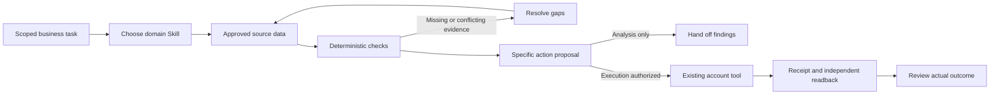

# Jingqiu · Operator Skills

把运营里需要判断的事情，写成能交给 Agent 执行、也能由人检查的任务。

这里按平台和业务分工，不用一套“增长流程”覆盖所有场景。首页展示作品，具体方法、流程和工具留在这个仓库。每个 Skill 说明该读什么、如何判断、交付什么、什么时候停止，以及完成后怎样核查。

## 从具体工作进入

|领域|方法与 Skill|重点|
|---|---|---|
|TikTok Shop|[tiktok-shop-operations](skills/tiktok-shop-operations/SKILL.md)|可证明的商品场景、可用授权素材成本、寄样分支、点击/购买/退款诊断、GMV Max 素材状态与下一版 brief|
|Amazon|[amazon-operations](skills/amazon-operations/SKILL.md) · [四源与经营判断](skills/amazon-operations/references/operating-method.md)|卖家精灵、SIF、Sorftime、西柚；选品成本与现金、Listing 购买疑问、视频证据、具体广告对象和贡献目标|
|Shopify|[shopify-operations](skills/shopify-operations/SKILL.md) · [DTC 网站设计](skills/shopify-operations/references/storefront-design.md)|从品牌定位、购买路径到页面交互与建站验收；包含商品、媒体和广告承接|
|AliExpress / AE|[aliexpress-operations](skills/aliexpress-operations/SKILL.md)|经营权责、国家×规格总报价与结算、漏斗诊断、活动亏损变体和贡献测算|
|美客多|[mercado-libre-operations](skills/mercado-libre-operations/SKILL.md)|国家与履约路线、目录竞争与贡献底线、AdGroup 影响范围、预算/排名损失、Full 库存与 Clips|
|Shopee|[shopee-operations](skills/shopee-operations/SKILL.md)|封面与变体承诺、已付订单转化、利润、当前广告模式|
|Web / App / SaaS 投放|[paid-acquisition](skills/paid-acquisition/SKILL.md)|搜索/社交/商店差异，创意与承接、归因对账、试用付费与回收|
|GEO|[geo-distribution](skills/geo-distribution/SKILL.md) · [号池、渠道与数据方法](skills/geo-distribution/references/operating-method.md)|18 个渠道的具体任务、号池分工、推荐证据缺口、固定条件复测；附离线样本统计|
|北美用户增长|[north-america-growth](skills/north-america-growth/SKILL.md)|定位、广告/PR/社区、首次价值、重复使用、付费与团队职责|
|多模态制作|[multimodal-production](skills/multimodal-production/SKILL.md) · [算法与实现](skills/multimodal-production/references/algorithm-method.md)|参考片 DNA、参考角色、生成控制、质量校准、真实像素候选检查、依赖返修与预算|

每个 Skill 内有英文 Mermaid 流程图。方法之间可以转交明确任务，但不要默认把所有 Skill 都执行一遍。

## 能实际运行什么

一个零第三方依赖的 Python 3 本地工具：[scripts/review.py](scripts/review.py)。它读取 JSON，输出检查与候选动作，**不联网、不改账户、不发帖、不生成视频、不花钱**。

多模态另有 [scripts/multimodal.py](scripts/multimodal.py)：`inspect` 用现有 FFmpeg 实际解码画面，定位场景变化和低变化候选；`plan` 仅需 Python，按声明的渲染依赖算返修范围与一次尝试预算。它不修改源视频、不调用模型，也不自动判断脸、SKU 或画面语义。

```bash
python3 scripts/multimodal.py inspect /absolute/path/video.mp4 --seconds 60
python3 scripts/multimodal.py plan /absolute/path/repair.json
```

输入、阈值、扫描范围和可运行返修 JSON 见 [算法与实现，第 6 节](skills/multimodal-production/references/algorithm-method.md#6-可以直接运行的两项实现)。切镜/低变化候选需要人工回看；依赖集合需要复查，不表示全部重渲染。媒体检查需 FFmpeg，但不要求安装 Python 模型库；不会自动安装工具。

```bash
git clone https://github.com/meowdoone/jingqiu-operator-skills.git
cd jingqiu-operator-skills
python3 scripts/review.py examples.json --example paid
python3 scripts/review.py examples.json --example promotion_mix
python3 scripts/review.py examples.json --example mercado_ads
python3 scripts/review.py examples.json --example catalog
python3 scripts/review.py examples.json --example cohorts
python3 scripts/review.py examples.json --example distribution
python3 scripts/review.py examples.json --example geo_sample
python3 scripts/review.py examples.json --example shots
python3 -m unittest discover -s tests -v
```

真实任务传入已授权、脱敏且核实过的文件：`python3 scripts/review.py /absolute/path/to/input.json`。输入合同见 [examples.json](examples.json) 和相应函数；示例全部为合成数据，数值是演示参数，不是行业门槛。缺字段、错误类型与非法数据返回非零状态，不能把报错当作完成报告。

|模式|实际实现|不代表什么|
|---|---|---|
|`paid`|核账号、市场、币种、日期、收入/归因口径；匹配群体且成本完整后算广告后贡献；给观察、对账、停投/修改/放量**复核候选**，独立提示不可售/超支风险|没有预测 LTV、统计显著性、因果归因或竞价执行；不能把面板 GMV 当增量|
|`promotion_mix`|相同市场、币种和等长周期内，按变体订单×单笔贡献减固定支出，对比两种情景；列亏损规格和固定销量结构下持平所需总单量|不解析平台结算或预测需求；单笔贡献先由已核结算减尚未扣除的成本得到，不重复扣费；整数规格、库存及阶梯成本另算|
|`mercado_ads`|核对站点、广告主、campaign 与 CATALOG/FAMILY/ITEM 成员映射；保留 campaign 级预算/排名损失，结合经营条件声明与经营者设定的阈值给出资料、目录、排名或有限预算复核结果|不独立核实账户、利润或库存；不分摊 campaign 损失到 SKU，不预测放量结果，不计算 Full 补货，也不改价或调整预算|
|`catalog`|精确 SKU 与远端 ID 的改动前后差异；检查变体/履约/权限证据；区分 update / publish / unpublish|没有上传或调用卖家 API；不支持删除；NO_CHANGE 只表示输入没有差异|
|`cohorts`|按固定观察期筛成熟批次；以 eligible 为共同分母算激活、留存、付费率|没有读取数据库或自动定义业务事件；不是激活后留存率；不同结果人数不能相加|
|`distribution`|检查账号授权声明、内容版本、提交、公开 URL、时区时间格式和回读声明；输出台账状态|不访问帖子证明声明，不查索引/引用，不把环境数量当独立用户|
|`geo_sample`|按预先固定的产品端、问题和条件核样本；合并重复导入，拒绝冲突；分列有效/失败/拒绝/未触发/未运行，输出提及、推荐、目标来源引用与确认检索子集的分子分母|统计输入标签，不读取原始答案核实；不自动采样、清洗实体或 URL、判断来源归属，不计算权重、排名或因果效果|
|`shots`|整理审核者提供的带时码镜头检查，指出商品/身份/动作/声音/权利问题|不读取像素、不做视觉识别；READY_FOR_EDIT 不是成片通过|

贡献公式：同一组订单与花费下，`gross_revenue − refunds − cogs − fees − fulfillment − spend`。`contribution_roi = 广告后贡献 / spend`，不是平台 ROAS。费用不能重复扣；日期、退款范围、服务成本与时区先由数据提供者统一。已有支出超限的提示不依赖利润是否补齐，但数据无法确认时仍须人工核查。

Amazon 的四源用于市场、竞品与查询研究，自有广告/订单/成本/库存用于检验经营结果。方法包含选品压力测试、父子体与统计窗口冲突、Listing 字段分配、搜索词与版位的不同改动层级，以及“ACOS 25% 仍低于贡献目标”的算例。当前公开实现复用 `paid` / `catalog`，未内置四家连接器、关键词打分器或竞价执行；不要把方法中建议的流程当作接口已接通。

## Agent 怎样使用

在仓库目录内给 Agent 指定对应 `skills/.../SKILL.md` 与本次输入。保留整个仓库，方法参考和工具通过相对路径引用；只复制一个 SKILL.md 会丢失配套资料。

1. 从本次业务目标与已有能力开始，不先造一层通用接口。
2. 用用户授权的导出、浏览器或现成连接器读取真实数据；字段不存在就记录缺口。
3. 模型整理问题、文案、分镜和候选解释；确定性代码负责计算和精确差异。
4. 输出具体对象、旧值、新值、证据、风险与完成条件。分析请求到此结束。
5. 只有任务允许真实执行、当前账号和权限明确时，才通过已有工具写入；部分成功逐项记录，未知提交先查询，不盲重试。
6. 重开目标页面/对象，核对实际值和状态。发布、被看见、被引用、被购买分别记录。



没有内置无人值守执行器或跨平台 API 框架。商品/广告/订单权限分开核实；生成引擎、剪辑器、CRM 和账号连接均复用当前环境已具备的能力，未连接的部分不能写成“已跑通”。

## 验证与尚未覆盖

本地代码包含 62 项测试；10 个 Skill 做格式校验，另用缺成本、主变体缺货、提交后 404 的场景独立检查。活动演示中，订单从 100 到 150，贡献却从 480 降至 200；计算会标出亏损规格，并给出固定结构下 325 单的持平情景，结果保留周期与固定支出条件。美客多检查覆盖对象映射冲突、缺指标、目录 listed 原因、排名/预算限制和经营条件；示例阈值由经营者设定，不是平台标准。测试与示例验证计算和分支，不证明商业有效性，也不是本人店铺业绩。

GEO 合成例计划 6 次，观察到 5 次，其中有效 4 次、技术失败 1 次、未运行 1 次；重复导入第一条只合并，不增加样本。提及为 3/4、推荐为 2/4、引用目标来源为 1/4；确认检索的有效子集单列 1/2。无引用的有效回答仍在分母，无有效样本时率为 `null`。目标产品 `DEMO-ARM-D27`、来源 `DEMO-compatibility-v1` 和日期均为演示，不是实际模型测试。方法中的改后对照是独立算例，不是当前脚本自动比较的结果。

出价、预算增幅、关键词数和测试窗口按当前业务确定；执行前核实所在国家、账户权限与平台规则。虚假包装、评论、独立背书或绕过限制的做法不在执行范围内。

仍需逐项目验证：AE 当前竞价与视频增量效果、Shopee 非巴西市场、美客多其他国家的完整运营、销售型 SaaS 链路，以及各平台真实账户连接。PR/社区分工与自动化流程是可执行方案，不代表已在所有业务中验证。方法、实现代码、待接入能力与真实经营结果分别记录。

公开仓库只放方法、Skill、流程、代码和合成示例。不包含私人聊天、客户信息、账号凭据、代理设置或个人形象源文件。请勿向公开 issues 或提交记录上传这些资料。
