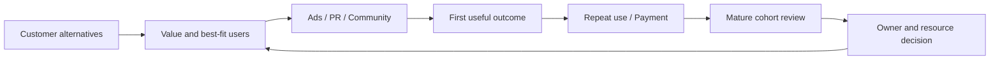

# 北美用户增长：定位、首次价值和持续使用

2026-09-08。研究支持方法设计，不证明个人历史业绩。视频由操盘者或顾问接受访谈，非平台官方教学；经验和个案数字不是普遍规律。

## 实际读取的材料

|专家 / 原始 YouTube 视频|已读范围|用途与边界|
|---|---|---|
|[Elena Verna — Product-led growth B2B companies succeed if they master this first step](https://www.youtube.com/watch?v=PzTTum1gkGs)，Lenny's Podcast|英文自动字幕全文 00:00–08:59，9:01 视频|留存与获客、自助与销售协作；没有审计她提到的公司内部结果。|
|[Lauryn Isford — Mastering onboarding](https://www.youtube.com/watch?v=dLku0AiGPVA)，Lenny's Podcast|英文自动字幕 **03:36–29:55**；全片 1:04:20，其余未作为已读|上手体验、团队激活指标、实验成本；Airtable 当时的案例不是所有 App 的统一标准。|
|[April Dunford — How to nail your product positioning](https://www.youtube.com/watch?v=hdjlCLb9Hl8)，Lenny's Podcast|英文字幕 **09:28–31:50**，其余未作为已读|定位与跨团队协作；自述研究/咨询观点，不是唯一可行方法。|

以上均从原视频页面导出字幕并读取，不是搜索摘要，也不是逐帧审计。自动字幕可能误识别数字和专有名词。页面显示三年前，未据此猜精确上传日期。

## 专家看重什么

- Elena 00:15–01:36：先建立激活与重复使用，再判断产品是否具备邀请/协作型获客条件。单人使用产品不必强行做病毒传播；市场营销和销售也是合理路径。03:22–04:20、06:45–08:49：销售与自助可以分阶段叠加，但不能因大客户合同停止经营原有活跃用户。[视频](https://www.youtube.com/watch?v=PzTTum1gkGs&t=15s)
- Lauryn 04:56–06:42：实验用于降低风险或回答确实需要量化的问题，并非所有修复都要 A/B。17:26–19:15：复杂产品可以用引导式创建帮助用户完成第一件事；这不是所有产品都应使用向导的结论。24:49–29:55：Airtable 当时用第四周多人协作观察激活，再拆到个人留存、作品深度和邀请行为。**不把第四周、5%–15%等经验硬编码为本项目标准。**[视频](https://www.youtube.com/watch?v=dLku0AiGPVA&t=1490s)
- April 09:48–12:12：定位不清可能同时影响点击、销售理解和使用后流失，先听真实客户如何理解产品。14:30–15:28：营销、销售、产品和客户团队共同对齐。23:26–28:29：先分析客户现在的替代办法，再把差异能力连到价值、最适合客户与市场分类；替代方案包括表格、人工和不购买。[视频](https://www.youtube.com/watch?v=hdjlCLb9Hl8&t=1406s)

## 本次推导的经营方法（不是专家原话）

### 1. 先找业务卡在哪里

读取目标市场、产品、阶段、获客费用、用户行为与经授权的反馈。分别判断：没人理解产品、到访未开始、开始却未完成、完成后不再回来、活跃但不付费。没有数据就列出最低取证任务，不让模型编造“用户画像”。

每个判断要有：用户/团队单位、观察窗口、数据来源、失败发生在哪一步、谁负责解决。消费者 App、团队 SaaS、销售辅助型 SaaS 不共用一套激活事件。

### 2. 广告、PR、社区分工，不是三个独立 KPI

|工作|具体输入与交付|结果与边界|
|---|---|---|
|广告|从定位材料确定人群和承诺，提交素材/入口/预算测试卡；详见 paid-acquisition Skill|看合格用户、首次价值、付费与回收；不只看注册成本。|
|PR|从真实产品能力、客户授权案例和问题研究中选题；给媒体事实包、采访提纲、声明核对表|覆盖与信任是中间结果，询盘/品牌搜索只是线索；不把刊发与收入直接画等号。此 PR 拆分是组织设计，不是已研究完整媒体投放方法。|
|社区|按使用阶段记录问题，安排上手支持、作品共创、活跃用户反馈和自然推荐|看具体任务完成及回来使用；人数和消息数单列。没有同意不群发，不伪造用户发言。此处不是特定社区平台增长秘诀。|
|产品/设计|收到带步骤、设备、截图/日志的阻塞，回传版本与修复范围|修复能被重现并复测；只改善点击不能代替完成目标任务。|

先对齐产品事实和阶段目标，再分别产出适合渠道的内容。不要把所有创意写成统一口号，也不要让模型冒充用户做推荐。

### 3. 事件与 cohort 要能解释分母

本仓库 `scripts/review.py` 的 `cohorts` 模式已经实现固定观察期筛选和比率计算。输入使用匿名汇总数据，不上传原始用户轨迹。每行必须有 cohort 结束日、单位、来源、eligible、activated、retained、paid；三项人数都以 eligible 为分母。未满观察期返回 WAIT_FOR_WINDOW，不标流失。

实际事件聚合仍需业务自己的事件字典：例如 `usable_export` 必须证明输出可用，`payment` 必须区分试用与实扣，`team_active` 不能当作个人活跃。脚本不会自动识别这些事实，也不把来源相关性变成增量归因。

### 4. 团队每周交接什么

周初由增长负责人确定一个瓶颈与投入边界；数据同事交付时间窗一致的结果表；内容/PR/社区分别交付可检查的任务；产品/技术修复具体使用阻塞。复盘保留“观察到什么、变了什么、还有什么解释”，负责人决定下一轮投入。不用一个 Agent 名词替代责任人。

## 验证与仍需接入

可本地运行：成熟 cohort、费用口径和候选判断。须另行连接：产品事件、CRM、广告、客服/社区反馈及真实账户权限。没有做任何媒体联系、用户触达、账户预算修改。三位专家样本不足以覆盖整个北美市场；具体国家、品类、用户与商业阶段仍需研究。
