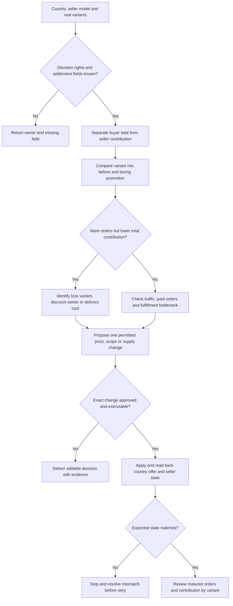

# AliExpress 卖家运营

从本次经营问题进入：哪个国家或规格该继续卖、曝光为何没有变成订单、活动该进还是退、要改哪个商品字段。用户只要求改商品或制作素材时，直接走对应分支，不额外展开全店分析。

## 1. 经营模式决定能采取的动作

锁定账号、国家、经营/履约模式、商品 ID 与真实 SKU、目标和观察期。不要把“自运营/半托管/全托管”只填成标签；从当前后台、适用协议与负责人确认，给本次涉及的字段标 `可直接改 / 可申请或报价 / 仅观察 / 未知`。

| 本次要改变什么 | 先确认的权责 | 对应动作 |
| --- | --- | --- |
| 买家价格或供货报价 | 谁定零售价、谁接受报价、有效期与结算基准 | 可改价才提改价；仅能报价则提交报价和供货成本依据，不能承诺买家端价格随之改变 |
| 活动、优惠及推广预算 | 谁报名、谁承担每笔优惠、谁控制预算、退出生效条件 | 分别输出报名、补贴承担或预算候选；平台控制的动作交相应负责人确认 |
| 库存和配送承诺 | 备货、运输、仓储和售后分别由谁负责 | 商品缺货、供货不足、线路不可达分开处理；不能用改标题解决履约问题 |
| 属性、变体、图片和视频 | 卖家可编辑字段、平台管理字段及审核要求 | 给字段级差异；平台控制的字段交修正申请，不生成不存在的写入命令 |

没有证据的权限标未知，只暂停依赖它的动作。交付时必须能指出：**当前问题由谁处理、能改什么、不能靠什么解决。** 不从一个国家的本地店经验推定其他跨境或托管账号的权限。

## 2. 国家 × 规格：买家到手价与卖家贡献分开算

需要算账时，最小分组为 `账号 × 国家 × 经营/履约模式 × product_id × sku × 订单批次 × 币种`，必要时再分活动和配送线路。用订单明细、结算/费用单、退款与成本表连接 `order_id + line_id + sku`；商品别名先映射，不按标题模糊合并。报表只有商品级时停在商品级，不能造出变体明细。

**先建立两张相连的表：**

1. **买家报价表**：真实变体、目标国家/配送地址条件、商品价、运费、可用优惠、买家承担的税费、最终应付、承诺时效、观察时间。平台券是否实际可用以结账条件为准，不能把所有优惠都假设能叠加；未显示税费标未知。比较同用途、同规格、同交付条件的报价，不把配件价格与完整商品相比。
2. **卖家结算桥接表**：商品/运费等卖家应收、卖家承担优惠、平台实际补贴、退款、佣金/活动费、物流/仓储/售后扣项、到账及冻结/待结算金额。每个科目标明承担方、正负号、是否已包含在净到账里，再接货本与外部成本。

若采用**已结算净额**口径：

```text
订单批次贡献 = 对应该批次的净结算收入
             − 尚未在结算中扣除的货本、履约、售后及其他成本
             − 对应推广费用
```

净结算已经扣过的佣金、退款或优惠不再扣第二次。退回可再售商品的成本恢复必须有依据；已退款不等于货本自动归零。冻结或未到账先列现金状态，不直接认作经营损失；未成熟退款单列，实绩和估算情景不能混为一个利润。

**判断 → 动作：**

- 某国家同规格贡献转负，先分是买家优惠、结算扣项、线路成本还是退款造成；只对对应国家/线路提出改报价、改配送、退出活动或暂停供给候选，动作受第 1 节权责约束。
- 到手价较高但卖家贡献已很薄，不能直接建议再降价；查交付组合、包装/运输成本和选品适配。包邮只是买家报价方式，运输成本仍要有人承担。
- 缺结算映射、优惠承担方或退款数据时，输出明确缺口和可计算范围，不把未知补零。

**复测：**同国家、SKU、线路与收入口径比较，记录旧值/新值、生效时间、销量结构、每单贡献和总贡献；使用与本业务结算/退款周期相符的观察期，不套通用天数。

## 3. 曝光 → 点击 → 支付 → 履约：定位首个有证据的断点

先取当前账号实际可得的流量、商品和订单报表，标清来源是搜索、活动、广告还是其他入口。站外关键词只是需求线索，不代替 AE 站内数据。指标分母要相容：点击/曝光用同一报告范围；支付转化使用报表明确支持的访客或点击口径，不能混用人数、次数和订单数。

| 症状 | 读取与判断 | 先做什么 | 怎么复测 |
| --- | --- | --- | --- |
| 目标国家没有或很少曝光 | 先核该地区可买、库存和审核，再看类目/属性完整性及商品与可得搜索词的相关性；区分未展示与报表缺数据 | 可售问题先交履约/商品负责人；相关性有证据不足时才改对应类目属性或标题词，不追无关热词 | 同国家、来源与可比时段看展示覆盖；没有词级报表则不声称关键词排名被修复 |
| 有曝光、点击弱 | 看买家实际看到的首图、标题、价格范围及配送信息；核低价规格是否与画面中的商品一致 | 选择一个有证据的问题改首图、准确标题或报价展示；其他主要变量尽量保持 | 保留展示版本与来源，比较相同口径点击率，同时看支付质量；点击上升不自动算经营改善 |
| 有点击、支付弱 | 按可得国家/商品范围查最终总价、可购规格、库存、配送、商品疑问与真实售后反馈 | 报价矛盾先修；交付不适配先处理；确认是规格/用途不清再改属性、详情或演示 | 复查结账可购性，再观察支付及贡献；无用户行为细节时把原因写成待验证假设 |
| 订单增长，取消/退款或履约异常增加 | 连订单批次到取消/退款原因、备货/运输节点及 SKU；未成熟订单与已完成订单分开 | 定位错规格、库存、承诺或线路问题；必要时提出停止对应供给/活动，不继续靠拉流量掩盖 | 看同批次后续履约、售后与实际贡献，不能拿当日付款单当最终成交 |

每次只给能改变当前决策的主要假设：`证据 → 排除项 → 候选动作 → 负责人 → 复测口径`。出现季节、入口、价格和流量结构同时变化时，不把前后差异全归因于一项 Listing 改动。

### 需要改 Listing 或视频时

- 把 `目标国家的购买问题 → 商品证据 → 属性/真实变体 → 标题/页面位置` 连起来。缺失的材质、单位、包装或适用范围先补事实；翻译不能补出不存在的规格。
- 将正确事实放入当前类目允许的结构化字段；关键词表记录来源、日期和购买意图。输出具体旧值/新值及依据，保留无关正确内容。
- 演示素材服务一个已识别的问题，例如配件是否包含、尺寸如何判断、实际如何操作。brief 指定真实 SKU、必须出现的细节、步骤、当地字幕和需要补拍的证据；商品页演示与推广片按用途分别准备。
- 生成式工具可辅助分镜、字幕和获准素材处理；实物细节、操作和功能声明逐项核对。尚未生成的视频标为 brief，不把概念画面写成实测。现有证据不足时不声称某类 AE 视频必然提高转化。

## 4. 活动：先看规格结构，再看增单

读取活动资格、起止时间、适用国家/规格、优惠叠加条件和承担方、当前真实收费、库存/产能及退出条件。点击付费、成交付佣与店铺/平台活动分别列账，只有当前账户确实可用的入口才进入方案。

**参加前：**用第 2 节口径算每个规格的活动后单位贡献，列可成立的优惠组合和最不利情景。额外活动/推广固定成本单列。低价规格如果贡献为负，先查它是否真实完整售卖、是否被活动单独推动；不能用误导低价或不对应的配件制造入口价。

**参加后：**同时比较订单量、规格占比、每单贡献和总贡献。正贡献规格的增长可能掩盖另一规格的亏损；同样，整体订单增长也可能来自负贡献规格占比上升。先提出缩小活动范围、调整报价/优惠或退出的候选，而不是默认停整条商品；是否支持单独操作以当前权限为准。

### 演示算式：不是店铺实绩，也不是平台规则

假设同一国家、同一长度且可比的观察期，金额统一为演示 USD，不来自真实美元订单；下列单位贡献已计货本、履约、已确认退款损失和卖家优惠/佣金，尚未扣单列的额外活动费。

| 真实规格 | 常态订单 × 单位贡献 | 活动订单 × 单位贡献 |
| --- | --- | --- |
| A | 70 × 6 = 420 | 70 × 4 = 280 |
| B | 30 × 2 = 60 | 80 × (−0.5) = −40 |
| 额外活动费 | 0 | 40 |
| 合计 | 100 单，480 USD | 150 单，200 USD |

订单增长 50%，贡献却少 280 USD。先核 B 的优惠承担与成本是否算对，再评估限制该规格参加、调整供货/售价或退出活动；不能直接把 150 单判为应该放量。即便移出 B，也不能假定它的流量和订单会自动转到 A。

对一个单位贡献保持为正的规格，若其他条件确实可比，匹配常态贡献所需活动订单量可计算为 `向上取整((常态订单×常态单位贡献 + 活动额外费 − 常态额外费) / 活动单位贡献)`。活动单位贡献不大于零时不使用该式推“多卖就能补回来”。多个规格分别算再看组合；此式只是保本情景，不预测订单，不证明活动增量。长期引流价值需要另有可追踪的后续贡献证据和明确损失预算。

**复测交付：**参与/调整/退出候选逐项给出国家、SKU、可控字段、当前及活动报价、承担成本、库存约束、负责人和重新判断条件；费用未知的规格先待核，不与已算清的混成一个结论。

## 5. Agent 做哪一段，现有代码做到哪一步

Agent 优先处理当前已有的授权导出或连接器：保留原始字段和时间戳，整理 SKU/国家映射、费用科目及来源，再输出 `报价与结算对照、变体贡献表、断点证据、具体变更候选`。语言模型负责商品事实/问题归类和文案草稿；算账用可复算公式或代码，未知科目请负责人确认。

本文件给出操作方法，不表示这些 AE 报表已经全部自动接通。现有 [审核脚本](../../scripts/review.py) 与 [输入示例](../../examples.json) 包括以下局部离线能力：

- `catalog`：对精确 SKU 的 `before/desired` 生成差异；`source_refs` 与变体/履约/权限检查标志由真实核验提供，下架另核未完成订单。它不会理解 AE 托管权责、检查真实后台或执行发布。
- `paid`：核同账号、国家、币种、订单范围和窗口的收入/退款/货本/费用/履约/推广支出，输出贡献与审核候选。原始平台账单需要先按第 2 节归一；脚本不会自动识别优惠承担方、结算科目或变体归属。
- `promotion_mix`：以 `basis=scenario`、同国家/币种/等长周期、独立固定费用及逐 SKU 的前后订单数/单位贡献，复算第 4 节的规格组合。准确结构见示例的 `before_extra_fee/after_extra_fee`、`before_orders/after_orders`、`before_unit_contribution/after_unit_contribution`。输出总贡献变化、亏损规格，以及固定活动规格比例下匹配常态贡献的连续总订单数。输入的结算归一与成本真实性仍需先核对，不是脚本自动完成。

在仓库根目录先核示例结构，再运行实际输入：

```sh
python3 scripts/review.py examples.json --example catalog
python3 scripts/review.py examples.json --example paid
python3 scripts/review.py examples.json --example promotion_mix
# Replace with the reviewed local input for the selected task:
python3 scripts/review.py ae-reviewed-input.json
```

映射 `gross_revenue/refunds/cogs/fees/fulfillment/spend` 时附科目桥接：若起点为净结算，已在其中扣除的项不得再次输入为成本；确认为已包含才能填零，不知道则标 `costs_complete=false`。`scope` 必须与实际对账口径一致，不把净结算的 ROAS 候选冒充广告后台的销售 ROAS。无付费广告的活动不能捏造 `spend` 让 `paid` 作放量判断，可用已核单位贡献进入 `promotion_mix` 复算情景，不能把其结果写成实测增量。

本演示的 `promotion_mix` 返回常态 480、活动 200、变化 −280、亏损规格 `DEMO-B`，固定活动结构的持平订单数为 325。这假设规格比例、单位贡献和固定费用保持不变；实际整数规格订单、库存、产能和费用阶梯须重新核算。加权单位贡献非正、活动无订单或常态贡献非正时，当前函数不提供这个持平订单数；空结果不是零单即可实现正收益。

审核阈值由本业务的成熟订单、可承受损失和贡献要求确定。输出是复核候选，不是统计显著性、因果增量或自动改价/出价。



## 6. 执行、失败与完成

仅在用户要求实施的范围内操作；诊断止于建议。执行前读取当前字段，保存最小差异和依据；运费模板变更核实际绑定商品，测试范围不能影响整店。主动暂停、缺货、审核失败分开处理，不能靠反复删品重建解决。

获批且当前工具可用时提交，随后回读同一账号/商品/国家的后台状态及买家规格、价格、可购性和配送承诺。托管报价提交、平台接受、买家端生效分别报告。批次部分成功只重查失败项；返回不确定先查回执与现有状态，避免重复写入。

- 权责、费用或真实规格不清：保留可做的分析，暂停相关变更与强制利润结论。
- 数据粒度不支持诊断：交可判断范围和待补字段，不推造词级/变体级数据。
- 写入冲突、账户校验或权限不足：说明实际状态，不换身份绕过或覆盖新改动。
- 素材与交付不符：仅返修失败的事实、镜头或字幕，不把整批生成算作验收通过。

最终给出本次经营结论、依据、国家与 SKU、可编辑提案/已核结果、尚未完成的动作与复测条件。接口、现行费用和经营结果以当前账号证据为准；本 Skill 不包含刷单、伪评或重复刊登策略。
