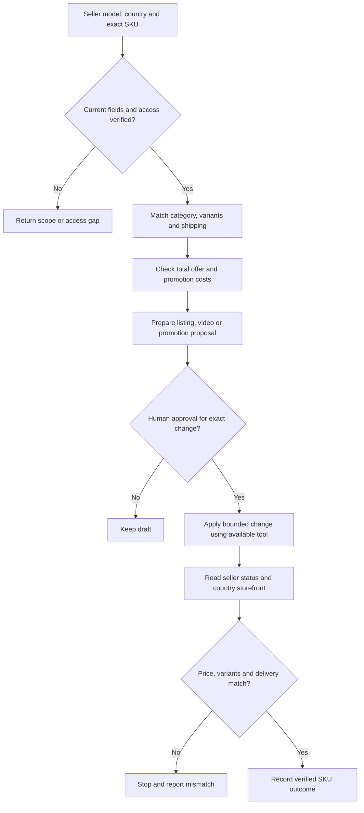

# AliExpress 卖家运营

先回答这次是商品无法卖、详情没讲清、需要视频，还是推广回收不好。只处理用户指定工作，不能把旧课程操作或西班牙/巴西本地模式套成所有 AE 账号的现行规则。

## 确认范围和证据

需要：卖家账号、目标国家、经营/履约模式、商品 ID 与准确 SKU、目标动作。遇到自运营/半托管/全托管不明，先读后台或请用户补充；没有资料可做草案，不能承诺当前广告入口或 API 可用。

| 请求 | 资料 / 可用工具 | 连接字段 |
| --- | --- | --- |
| 上下架 | 获授权 CSP/Seller Center，商品导出，当前商品 schema 或可用连接器 | account、market、product_id、sku、category、attributes、variants、status、stock、price、shipping_template、observed_at |
| Listing | 商品说明和证明、类目属性、当地语言搜索需求、来源明确的问答 | fact_id/source_ref、market、intent、variant、unit；站外需求与 AE 站内数据分列 |
| 视频 | 真实图/实拍、规格、授权、发布位置、当地字幕 | sku、fact_id、shot、rights、required_evidence |
| 推广 | 当前可参加活动及收费规则、推广/订单/退款导出、成本 | sku、campaign/activity、time、currency、discount、commission、ad_spend、refund、shipping_cost |

列表是规范化输入，不假定每种模式有相同字段或账号权限。账号/国家/币种/变体冲突先返回缺口；缺少真实重量不估成已核重量。

## 上下架：运费模板也是商品的一部分

1. 锁定选择的商品与 SKU，读取当前库存、价格、审核原因、配送模板和未完成订单。
2. 区分主动暂停、缺货和平台审核；先解决对应问题，不反复删品重建。上架前检查地区可送、备货与运输时间分别成立。
3. 给出 before→desired 差异。运费或活动测试使用已批准范围，不能悄悄绑定整店真实商品。
4. 获批执行后读取后台状态和目标国家的买家可见规格、价格、运费及承诺。模拟器只是检查工具，不等同更改实际配送区域。

完成以逐 SKU 可核结果为准，不以批次 HTTP 成功为准。提交不确定时先查现有商品与回执，避免重复创建。

## Listing：需求表转成商品字段

- 国家×类目×购买意图先明确；同名搜索词不一定指向同一商品。关键词表保留来源、日期、意图、同义表达和问题。
- 先填类目属性、品牌依据、真实变体、单位、包装重量与配送归属，再写标题、卖点和详情。
- 自动翻译后复核材质、尺寸、用途和交付内容；无证据的规格留下待核项。
- 看见曝光不足先查可售/类目/属性/相关性；点击有但购买弱先核总报价、配送、信任和疑问。一次观测不证明标题导致增长。

输出：字段缺口、文案与属性差异、事实对应表、地区/变体检查。不存在的评价或使用感受不生成。

## 视频：从购买疑问出发

从目标 SKU 和问题库输出用途演示、关键细节、使用步骤、字幕及必须保真的部位。商品页视频和推广片按目标位置分别准备。

现有实操研究支持“真实商品与场景帮助理解”，不证明固定 AE 视频回报算法。当前账号的上传位置、审核、比例及 AI 标注要求需要现场核验；不称已接视频 API。镜头中的包装、配件、功能与声明逐项核真实交付。

## 推广：先区分收费方式

| 当前入口 | 判断 | 输出 |
| --- | --- | --- |
| 店铺折扣 / 优惠券 / 平台活动 | 商品原价、有效期、适用范围、叠加与承担方 | 实际买家价格及最坏叠加成本，参与/退出候选 |
| 按成交付佣的推广 | 佣金层级、归属规则、退款处理、物流成本 | 按 SKU 的成交后贡献与佣金候选，不叫 CPC 优化 |
| 账户实际可用的付费广告 | 先核产品名称、报告粒度、目标与权限 | 搜索/素材/商品问题诊断；待批准预算或出价候选 |

所有推广看退款、履约和费用后的回收。活动资格或费用不全时不推荐放量。历史佣金比例和活动名称不写成默认参数；不能用刷单、伪评或重复刊登来解决增长问题。

## 本仓库可执行部分

在仓库根目录先读 examples.json 对照数据，再运行：

```sh
python3 scripts/review.py examples.json --example catalog
python3 scripts/review.py examples.json --example paid
```

`catalog` 生成精确 SKU 差异，输入 source_refs 和已核的变体/履约/权限标志；下架另核 open_orders_checked。它不执行上下架、删除或模拟真实账户。

`paid` 是同群体同窗口的完整成本核算。促销折扣、佣金、运费不要重复扣：先标收入是折扣前还是实收，再映射 gross_revenue/refunds/cogs/fees/fulfillment/spend。缺费用标 costs_complete=false，不把缺项填零。ROI 候选不证明增量或利润保证。

## 交付与中止

每个 SKU 返回：当前证据、问题、拟改值、预计费用影响、批准状态、执行凭据与读取结果。权限受限、目标/国家不符、返回不明确则停止该写入并说明下一步；允许继续不涉及该缺口的只读分析。



## 方法来源和边界

需要来源依据时读 [实操者研究 AE 部分](../../research/expert-amazon-aliexpress-2026-09-08.md)：Óscar Martín 的关键词、商品发布、物流误配案例，及 Universidade Ecommerce 的巴西本地库存/运费案例。旧课只保留业务判断；中国跨境托管模式、当前竞价及视频增量效果没有被这些案例完整验证。

