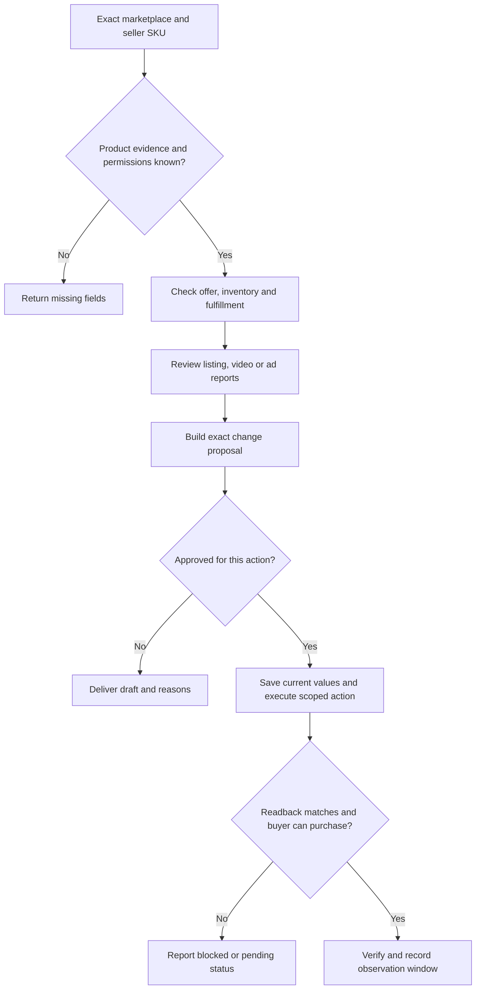

# Amazon 商品与广告运营

目标是让指定商品可买、讲清楚、获得合适流量，并看清广告后的贡献。按用户本次请求选择下方工作，不默认执行四项，也不扩展为选品或开店。

## 先锁定任务

读取或确认：`marketplace / seller account / seller SKU / ASIN / requested action`。区分自有品牌、新建商品、现有 ASIN 上的 offer；共享详情页不是卖家可随意删除的私有商品记录。

缺少准确站点或 SKU 时，先做只读解析并让用户确认候选。涉及外部写入，确认本次操作范围与可用权限；“帮我分析”只到建议。来源为只读导出也能工作，不因没有 API 而虚构接入。

## 数据和工具怎么接

| 工作 | 读取资料 / 常见工具 | 规范化字段与注意 |
| --- | --- | --- |
| 可售 | Seller Central 商品/库存及问题列表，或已授权 SP-API Listings/Reports | market、sku、asin、status/issues、quantity、price、fulfillment、observed_at。返回 accepted 不是前台可买。 |
| Listing | 当前类目 Product Type 要求、商品证明、详情内容、评价与问答样本、关键词来源 | 每个规格/收益声明记录 source_ref；seller SKU→变体→ASIN 映射先核，不用模型补规格。 |
| 视频 | 实物/商品图、使用说明、交付包装、权利、目标发布位置 | shot→fact→proof→SKU；视频资格、上传位置和真实展示分别检查。 |
| 广告 | 获授权 Ads 报表 / 导出，Business Reports、订单/退款/费用与成本 | account、campaign/ad group、search term/target、placement、sku、date、currency、attribution_window；广告归因销售与全部销售分开。 |

字段命名依当前报表映射，以上不是承诺每份接口都有这些字段。只拉请求所需最小范围；被截断、跨币种或缺成本时列缺失，不填零。

## 上下架：先找到不可售原因

- 库存为零、配送不可达、价格异常、审核问题分别列出。停售自己的 offer 与移除共享 ASIN 不能混淆。
- 上架提案先核真实商品、类目属性、变体、定价、库存与履约；下架提案另核未履约订单和活动影响。
- 生成准确 SKU 的 before→desired 差异；无变化结束，不反复提交。
- 执行获批时保存原值与提交凭据；重新读取审核/可售状态，再检查同站点买家页面价格、变体和配送。仍在审核记 SUBMITTED，不报上线成功。

## Listing：先判断哪里妨碍购买

1. 用真实商品与来源明确的评价/问答整理购买疑问，标注样本时间和局限；竞品描述不能冒充自有事实。
2. 搜索意图相关而点击弱：检查主图、价格、商品表达；点击到达但转化弱：检查规格、配送、证明、价格与疑问。没有足够观测时只列假设。
3. 按重要购买信息生成标题、要点、属性及图片说明候选，保持类目适配和可读性，不堆无关词。
4. 输出差异、声明证据表及待核字段；实验记录页面/价格/广告版本，避免把多项同期变化归因为文案。

## 视频：商品证据进入分镜

输入目标 SKU、真实图/包装、要回答的问题和发布位置。输出镜头顺序、演示动作、字幕、所需证明及必须保真的尺寸/接口/颜色/配件。事实核验通过后才制作；发布授权独立。

优先让镜头回答使用和选择问题。任何徽章、测试结论、评价、包装都必须真实可核。渲染素材不能展示买家不会收到的内容。成片通过不等于平台审核或前台展示通过。

## 广告：先分问题，再提出动作

| 观察 | 先核 | 候选动作 |
| --- | --- | --- |
| 有花费但商品不可买 | 库存、价格、配送、审核状态 | 停止复核及修复商品，不用调词替代可售修复 |
| 少数词消耗多数预算 | 搜索词相关性、目标 SKU、匹配及错杀否词 | 复核否词/预算隔离；保留有效旧计划，小范围比较 |
| CTR 弱 / CVR 弱 | 先分别查点击前承诺与点击后详情，排除追踪/报价变化 | 指向创意、Listing 或流量问题的实验，不只改 bid |
| ACOS 降但利润也降 | 全部净销售、COGS、费用、履约、广告、库存 | 比较利润金额与额外投入回收，不机械追最低 ACOS |
| 小样本或近期数据 | 订单密度、转化延迟、窗口、退款 | HOLD；预算/亏损硬上限可单独触发停止复核 |

Sponsored Products 的搜索词/商品定向与 placement 分开分析；其他广告类型按资格和任务独立判断。固定词数、Broad 必然更便宜、若干转化即可扩量不是通用规则。

## 已实现的离线检查

在本仓库根目录运行：

```sh
python3 scripts/review.py examples.json --example catalog
python3 scripts/review.py examples.json --example paid
```

实际任务把已核资料映射为独立 JSON，使用同一脚本读取。示例不是客户数据。脚本 `catalog` 接收 platform/market/account/intent 和 items；item 为 sku/remote_id/before/desired/source_refs 及 variant_mapping_checked、fulfillment_checked、account_permission_checked；unpublish 另需 open_orders_checked。标志依据证据填写，不能为了通过而填 true。

`paid` 需要匹配群体/日期/币种/归因窗与完整成本，算广告后贡献，只输出复核候选。它不预测 LTV、不做显著性或因果检验、不调用账户 API。若要复用脚本，先读当前 examples.json 字段；数据不足结束于缺口清单。

## 交付与失败处理

交付每个目标的证据、问题、建议、原值/拟改值、预算或库存影响、观察期、回退资料和状态。状态区分 BLOCKED / DRAFT / APPROVAL_REQUIRED / SUBMITTED / VERIFIED。

账号不明、权限失败、目标不匹配、状态不确定时停止该目标的写入。提交超时先查凭据与当前状态，不重建广告或重复商品。执行未获批不进一步索取或改造账户。



## 方法依据

需要判断来源或具体案例时读 [Amazon 与 AE 实操者研究](../../research/expert-amazon-aliexpress-2026-09-08.md)的 Amazon 部分。Steven Pope 侧重预算结构和搜索词，Mina Elias 侧重商品漏斗与利润；研究保留阅读时间点及明确剔除的虚假素材建议。规则执行以当前账户及官方要求为准。

