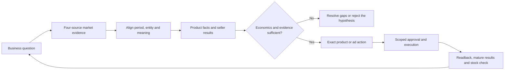

# Amazon：从选品到订单贡献

这套方法使用卖家精灵、SIF、Sorftime、西柚研究市场与竞品，用自有广告、商品、订单、成本和库存检验决策。四源用于不同问题，不合成一个“选品分数”，也不把竞品曝光当成它的订单。

## 按本次任务进入

先确定站点、产品/用途及要做的决定。自有商品再锁定 seller account、seller SKU、父/子 ASIN；纯市场选品不要求不存在的卖家 SKU。只做用户指定的工作，不默认执行整条链路。

深入判断时读 [operating-method.md](references/operating-method.md) 的对应部分：

|任务|阅读部分|交付物|
|---|---|---|
|调研或核对四源|§1 数据源与口径|同口径对照、矛盾与缺口；保留来源原值|
|选品|§2 进入一个市场的条件|竞品样本、差异证据、成本与压力测试、试销或否决理由|
|上下架|§3 商品与报价|精确 SKU 的 before / desired、影响与可售回读|
|Listing|§4 词与购买疑问|意图词表、字段分配、事实证明、一个明确的改版/实验提案|
|视频|§5 证据镜头|疑问→镜头→可证明事实→发布位置，商品一致性要求|
|广告|§6 广告对象与贡献|具体 query/target/campaign 的动作、计算、库存约束与观察期|
|交给 Agent|§7 实现与交接|读取与规范化、确定性检查、动作清单、当前能力边界|

## 四个数据源不能互换

- **卖家精灵**：需求词、搜索趋势、相关竞品与销量估计。父体预测和子体前台数据分开，不能把共享父体值逐子体相加。
- **SIF**：反查流量词、自然/广告曝光位置及竞品变化。流量占比是估算曝光构成，不是点击、订单或后台预算；未观测到不等于没有。
- **Sorftime**：类目竞争、季节、价格与新老款结构。具体模块的样本、父子体和时间窗以当前导出说明为准，不用一个默认“月销”覆盖全部字段。
- **西柚洞察（原西柚找词）**：细分市场、变体、词与位置变化。自研分类不等于 Amazon browse node；流量得分不是订单，市场加权 CVR 不是新 ASIN 的 CVR。
- **自有资料**：Ads 报告、可用的 Brand Analytics / SQP、Business Reports、商品与报价、订单/退款、成本/费用和库存。也须按报告原始对象与窗口核对，不能默认互相精确归因。

读取前记录 source、module、metric_definition、marketplace、entity_scope、start/end、captured_at、unit、estimate_flag。保留原词、原值、原文件引用及父子 ASIN 关系。缺失不填零，跨币种不相加，不取各工具最大值拼成一条不存在的记录；详细比对要求见参考 §1。

## 会改变决策的检查

1. **选品先算能不能进入。** 相同用途、价格带、规格的竞品才可比较。季节、新品进入、评论痛点要落到供应链能兑现的差异；MOQ、补货期和获客成本不成立，就不因外部销量漂亮而备大货。
2. **Listing 先定位损失。** 用同查询、同窗口的需求及品牌/ASIN漏斗找问题，排除价格、可售报价、配送与变体变化，再决定补哪个疑问、改哪张图。市场购买份额不是自己广告 CVR。
3. **广告操作精确到对象。** Search term 是买家查询，target/keyword 是设置的定向；match type、campaign budget 和 placement adjustment 不可混写。查询不相关可提出精确否词复核；相关但成本高，不等于该否掉整个关键词。
4. **报表没有交叉维度，就不制造。** Campaign×placement 报表不能与搜索词报表强接出 query×placement；多商品 ad group 也不能按点击比例分摊出虚假的 ASIN 订单。
5. **有贡献不等于达到目标。** 先明确净收入、变动成本、希望保留的贡献和订单归属，再算可承受 CPA。预算增加还要看边际回收、成熟窗口与库存；ACOS/TACOS 下降不证明增量。

## 当前可以运行的部分

在仓库根目录运行以下合成示例：

```sh
python3 scripts/review.py examples.json --example catalog
python3 scripts/review.py examples.json --example paid
```

真实输入用同一入口：`python3 scripts/review.py /absolute/path/input.json`。先读当前 [examples.json](../../examples.json) 与 [review.py](../../scripts/review.py) 的字段要求。

- `catalog` 生成指定 SKU 与 remote_id 的更新/上架/下架差异，检查变体、履约、权限及下架订单影响声明；不调用卖家接口、不删除 ASIN。
- `paid` 检查账户、站点、币种、期间、收入和归因口径，以及群体匹配、成本完整声明；计算广告后贡献，给出对账、观察或改动复核结果。不会自行核实输入声明。
- 四源读取、关键词解释、Listing 提案和广告对象分析是 **Agent 按方法处理获授权资料**；本仓库没有内置四家 API 连接器，不自动抓取或购买数据。
- CPA、ACOS、CPC 参照及选品压力测试见参考中的明确公式；当前 `paid` 没有实现这些字段，也不做竞价、因果或显著性分析。旧私有套件不在本仓库内，不假设环境中存在其脚本或权限。

## 输出到具体动作

每条提案写明 market、object_type、exact_id_or_query、evidence、current、proposed、expected_effect、cost_or_stock_limit、observation_window、owner、status。没有后台原值时留空并列缺口，不造 bid 或预算。无订单或零分母时相关比率为未定义；零销售不写成 ACOS 0%。

分析请求止于判断和提案。执行请求只写获准目标，保存原值及提交凭据；未知提交先读回，不盲重试。区分 DRAFT、APPROVAL_REQUIRED、SUBMITTED、VERIFIED。可售验证还需同站点买家页面；审核 accepted 不是买家可下单。


