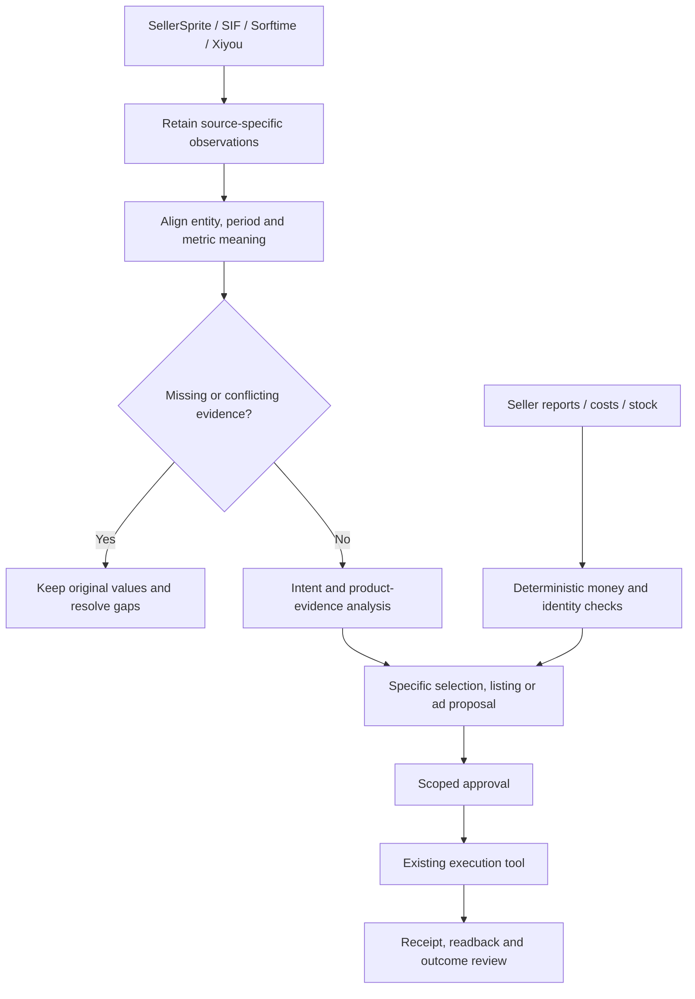

# Amazon 经营判断：四个数据源怎么用

这是选品、Listing、视频和广告的工作方法，不是工具功能目录。先问“现在需要决定什么”，再取够用的数据。所有数字算例均为 **DEMO 合成数据**，不是本人账户业绩或平台默认门槛。

目录：§1 数据源；§2 选品；§3 上下架；§4 Listing；§5 视频；§6 广告；§7 实现与交接；§8 字段依据。

## 1. 数据源与口径

|来源|主要用于什么决定|具体看什么|不能直接推出什么|
|---|---|---|---|
|卖家精灵 SellerSprite|需求是否存在，哪组词值得研究|反查词、搜索趋势、同用途竞品、价格/排名与销量估计；同时看真实规格|高搜索量不等于自己的可得流量；父体 BSR 预测不是精确子体订单|
|SIF|在哪些查询、位置及变体上竞争|可见自然/广告流量词、排名与出现时间、竞品主推变体变化|流量占比是估算曝光构成，不是点击/订单占比；未出现在样本中不等于未投放|
|Sorftime|增长能否持续、竞争和供货是否适合进入|类目历史、季节、价格带、新老款与品牌结构、竞品趋势|估算不是后台结算；各模块样本与时间窗不同，不能统一套一个“月销”定义|
|西柚洞察（原西柚找词）|哪个细分市场、子体、词或位置发生变化|市场洞察、父子体、词位趋势、可见价格/页面变化|自研分类不是 Amazon browse node；流量分不是销量，观测变体数不是全部在售数|
|自有经营数据|自己的钱花在哪、谁买了什么、还能否补货|Ads、SQP、Business Reports、订单/退款、费用、成本、可售与库存|归因销售不是因果增量；业务报告与广告报告不可直接相减当精确自然单|

### 导入合同

每项指标保留下列信息。未知标 `unknown`，不拿别家列名推断：

```text
source + module + source_ref + captured_at
marketplace + currency (money) + device/postcode (rankings)
entity_type + parent_asin + child_asin + seller_sku (when available)
raw_query + metric_name + metric_definition + unit
period_start + period_end + rolling_or_calendar + estimate_or_observed
raw_value + missing_reason + sample_coverage
```

读取时间不是统计窗口。反查词的滚动窗口、月搜索量的自然月、ABA 的周期可能同屏出现，但不是同一期间。两家共用 Amazon 前台/ABA 时，结果接近也不等于多份独立交易证据。

允许统一拼写/单位但保留原词；同父体下的不同规格不能去重成一件产品。外部记录按来源、模块、站点、词、实体、窗口和指标保留；订单与广告另用实际唯一键去重。

**禁止拼出“最好的一行”**：SIF 7 天与 Sorftime 30 天不能取最高搜索量、最高 CVR、最低 CPC，再标成同一期间。并列原值，解释差异；拿不到同口径，只做分来源观察，不给合成的销量、转化率或分数。共享父级预测值不能对子体逐行相加，空白不填零。

### 数据相反时怎么决定

例：工具显示父体曝光上涨，但自己的目标子体订单下降。

1. 核同一站点/窗口，父体增量是否落在另一尺寸或包装。
2. SIF / 西柚观察主推子体和词位变化；卖家精灵看该尺寸的需求词，Sorftime 看季节/价位背景。
3. 回自有子体核可售、价格、配送、库存和变体选择，再看确实可归属的广告与订单。
4. 交付“修复目标子体报价”“测试该尺寸的具体词”或“缺少子体归属，先补资料”。不能从父体上涨直接给目标子体加预算。

## 2. 进入一个市场的条件

按用途、人群、功能、规格/件数和到手价格建立竞品池，不拿类目 Top 100 平均值代表自己。记录纳入/排除理由、父子体、可售状态和样本日期。工具自研分类需回到同一批 ASIN 后比较。

|要回答的问题|交叉读取|决定与交付|
|---|---|---|
|真需求还是短时波动？|Sorftime 类目时间线；卖家精灵相关词；促销/缺货/季节记录|拆常态与旺季情景；不将重叠词的搜索量累加为市场总量|
|有进入空间吗？|同价位/用途头部品牌集中、排名稳定性、新进入商品的持续表现；SIF / 西柚入口分布|指出要争哪个需求和规格；新品数量不是成功率，需要观察存活与退出样本|
|买家为什么换成我的？|评价/问答重复疑问、退货原因、实物和供应商能力|把抱怨转成可验证差异，例如真实适配尺寸/安装方式；没有证明就不写优势|
|成本和现金撑得住吗？|采购/头程/平台费/履约/退货损失/仓储/活动成本，MOQ、交期和付款安排|逐项确认已扣/未扣；做价格下调、CPC上升、CVR偏低压力情景，假设不是预测|
|下一步投入什么？|上述证据与缺口|拿样、限量试销、调整产品/成本或放弃；写预算/亏损上限和验收条件，不默认采购|

### 反例：市场转化率不能当新品转化率

DEMO：净收 $30，非广告变动成本 $21，希望每单保留 $3，允许获客成本是 $6。

- 外部词级参考 CVR 15%、CPC $0.90：CPA $6，似乎刚好达标。
- 新品自己的 CVR 若仅 5%：CPA = 0.90 / 0.05 = **$18**；单件广告后贡献 = 30 − 21 − 18 = **−$9**。
- 此 CVR 假设下保本 CPC 参照 $0.45，保留 $3 贡献的参照 $0.30；不是对未来 CPC 的预测，也不是后台 bid。

不能靠“以后自然单起来”把当前亏损算没。先证明差异和成本，或以明确亏损上限试销；无预算/供货授权不订货。西柚的词级 CVR 是市场加权口径、CPC 为参考，不保证新品复现。

## 3. 商品与报价：上下架不是一个开关

区分新建商品、现有 ASIN 的卖家 offer、共享详情页与父子变体。先定位不可售：属性/审核、报价、库存、配送、变体或账户。

交付准确 `market + seller + SKU + ASIN + fulfillment` 的原值/拟改值。上架核实商品、类目属性、价格与配送；下架核未履约订单、活动和补货影响。无差异即结束，只关闭自己的 offer，不写成删除共享 ASIN。

实际执行后，提交 accepted、审核完成、买家可下单分别记录；核目标变体、价格、配送承诺。仍审核为 SUBMITTED，不重复创建商品。

## 4. Listing：词要对应购买理由

从四源形成相关候选，再用商品事实筛选；不是按搜索量整批塞入文案。

|词或疑问|核什么|承接位置|
|---|---|---|
|核心品类与用途|实物是什么，目标用户如何称呼|标题和首屏；遵循当下类目要求|
|尺寸、数量、接口、材质|测量/说明书/包装/合规文件|属性、规格、尺寸图；与变体选择一致|
|场景与差异|是否能真实演示，有何使用边界|要点、场景图、视频；写清区别，不堆形容词|
|安装、清洁、兼容和不适用情况|买家误解及售后证据|辅图、A+、适用的问答/说明位置，减少误购|
|剩余相关表达|重复、拼写、语言和字段限制|合规且适用的后台搜索字段；不保证索引/排名|
|竞品品牌词|品牌归属及广告规则|竞争研究/单独广告评估；不当作自己品牌塞入标题或后台词|

每条带 `query / intent / source / product_fact / proof_ref / page_field / keep_or_reject_reason`。商品没有的规格、认证、评价、效果不能由模型补齐。

### 不是点击率一跌就换主图

能用 SQP 时固定查询、站点、周期、brand/ASIN 视图，分别看总查询需求、曝光份额、点击份额和购买份额。份额变化是定位线索，不是同一公式的连续转化率，也不等同广告 CTR/CVR。

- 需求降、份额平稳：先查季节/需求，不整页重写。
- 需求在、曝光份额降：查可售、覆盖、变体和竞争曝光，不靠堆词保证恢复。
- 曝光有、点击承接弱：核位置、主图、价格、配送、评价条件，选择一个待测改动。
- 点击有、购买承接弱：先排报价、库存、配送与变体错配，再找兼容、证明、包装数量等未回答问题。

具体提案：“尺寸不适配疑问重复出现，补一张实际接口和不兼容条件图，其他主要变量保持不变”，而不是“优化图片和五点”。记录版本、观察对象、成本和退货影响；符合资格可用 Manage Your Experiments 随机对照。普通前后变化只作观察，不能独断为文案增量。

## 5. 视频：把疑问拍成证据

先选商品、观众和位置，同一条片不无差别承担所有任务。

|位置/任务|展示什么|检查重点|
|---|---|---|
|详情页：确认能否使用|安装顺序、尺寸/接口、配件、限制及日常使用|实物一致，关键步骤完整，不暗示未验证性能|
|搜索/品牌视频：值得点击吗|前段明确品类、用途和一个真实差异，连接对应商品/品牌页|静音能理解，承诺与到达页一致；版位、规格和资格另核|
|对照创意测试|固定商品事实，仅变开头、问题或证据表达|保留 creative/version/landing 关系，不把多变量变化归因一个镜头|

镜头表：`time / buyer_question / action / SKU_fact / proof_ref / generated_or_real / acceptance`。尺寸、负重、密封、安装效果需实物或可核测试，生成画面不是性能证据。包装、附件、颜色与动作对应实际交付；模型换物或接口错误需返修。

## 6. 广告：明确对象，再算能花多少钱

### 任务不同，结构与结果也不同

|任务|可选承载，依当前资格|重点判断|
|---|---|---|
|发现需求词|SP 自动/关键词测试|实际查询相关性、成本、购买；保留有效旧计划，不规定统一词数/点击门槛|
|稳定获取核心需求|SP 关键词/商品定向|query、target、match、主推子体和预算限制；品牌防守与非品牌拓新分开|
|竞品/替代选择|SP 商品/类目定向等适用方式|真替代关系、价格/规格/评分/配送差距；不因竞品曝光高照抄出价|
|品牌、系列和视频表达|适用的 Sponsored Brands 等|创意、Store/PDP 路径、目标与归因；不能同 SP 混一个获客基线|
|展示与再触达|账户可用的 Display 相关广告|受众、频次、点击/观看归因和排除；归因销售不当新增客户或增量|

以上是设计选择，不要求每个商品开齐全部广告。

### 对象决定动作

|观察|先判断|提案对象|
|---|---|---|
|整只水瓶广告跑到 `water bottle replacement lids`，自己不卖单独瓶盖|查询意图确实不符；检查其他有配件的商品是否有效|指定 campaign/ad group 的该查询 negative-exact 复核，不否掉整个 `water bottle`|
|相关查询有单但成本高|窗口、实际子体、毛利、target/match、报价和详情承接|对应 target 出价或页面测试；“贵”不一概等于否词|
|某 campaign 顶部成本高|它自己的 placement 报告与当前设置，动态竞价和其他调整|campaign 的 placement 调整复核；无交叉维度就不称某查询在顶部亏损|
|预算提前耗尽|有效目标被挤掉，还是低质流量吞预算；是否真受预算限制|有限预算调整或单测优先目标，不只因花完就加钱|
|少量点击、未出单|相关性、窗口成熟、花费上限|观察或风险复核，不套“10次点击必否”|
|ACOS降但总贡献也降|规模、成本、品牌防守与新增需求、归因变化|看贡献金额及新增投入回收，不追最低ACOS|

两个边际汇总表不能制造交叉表：`campaign × placement` 与 `campaign × query` 不提供 `query × placement`。多 ASIN ad group 的订单也不能按比例分摊到 SKU；报告只到可证明的粒度。

ACOS = 花费 / 该广告归因销售；TACOS = 花费 / 同范围全部销售。固定账户、商品范围、币种、报告期间，说明归因延迟。不直接用总销售减归因销售叫精确自然单；TACOS 变化不是增量检验。

### 算例：ACOS 25% 为什么不能直接放量

DEMO：同站点/币种、成熟窗口、单 SKU、每归因订单恰好一件，无跨 ASIN halo；无退款，广告销售分母与每单 $30 净收一致。非广告变动成本 $21 完整覆盖货品、费用、履约等，不重复扣优惠或已扣费用；未分摊公司固定费，因此称贡献而非公司净利润。

|项目|计算|结果|
|---|---|---:|
|广告前单件贡献|30 − 21|$9|
|保本 CPA / ACOS|9；9 / 30|$9 / 30%|
|每单希望保留贡献|经营目标|$3|
|可承受 CPA / 目标 ACOS|9 − 3；6 / 30|$6 / 20%|
|实际点击、订单、花费|100；10；75|CVR 10%；CPA $7.50；CPC $0.75|
|实际 ACOS|75 / 300|25%|
|广告后贡献|300 − 210 − 75|$15|
|目标总贡献|10 × 3|$30|
|CPC 成本参照|6 × 10%|$0.60|

当前仍贡献 $15，但未达到 $30 目标。先核成本和承接，再测试具体 target 或版位调整；**$0.60 仅为 CVR 保持 10% 假设下的成本参照，不是后台 bid 指令**。竞价、版位/动态调整和实际 CPC 不是同一值；放量后 CVR、客单与费用会变，需观察新增投入而非复用整体均值。

多件、退款或跨 ASIN 销售时重建真实订单篮子和净贡献。平台销售分母与净收入不同，不直接套该 ACOS 阈值。零订单/零销售时 CPA/ACOS 未定义，风险仍可按花费上限判断。

**库存反例**：DEMO可售90件、日销3件，静态覆盖30天；补货45天，尚未计安全余量。即使贡献达标，也不能直接放量。先核在途可用日、销量变化、断货风险与付款安排。

## 7. Agent 的实现与交接

没有连接器先用现有导出，不先建框架。有获授权工具时只读请求需要的模块、对象和期间；厂商提供 API/MCP 不等于当前账户已接通。



|环节|Agent 做什么|事实/确定性检查|
|---|---|---|
|整理|识别列、提出映射、标来源冲突|原文件与指标含义保留；币种/期间/实体不合不得汇总|
|词与评论|按意图/规格/用途/疑问归类，连接事实|抽查原句/商品证明，不编频率；剔除不相关词|
|计算|选择所需公式，解释结果|金额、分母、订单归属、缺失和零分母用可重复计算|
|提案|准确对象、原值、拟改值、理由|核后台原值及成本/预算/库存限制，不跨层级改动|
|执行与复盘|现有获授权工具提交、整理回读|提交凭据、真实状态和观察窗；未知状态先查询|

**接到导出后的验收**：交一份原列名→指标含义→单位→对象层级→期间的映射，附几条可回到原文件的行。金额的币种、百分比是 `15%` 还是 `0.15`、千分位和空白分别处理，不二次缩放。用原报表总计校对导入总计，先排重复行/小计；只有明细覆盖范围一致才要求和总计相等。总量对不上就不形成金额建议。这是导入要求，当前脚本不自动解析四家原始 CSV。

**观察期与有限试验**：从具体广告类型/报表的真实归因窗口、更新延迟和退货成熟度安排，不默认所有报告都是7或14天。先记录开始日、结束日和下次读取日；归因未成熟仍单独监控花费上限。若准备把某个子体或查询单独测试，先核映射、现有计划和可用预算，提出明确的对象/唯一主要变量/总支出与亏损上限/库存约束；数值由这次经营条件确定。保留有效原计划，写清是否移动目标及可能重叠，不能一边复制投放一边称严格随机实验。未知账号成本时交待补字段，不生成统一预算或bid。

本仓库 [review.py](../../../scripts/review.py) 的 `paid` / `catalog` 可运行：前者核声明口径后算贡献/复核候选，后者输出商品差异。它们不读取四源、不生成关键词库、不计算上例全部广告比率、不调用 Amazon。字段见 [examples.json](../../../examples.json)。其余由 Agent 按方法处理授权资料；未接环节明确列出，不用流程图冒充完成系统。

旧 Listing/广告私有套件与公开仓库分开。若环境有旧工具，先核它接受哪种报表、ASIN归属和期间；不把单个 SP 搜索词解析器称为全广告处理。关键词脚本也须保留逐源值，不以固定分数或“Rufus/COSMO 权重”冒充 Amazon 内部排序规则。

动作条目至少有：站点、对象类型与准确ID/查询、证据、原值/拟改值、成本或库存影响、观察期、负责人和状态。没有后台原值就留缺口，不编出价。分析止于 DRAFT；写入需本次范围明确，提交后核回读。对不明提交先查，不盲重试。

## 8. 字段依据

这些链接用于核字段和资格，不是学习视频。2026-09-08 核过公开说明，执行时以当前模块/账户为准。

- 卖家精灵：[反查字段](https://open.sellersprite.com/api/14)、[销量预测原理](https://www.sellersprite.com/v3/knowledge/feature/sales-estimating-principle-of-sellersprite)。
- SIF：[反查流量词](https://blog.sif.com/article/bl37ebc3d60b1649b2a64fbf4d14eae39f/%E5%9B%BE%E6%96%87%E6%95%99%E7%A8%8B%EF%BC%9A%E5%8F%8D%E6%9F%A5%E6%B5%81%E9%87%8F%E8%AF%8D)。
- Sorftime：[亚马逊市场与历史功能](https://www.sorftime.com/en-US/pc)。
- 西柚：[模块与升级](https://knowledge.xydc.com/docs/)、[市场分类与销量](https://knowledge.xydc.com/faqs-product/)、[曝光得分](https://knowledge.xydc.com/docs/traffic-score-question/)、[CVR](https://knowledge.xydc.com/blog/average_cvr/)、[CPC](https://knowledge.xydc.com/blog/cpc/)。
- Amazon：[Brand Analytics / SQP](https://sell.amazon.com/blog/brand-analytics)、[Manage Your Experiments](https://sell.amazon.com/tools/manage-your-experiments)、[SP 定向](https://advertising.amazon.com/library/guides/targeting-with-sponsored-products)。
