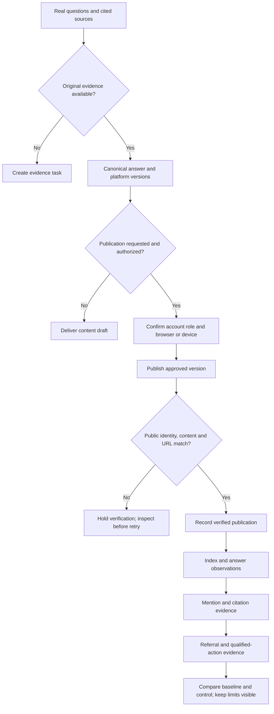

# GEO and content distribution

Operate two distinct jobs: **make useful source material discoverable** and **manage authorized publication**. A browser/device profile is account context; it is not an independent person, authority signal or proof of citations.



## Select the requested outcome

Identify brand, market, language, user question/topic, intended source page and requested scope: research, content draft, distribution, or measurement. A research request does not start posting. Reuse existing content, accounts, tools and workflows before proposing new infrastructure.

For this user's workflow, account pools, AdsPower/fingerprint browsers and managed phones may be authorized operational tools. Resolve the actual profile/device reference, represented brand/team and permission before any account action. Do not infer that a mentioned environment is configured or currently usable. Keep credentials, proxies, device identifiers and private conversations out of public artifacts.

## Research questions and current sources

1. Start from approved, redacted customer questions, sales/support material, search queries or user-supplied questions. Keep real observations separate from suggested question variants. Group matching intent into a topic instead of generating a separate page for every phrasing.
2. Observe answers for the selected market/language/product surface. Record exact prompt, time, interface/model if visible, run, answer and cited URL. Capture the actual citation; do not infer it from the answer text or a brand mention.
3. Separate owned pages, independent media, commercial partners, video and communities. Inspect the sources actually used for the question and what information they provide. A popular platform is not automatically relevant to this niche.
4. Identify the answer gap and evidence needed: specifications, use cases, comparisons, restrictions, steps, demos, dates and responsible author. If evidence is missing, produce a research task, not a confident factual answer.

**Complete when:** the topic has a traceable problem, observed source pattern and an exact content task, or an explicit evidence gap. A prompt list is not a measured demand estimate.

## Build and adapt the source content

Write a clear answer that remains understandable outside its surrounding page. Use the original product/brand material as the factual source; explain limits and date substantive updates. Reuse actual demonstrations and add useful transcripts or captions for audio/video when in scope. No fixed paragraph length, special file or repeated wording guarantees citations.

Prepare platform-specific versions around the same facts. For a community reply, state the contributor's real identity/brand relationship and answer the thread's actual question. For PR/affiliate work, retain the commercial disclosure and allow independent editorial judgment. Do not manufacture user experiences, independent endorsements, mutual likes or third-party identities.

**Complete when:** every material factual claim has an approved source, each version has a destination and role, and any unknown fact or permission is visible before submission.

## Publish only through the scoped authorized account

Use an existing approved connector or browser/device surface. Inspect the actual logged-in identity and current editor before filling anything. Record:

`task_id, account_role, environment_ref, authorized, platform, market, language, content_version, evidence_refs, canonical_url, submitted, post_url, verified_at, public_readback_matches, failure_reason, next_owner`.

The environment reference points to the correct authorized session; do not rotate accounts to evade a restriction or impersonate independent support. For a challenge, permission failure or unavailable interface, save the draft and stop that action. For an uncertain submission, inspect the destination before retrying to prevent duplicate posts.

After authorized submission, reopen the resulting post/page and compare identity, body, media, destination links and public visibility with the approved version. A success toast alone remains `VERIFY`; a draft/save state remains a draft. If a platform hides the post pending review, report pending review instead of public completion.

**Complete when:** every requested post is independently read back or explicitly pending/blocked with its next step. Do not turn an authorized single post into a recurring monitor or publishing campaign.

## Measure the stages separately

| Stage | Evidence required | What it does not prove |
| --- | --- | --- |
| Published | Exact public post URL and matching readback | Indexed or cited |
| Accessible/indexed | Current retrieval/index evidence for that URL | Mentioned by an answer engine |
| Brand mention | Captured answer names the brand in context | A source link or recommendation |
| Citation | Captured answer links the exact source URL | A click, sale or causal effect |
| Referral visit | Real site analytics/referrer record | Complete credit for direct/brand-search visits |
| Qualified action | Defined first-party event/order with matched window | Proof that a content change caused it |

Record question variants, repeated runs, surface, language, region and dates. A single screenshot is one observation. Use comparable topic-level test and control groups when evaluating a content change; a shared page can affect multiple questions, so avoid contaminating the groups. Keep the question set and measurement method stable during the comparison. State uncontrolled changes and sampling limits before interpreting trends.

For B2B, optionally add consented post-conversion “how did you hear about us” responses as self-reported evidence; do not replace observed attribution with them. Brand searches and direct traffic are auxiliary signals, not wholly attributable GEO revenue.

**Complete when:** the report names the measured stage, population/window, evidence and limits. Separate “observed improvement” from a reproducible causal claim.

## Optional local ledger checker

When this repository is available, inspect `scripts/review.py` and `examples.json`, then run from its root:

```sh
python3 scripts/review.py examples.json --example distribution
python3 scripts/review.py /absolute/path/to/distribution-review.json
```

The actual input is `{ "kind": "distribution", "posts": [...] }`. Each post requires unique `task_id`, `account_role`, `content_version`, `environment_ref`, `canonical_url` and actual boolean `authorized`, `submitted`, `public_readback_matches`; verified publications also need `post_url` and `verified_at`.

The helper checks the supplied ledger only. `PUBLISHED_VERIFIED` does not mean the script visited the URL or authenticated a person: the operator must supply real readback evidence. It does not publish, crawl, inspect rankings, compute citation lift or prove referral conversion. If the helper is absent, use the same ledger in an existing table; do not invent a connector.

## Practitioner evidence and boundaries

- [Ethan Smith / Lenny’s Podcast, 2025-09-14](https://www.youtube.com/watch?v=iT7kq-R3Gjc): subtitle excerpts 15:47–27:43, 29:53–41:11 and 43:35–46:13. Question research, authentic community participation, source-specific content, repeated observations and controls.
- [Lily Ray / MozCon virtual presentation, 2025-11-11](https://www.youtube.com/watch?v=2nJkT8zOzcM): subtitle excerpt 19:24–36:36. Clear answers, brand facts, region-specific content, analytics and genuine updates.
- Both are external practitioners with commercial interests. Do not adopt their historical traffic ratios, platform-source explanations or speculative ranking mechanisms as current universal facts. These sources do not validate the user's device/account setup or results.
- For method changes or provenance while in this repository, read [the research note](../../research/expert-geo-2026-09-08.md). Verify current technical access and platform requirements from primary documentation when an actual integration requires them.
