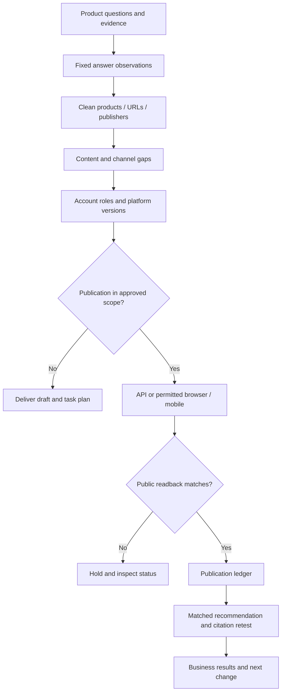

# GEO: account operations and recommendation analysis

Use two connected jobs: authorized multi-channel distribution and observable recommendation analysis. Read [the operating method](references/operating-method.md) when selecting channels, assigning accounts, defining sampling, cleaning data or interpreting scores; it contains the channel matrix, field contracts, decision rules and English flow diagrams.

## Choose the requested work

Identify product, market, language, business question and scope: method design, research, drafts, authorized publication or measurement. Use existing accounts, content, tables and tools. A documentation request does not authorize creating accounts, posting, paid submissions or running a new recurring campaign.

This user's method uses Google accounts as a major part of an account pool, AdsPower/browser environments and mobile devices. Treat these as the user's stated operating method, not verified inventory or evidence of results. Public artifacts contain role references, not credentials, personal account details or device/proxy configurations.

## Assign accounts and channels

1. Resolve each existing account's real brand/team, owner, target platform, market/language, permitted actions and environment. Google sign-in does not grant publishing permissions on other services.
2. Select channels from the reference matrix using topic relevance, current public access, observed citations, content fit and permission. Distinguish self-publishing, editor-approved directories, independent reviews, commercial media and private communities.
3. Give each task a content purpose and destination. Reuse product facts while adapting demonstrations, long-form explanations, technical material and relevant community answers. Do not treat many same-owner accounts as independent endorsements.
4. Record the approved batch scope, cadence/capacity, review requirements and stopping conditions. No account rotation to evade restrictions, fake identities, fabricated reviews or automated mutual support.

**Complete when:** each proposed task has a channel, account role, owner, factual basis, version and publication permission or explicit blocker. Account count and posting volume remain operational measures, not ranking signals.

## Observe recommendation results

1. Agree the question set, real product constraints, branded/unbranded strata, number of repeats and time batches before sampling. Preserve the plan; do not repeat until the target appears.
2. Keep ChatGPT consumer search/shopping, OpenAI API, Gemini App/API and Google Search AI surfaces separate. Record visible model, locale, login/personalization/Memory, search setting, actual search evidence, session mode, timestamp and run ID. Unknown stays unknown.
3. Save the original answer and evidence. Extract mentioned brands, recommended products, visible reasons, ordered positions only when ordered, actual citations and other link roles separately.
4. Inspect actual cited pages and map their information to the user's purchase conditions. A follow-up explanation or requested score is a new answer, not the original hidden reasoning or ranking log.

**Complete when:** every observation has its original evidence, conditions and status. A configured search tool is not proof it was used; no visible sources is not proof no source exists. Technical failures, refusals and feature-not-triggered states are not negative recommendation results.

## Clean before comparing

Use the four minimal tables in the reference: runs, answer_items, sources and actions. Preserve raw responses; proposed entity merges or source classifications need evidence.

- Keep brands, product families, variants and sellers distinct. Review ambiguous aliases.
- Keep raw URL, tracking-cleaned URL and verified canonical separately; retain product-identity parameters.
- De-duplicate repeated imports of the same run, not independent real runs with identical answers. Conflict for the same run ID requires review.
- Distinguish citations, related/verification links and retrieved candidates. Collapse repeated same-URL coverage within one answer while retaining positions.
- Track domains, original works, publishers and ownership. Syndication and several owned accounts are not independent support.
- Retain valid answers without visible citations in the overall denominator; report confirmed-search subsets separately.

**Complete when:** every retained row can be traced to raw evidence, all exclusions have reasons, unknowns are visible and comparison groups share compatible conditions.

## Turn observations into actions

Use visible recommendation conditions to check fit, specifications, limitations, current prices/availability, comparison evidence, demonstrations, identity and access. Mark confirmed missing / partial / sufficient / unknown with evidence.

These are operator content checks, not ChatGPT/Gemini scores or recovered weights. Prioritize by business relevance, repeated evidence gaps, feasibility and cost; label any custom weights as team configuration.

Produce exact changes: page/Listing facts, compatibility tables, original demos, useful topic-specific articles, permitted community answers or genuine editorial outreach. Keep commercial relationships visible.

**Complete when:** each action names a gap, affected question/topic, exact page or channel, evidence, owner and testable expected change. Missing product truth becomes a research task, not invented copy.

## Execute only within the approved publication scope

Prefer available authorized APIs/connectors. If unavailable, use an existing permitted browser/device flow; do not invent integration support. Confirm actual identity and editor before submission.

Use a stable task key such as `topic_id + platform + destination_id + content_version`. Keep receipt, public URL, state, evidence reference and next owner. Avoid concurrent writes to one destination. On challenge, limit or permission failure, hold that task; on uncertain submission, inspect before retrying.

Reopen the result and compare identity, text, media and links with the approved version. Editor review/pending access is not public completion.

**Complete when:** every requested item is independently read back or explicitly pending/blocked. No unrequested account creation, purchase, review solicitation campaign or expanded posting batch.

## Report separate results and retest

Use the exact denominators in the reference. Report planned/valid/failed runs, mention rate, recommendation rate, target citation rate, confirmed-search subset, unique URLs/domains/publishers and first-party business results independently. No fabricated rankings for unordered or missing items.

Keep question conditions stable before/after the change, repeat across planned batches and retain comparable unchanged topics. Shared pages and simultaneous campaigns can contaminate comparisons. State sample size, variation and confounds; observational lift is not proof of causation.

## Available local implementation

From this repository root:

```sh
python3 scripts/review.py examples.json --example distribution
python3 scripts/review.py examples.json --example geo_sample
```

`distribution` checks a supplied publication ledger: input is `{"kind":"distribution","posts":[...]}`. It requires unique task IDs, account/environment/content references and real boolean authorization/submission/readback values; a verified entry also needs valid URL and timestamp fields. `PUBLISHED_VERIFIED` means those fields passed, not that the script visited the post.

For sample statistics, read section 9 of [the operating method](references/operating-method.md) and map verified labels to the `geo_sample` example. Use one complete scope and a predeclared run plan. `mentioned` and `recommended` refer to the fixed target product; `cited_target` refers to an actual citation of the predefined target source, not a related link. Validate labels against the saved answer before running the helper; it does not read evidence files.

The sample checker merges identical imports by run ID, rejects conflicting/unplanned/mixed-scope records and retains independent runs with identical answers. Report planned, observed and valid counts separately. Keep uncited valid answers in the overall denominator and confirmed-search results in a separate subset. A zero outcome denominator returns `null`; failure, refusal, not-triggered and unobserved are distinct states.

**Complete when:** the output preserves scope and original references, every planned run is observed or unobserved, and each reported rate has its numerator and denominator. Resolve invalid input instead of dropping it to obtain a better result. The local helpers do not operate accounts, query answer engines, clean entities/URLs, infer source ownership or calculate causal lift; these require the available approved tools and evidence review described above.


