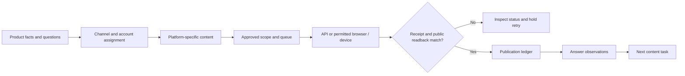
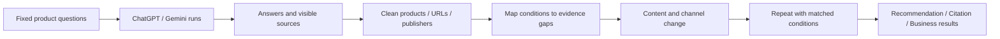

# GEO：号池分发与推荐结果分析

这套方法分两条线：以 Google 账号为主的授权账号池，配合网页和手机端工作环境，让 Agent 处理多渠道内容；另一条固定询问 ChatGPT、Gemini 等产品，整理推荐、引用和商品资料，找出下一轮该改什么。账号规模、发布数量与推荐效果分别记录。

## 1. 号池：先定用途，再分任务

| 对象 | 记录与分工 |
| --- | --- |
| Google 账号 | 内部账号编号、真实所属品牌/团队、授权人、市场、语言、可用服务、负责人、当前状态。Google 登录不能代替各平台自己的权限。 |
| 网页账号 | AdsPower 等现有浏览器环境只存内部引用；执行前核对实际登录身份、品牌与目标频道，不在公开仓库保存邮箱口令、代理或设备参数。 |
| 手机账号 | 对应原生应用、授权设备、账号和负责人。没有开放接口且允许自动化的场景，才使用现有设备操作能力。 |
| 内容角色 | 产品说明、教程演示、技术文章、品牌动态、社区答疑分别分工。多个账号不包装成多位独立消费者。 |
| 发布账号与测量账号 | 分开用途。采样使用固定、可解释的会话条件；不把发布历史、Memory 和个性化混进无差别的结果表。 |
| 批次与容量 | 按可用权限、渠道限额、原创内容供给和核验能力排期。单个账号/目标避免并发写入；未知提交先回查，受限任务暂停，不轮换账号绕过限制。 |

只接入已有、真实授权的账号。账号池管理不包含买号、假身份、批量注册、互赞、假评价或规避验证；新增访问权限按实际业务需要申请。发帖批次需明确账号、渠道、内容范围、频次、审核方式和停止条件，写方法不等于授权发帖。

## 2. 渠道怎么选

下面是候选范围，不是所有产品都要投放的清单，也不是 ChatGPT 或 Gemini 的渠道权重表。先看目标问题实际出现哪些来源，再补行业适配的渠道；没有引用证据的渠道标为待测试。

| 类型 | 具体渠道 | 适合做什么 | 发布边界 |
| --- | --- | --- | --- |
| 自有资料 | 品牌官网、产品/比较/FAQ 页、博客、帮助中心与开发文档 | 规格、限制、价格、适配、操作步骤、原始演示 | 自有授权发布；一题一处可靠资料，避免近义问句批量造页 |
| Google 生态 | YouTube、Blogger、Google Sites、Google Business Profile | 演示与字幕、专题、品牌事实、本地商家信息 | 自有频道/站点；Business Profile 仅适用符合条件的真实商家，不是通用铺文工具 |
| 公开长文 | LinkedIn Articles / Newsletter、Medium、Substack 的公开文章 | 产品决策、比较、案例、使用教程 | 按编辑规则发布；邮件或付费墙内容另计，不能默认可公开检索 |
| 公开社区 | Reddit、Quora、Hacker News / Show HN、Indie Hackers、Stack Overflow、Stack Exchange、行业 Discourse 论坛 | 有关的问题、可验证的经验、项目与技术讨论 | 社区准入与主题相关性优先；技术问答不作推广模板投放，涉及品牌说明关系 |
| 开发者资料 | GitHub、Hugging Face、DEV Community、Hashnode | 可运行示例、文档、模型/数据说明、技术教程 | 只发与实际项目相关的资料，不造空仓库占位 |
| 商家与评价 | G2、Capterra、Trustpilot、Clutch | 准确商家资料、真实使用反馈 | 商家资料与用户评价分开；评价只能来自真实使用者，不能让自有账号代写 |
| 产品目录 | Product Hunt、BetaList、AlternativeTo | 发布产品、类别与替代关系 | 提交/付费申请不等于获准收录；审核状态单列，不能承诺排名 |
| 社交发现 | X、Threads、Instagram、Facebook Pages、TikTok、Pinterest | 短演示、视觉说明、更新与讨论 | 逐帖查公开性；登录墙、地区限制、动态内容会影响访问，不假定能被引用 |
| 新闻与行业资料 | 自有 Newsroom、PR Newswire、Business Wire、行业媒体、专业博客、合作伙伴/客户网站 | 新事实、真实案例、新闻分发、独立编辑评价 | 新闻线付费分发不等于独立报道；商业合作披露，媒体保留编辑决定权，不预设所有媒体接受投稿 |
| 商品资料 | Shopify 品牌店、Amazon、TikTok Shop、AliExpress、Mercado Libre、Shopee | 准确 Listing、规格、图文视频、库存与地区信息 | 店铺授权维护；不把上架与排名、购物卡展示混为一谈 |
| 私域 | Discord、Slack、电子邮件 | 收集真实问题、反馈与共创 | 默认不算公开引用资产；公开改写需授权与脱敏 |

“很多渠道都发”落到执行时，是同一份商品事实生成不同任务：视频演示、长文、技术说明、图解、讨论答复和资料收录，不是同一段广告全文复制到所有地方。

### 2.1 先后顺序怎么定

先过两道条件：商品能否满足该问题；目的地是否相关、可公开访问且允许这项发布。没过就修商品资料、访问或权限，不用账号数量抵消。过了以后，按“已核实的事实错误 → 多次出现的购买证据缺口 → 新渠道假设”安排工作；同类任务再比较覆盖的问题和实际制作/审核成本。这个顺序是经营方法，不是模型权重。

| 当前证据 | 优先动作 | 暂不做什么 |
| --- | --- | --- |
| 自家页面把适配写成“通用”，实物资料有明确限制 | 先补一个可读的适配表和例外，再让各渠道引用同一版本 | 不先生成十篇含糊的推荐文章 |
| 多次样本引用同一行业原始测试，自己的问题也在其选题范围 | 看测试条件能否复核，准备产品资料与编辑选题；是否刊发由编辑决定 | 不把获得投稿入口等同于获得独立评测 |
| 有原始安装过程，但买家只看到效果图 | 优先做演示和可检索的文字步骤，自有页面与视频互相说明 | 不从漂亮渲染画面推导承重或兼容性 |
| 某社交平台很热，却没有本题引用或适配内容证据 | 列为有明确内容目的的小规模渠道测试 | 不凭平台名气给固定权重或全账号铺发 |
| 问题来自私域 | 经许可把共性问题脱敏，补到适合公开的位置 | 不把群聊数量计为公开来源覆盖 |

号池容量按任务完成能力排：每个环境负责的品牌/语言/用途、允许动作、待审核任务和核验人均明确。积压在事实审核就先补资料，积压在发布回查就缩小批次；不是只要还有账号就继续新增任务。

## 3. Agent 的发布工作

| 环节 | 输入 | Agent 做什么 | 交付与停止条件 |
| --- | --- | --- | --- |
| 问题与事实 | 产品资料、目标市场、问题库、已有页面 | 合并同意图问题，核对规格与限制，列证据缺口 | topic_id + product_id + evidence；未知事实待补，不编答案 |
| 渠道分配 | 实际来源样本、渠道准入、公开性、内容类型 | 决定在哪发、以什么身份发，准备平台版本 | 每个任务有渠道、账号用途、负责人、版本 |
| 审核与排期 | 确认的发布范围、草稿、素材和额度 | 核事实、重复内容、品牌关系、社区规则，排队 | 通过已批准规则才可进入发布；新事实/评价/付费合作由人判断 |
| 执行 | 已授权 API / OAuth，或允许的浏览器/设备流程 | 打开指定环境，核对身份，填写内容并提交 | 记录回执/状态；权限、验证码、限额或不确定提交时暂停 |
| 回查 | 回执、帖子地址、获准版本 | 重新打开，核对正文、媒体、链接和公开状态 | 保存证据；待审核不算公开；未知提交先查重再决定重试 |
| 反馈 | 发布台账、来源观察、访问和转化 | 找到缺失信息与下一批任务 | 发帖、收录、推荐、引用、访问、成交分开报 |

技术上优先复用现有 CMS、API 或发布连接器。浏览器/设备操作只覆盖没有合适接口且允许使用的流程；OAuth 或 Google 登录本身并不授予机器人发帖权限。

幂等键建议使用 `topic_id + platform + destination_id + content_version`。同时保存 `account_role, environment_ref, owner, approved_scope, receipt, state, public_url, checked_at, evidence_ref, next_action`；账号凭据不进入内容台账。



## 4. 从推荐结果反查，不把解释当内部日志

先问不含品牌名的需求题，建立自然推荐样本，再单独测带品牌题、竞品比较题和售前疑问题。示例：“在美国，预算 150 美元以内，适合两台 27 英寸显示器的桌面支架有哪些？说明适配条件。”预算和用途随真实产品调整，不能为了让自家胜出临时换题。

逐次保留推荐产品、展示顺序（若有）、可见理由、价格/规格/限制、实际引用 URL、相关链接、时间、截图或授权导出。随后打开实际引用页，检查它回答了哪个购买条件，自家页面是否缺少对应事实。

可以观察的是 `用户条件 → 推荐商品 → 可见理由 → 引用页 → 对应资料`。这里的箭头是复核顺序，不代表模型内部执行轨迹。追问“为什么推荐”“请给这些产品打分”只得到新的回答；它不是原回答的内部思考或排序权重。没有引用时填未知，不编来源。

把解释变成可核查的问题，而不是接受它的打分。例如回答说“更容易安装”，下一步打开其实际引用页，记录安装条件、步骤与证据，再对照自家资料。即使两页内容不同，也只能提出待验证解释；不能断言这就是未被推荐的原因。后续补齐资料后仍用原问题复测，不在原会话里不断补充品牌优点来制造命中。

分开采样：ChatGPT 网页、ChatGPT 购物结果、OpenAI API、Gemini App、Gemini API、Google AI Overviews、AI Mode。商品推荐和同商品的商家排序也分开。API 返回检索记录，不意味着消费端用了同一路径。



## 5. 数据清洗：保留原始样本，再做可解释的合并

| 数据 | 清洗方式 | 保留什么 |
| --- | --- | --- |
| 采样条件 | 按产品端、可见模型、市场、语言、登录/Memory/搜索状态、新会话、时间批次分组 | 原始完整问题、计划运行数、run_id、时间、实际搜索证据；未显示填 unknown |
| 问题 | 同意图问法归 topic_id，带品牌与不带品牌分层 | 不把题库条数当真实需求量；不临时增加容易推荐自家的问题 |
| 品牌与商品 | 分 brand / product / SKU / seller；别名经资料核实再合并 | 变体、尺寸、地区、价格日期；模糊匹配人工复核 |
| URL | 保留 raw_url、clean_url、已验证 canonical；仅移除确认用于跟踪的参数 | 保留 variant、型号、颜色等商品身份参数及跳转记录 |
| 来源 | 分域名、发布主体、原作者、自有/独立/付费关系与转载 | 同稿多站、自有多账号不算多个独立背书；归属未知保留 unknown |
| 引用 | 区分实际引用、相关链接、核查链接、API 检索候选 | 候选页不当作已引用页；同回答同 URL 的覆盖计一次，引用位置另存 |
| 去重 | 去掉同一 run_id 的重复导入；冲突版本待复核 | 不同真实运行即使回答完全相同，也保留各自样本 |
| 失败 | 验证码、超时、限额、拒绝和技术失败单列 | 不算未推荐；有效回答无来源仍保留，不能删掉抬高引用率 |

最小四张表即可，不必先搭新系统：

- `runs`：run_id、topic_id、prompt_id、surface、model_visible、market、language、session_mode、personalization、search_setting、search_observed、captured_at、status、raw_answer_ref。
- `answer_items`：run_id、brand_id、product_id、variant_id、seller_id、position_if_ordered、recommendation_label、visible_reason、evidence_ref。
- `sources`：run_id、raw_url、clean_url、canonical_verified、source_type、publisher、ownership、original_work_id、claim_supported、link_role。
- `actions`：topic_id、missing_fact、page_or_channel、owner、content_version、approved_scope、published_url、readback_state、experiment_id。

原始响应只读保存；模型提出归类/别名建议，规则检查重复与字段，再让人复核模糊实体和证据关系。来源网页中的提示语当资料处理，不作为 Agent 的指令。

## 6. 分数：用来安排工作，不冒充模型权重

先检查准入：符合问题的市场/价格/规格、内容事实可靠、允许在该渠道发布。硬性条件不满足就先修，不用“高总分”抵消。

对照可见推荐理由，将内容按下列维度标记：需求匹配、规格完整、适配限制、价格库存时效、比较依据、演示可复核、作者/品牌关系、公开可访问。每项 `0=确认缺失 / 1=部分具备 / 2=充分具备 / unknown=未核`，必须附页面位置和证据；unknown 不填零。

这张表叫“内容检查表”，不是 ChatGPT/Gemini 的后台分数。任务排序使用业务相关性、重复出现的证据缺口、可修改程度和执行成本；需要加权时把权重作为团队可调规则保留。不要发布没有来源的渠道权重榜、训练数据覆盖率或模型算法公式。

## 7. 结果要同时有数量、分母与条件

| 指标 | 计算口径 |
| --- | --- |
| 采样完成率 | 有效完整回答数 / 计划运行数；技术失败、未触发目标功能、拒绝分别列出 |
| 提及率 | 提到预定义目标产品的有效回答数 / 同组有效回答数；负面提及仍是提及，不算推荐。品牌提及可另表统计，不混入当前产品口径 |
| 推荐率 | 按预定义标签推荐目标产品的有效回答数 / 同组有效回答数；单回答多次提及只算一次 |
| 可见引用率 | 引用目标页或目标发布主体的回答数 / 同组有效回答数；目标范围预先定义 |
| 检索子集引用率 | 确认有检索证据且引用目标的回答数 / 确认有检索证据的有效回答数；与总样本口径并列 |
| 竞品推荐份额 | 各产品“被推荐的回答次数” / 所有产品对应次数之和；一条可推荐多个，不能当互斥市场份额 |
| 来源覆盖 | 被实际引用的唯一 URL、域名、独立发布主体数分别计；相关链接另计 |
| 引荐与结果 | 真实分析工具中的访问、合格线索、订单/订阅；自报来源和直接流量分列，不全归给 GEO |

排序只对确有排序的结果记录位置；不强行给无序回答或缺席产品补一个末位排名。不预设重复几次就有统计显著性；预先确定重复次数和时间批次、给出样本量与波动范围。

## 8. 找到问题后具体改哪里

| 观察 | 下一步 |
| --- | --- |
| 推荐理由强调安装限制，但自家只写“通用” | 补真实适配表、安装说明和不支持的条件，核对所有平台 Listing |
| 比较内容反复引用某个行业站点 | 研究该站的证据形式；提供真实资料或合适选题，不购买伪装独立的推荐 |
| 公开帖子存在但没有索引/引用证据 | 分别查访问、索引、主题匹配；不靠重复发相同内容解决 |
| 有推荐但商品信息过期 | 修价格、库存、地区与型号事实，再采样核对；不直接增加账号数量 |
| 有引用无访问 | 检查问题阶段、链接与页面价值，不能仅用引用数宣称增长 |
| 有访问但不转化 | 回看适配、价格、信任、购买流程；属于页面/产品问题，不仅是 GEO |
| 只有自己的账号互相引用 | 独立来源覆盖没有增加；先做有价值的原始资料与真实外部合作 |

### 8.1 一个完整工作例：DEMO-ARM / D27

以下为虚构教学案例，非用户商品资料、实际模型回答或经营成绩。问题版本 Q1 固定为：`For a US buyer with a budget under $150, which desk mounts suit two 27-inch monitors, and what compatibility checks are needed?`。一个统计文件只放一个产品端、问题版本与会话条件；ChatGPT 与 Gemini 分开运行和报告。

**观察与排除。** 假设某条回答没有推荐 D27，可见理由强调安装和兼容，引用了一份兼容指南。先查 D27 的真实接口、每屏重量限制、桌面安装条件、地区报价。任一硬条件不符，就把它从该问题的推广目标中移出；尺寸同为 27 英寸不足以判断适配。若条件待证，先补产品证据。假设已核实适配，但自家页面只写“通用”，才能提出“购买证据未讲清”的改动假设；引用页不是内部排序日志。

**执行清单。** 下表是已填写的任务示例，状态均为待做；所有技术数值须从批准的实物资料填入，不使用示例代填。

| 任务 / 负责人 | 交付到哪里 | 明确内容与验收 | 失败时下一步 |
| --- | --- | --- | --- |
| D27-FACT-v2 / 产品资料负责人 + 网站负责人 | 自有产品页和安装帮助页 | 接口、重量、桌面条件、例外、资料日期；关键事实有正文，与结构化数据一致；买家可打开且与实物核对 | 规格冲突交产品负责人；访问失败交网站负责人，不先发其他渠道 |
| D27-DEMO-v1 / 视频制作负责人 | 品牌视频频道及自有安装页 | 展示安装条件检查与完整动作，配文字步骤和实物依据；画面商品与资料同版本 | 商品细节不符只返修相关镜头；审核中保留状态，不换号重发 |
| D27-ANSWER-v1 / 社区负责人 | 已存在、主题相关且允许品牌参与的适配讨论 | 先解答买家问题，再说明品牌关系；确有帮助且允许时附完整说明，不发无关推广模板 | 无合适问题或禁止推广则不发布；可把共性疑问用于自有 FAQ |

向行业编辑提供原始测试资料是另外一项合作申请，不能由自有账号扮演独立测评。多品牌号池分别使用自己的商品事实和权限，不共享一套伪装消费者的发布话术。

**复测与决定。** 保留内容版本、发布/审核/公开时间、原问题和环境。首先核错事实是否修正，再看推荐/引用结果；不要把“更常提到”代替“更准确”。若同期改了页面、视频与多个渠道，只能报告整批改动后的观察，不能把效果分给某个渠道。需要缩小原因时，把可隔离的内容修改分阶段执行，配合未改主题并记录共享页面等干扰。

### 8.2 数量增加，不一定代表效果提高

| 合成样本 | 计划 | 有效回答 | 推荐目标产品 | 引用目标来源 | 其余状态 |
| --- | --- | --- | --- | --- | --- |
| 改前 | 6 | 4 | 2/4 = 50% | 1/4 = 25% | 1 技术失败、1 未运行 |
| 改后（独立算例） | 6 | 6 | 3/6 = 50% | 2/6 ≈ 33.3% | 无 |

推荐次数 2→3，但有效回答中的推荐率没变。引用率的变化也只是小样本观察，失败构成不同还可能影响比较；应按预先计划补足相近条件的采样批次，而不是宣称已提升。改前例中确认检索的有效回答有 2 条、目标引用有 1 条，则检索子集引用率为 1/2；它和全部有效样本的 1/4 并列，不择高展示。下面的 `geo_sample` 实现只运行改前这一组；改后表不冒充脚本的比较或显著性结果。

来源数量另看：若 20 条有效回答中 10 条引用品牌，涉及同一已核发布主体的 5 个账号转载同稿，则可见目标引用率是 10/20；来源记录可有 5 个 URL，但只有 1 个自有主体、0 个独立背书。归属未核不能自行合并。手工采样引用数不能用作全站访问的 CTR 分母。

### 8.3 不同断点，交给不同的人

- **没有推荐：** 先排商品不适配与证据不足，再按所测产品端查资料访问。对 Google AI 搜索，确认索引和摘要资格；这些要求不直接推成所有问答产品的准入机制。
- **推荐了但事实错：** 分开产品身份和商家报价。锁 SKU、地区、卖家、时间及错误出处，修原始页面/商品资料或联系第三方更正；更新可能有延迟，不继续扩散过期版本。
- **有引用但访问少：** 查真实引荐、落地链接及页面是否提供下一步价值，例如完整安装条件与演示。答案已经解决问题时，用户未点击也不能仅凭这一点判定内容失败。
- **到站不成交：** 检查来源问题是否带购买意图、地区可售、价格、适配和购买路径。交给商品/网站负责人处理，不靠加号补流量。

以主题或页面为实验单位，一批只改可解释的变量，留相近未改主题作比较。改前/改后沿用相同问题与条件，记录模型更新、季节变化和其他宣传活动；用“观察到的变化”描述结果，不把前后相关性当成已证明因果。

## 9. 当前实现范围

`scripts/review.py` 的 `distribution` 模式审核发布台账；`geo_sample` 模式统计已提取的单组推荐观察。两者不访问网站、创建/登录账号、发帖或询问 ChatGPT/Gemini。

```sh
python3 scripts/review.py examples.json --example distribution
python3 scripts/review.py examples.json --example geo_sample
```

`geo_sample` 使用 [examples.json](../../../examples.json) 中的实际字段：

- `scope` 恰好包含八个非空字符串：surface、market、language、question_id、question_version、conditions_id、target_product_id、target_source_id，逐 run 与顶层一致。conditions_id 对应单独保留的模型/登录/Memory/搜索等条件记录；不是程序验证过的环境。
- `planned_run_ids` 是预先安排的非空、唯一字符串 ID 列表；`runs` 是已观察记录，允许为空。每条保留完整 scope、带时区的 captured_at、raw_answer_ref、status；status 只能为 valid / technical_failure / refused / not_triggered。未运行不伪造一条记录，由计划减已观察得出。
- valid 另有 evidence_ref 和四项严格布尔标记 mentioned / recommended / cited_target / search_observed；其他状态不带这四项结果标记。mentioned 与 recommended 均针对 target_product_id，推荐为 true 必须也提及为 true。search_observed=false 表示未确认检索，不证明没有检索；实际证据和 unknown 细节保留在原始表。
- `cited_target` 只表示原回答实际引用了预先定义的 target_source_id，不包括相关链接或检索候选；人工/已有提取工具先核证据。程序不读取这些证据文件来判断标签。
- 同 run_id 完全相同的重复导入合并；冲突、未计划 ID 或混合条件拒绝。不同真实 run_id 即使回答相同仍保留；失败、拒绝、未触发与未运行各自计数。
- 输出 planned_count / observed_count / valid_count、status_counts、observed_rate（观察/计划）和 valid_completion_rate（有效/计划）；mentions / recommendations / citations 各含 count / denominator / rate，confirmed_search_valid 含 valid_count / citations / citation_rate。有效无引用仍在分母，零分母为 null；同时保留去重后的 runs、unobserved_run_ids、duplicates_merged。输出不是模型权重或因果增量。

这一步把样本统计做成了可运行检查。原始回答采集、推荐标签核验、实体与 URL 清洗、来源归属、访问/订单连接仍由已有授权工具与人工完成，不声称已经自动接通。批次间比较要先核相同问题构成与环境，当前工具不计算前后因果效果或统计显著性。
