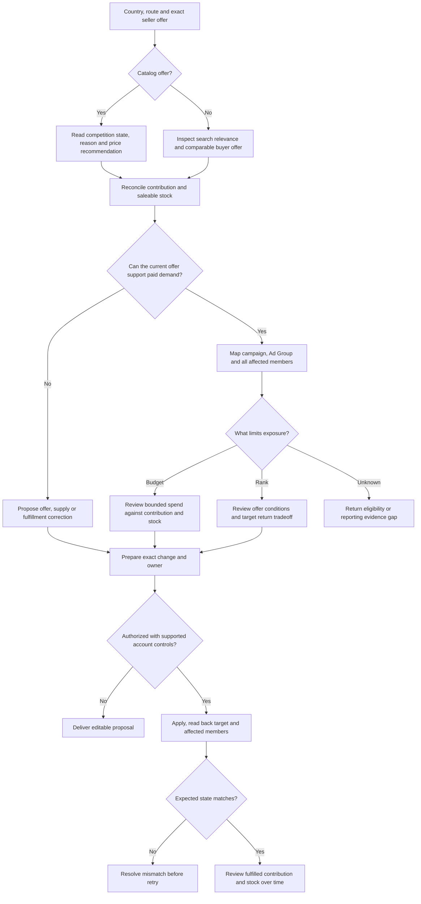

# Mercado Libre operations

Start with the business decision: which country-route-product combination to support, why an offer loses catalog sales, what limits advertising exposure, or which buyer question needs a page or Clip change. Use only the relevant branches; a requested Listing edit does not require a full-store review.

## 1. Choose a viable country, route and offer

Record `site_id`, merchant account, local or cross-border model, available fulfillment route, exact `item_id` and real SKU/variation, objective and observation window. Identify who controls retail price, delivery, stock, promotion funding and advertising. An unavailable route is not a planning option simply because another country's site offers it.

For each requested combination, compare:

- **Demand and competition:** same product/condition, pack size and buyer destination; distinguish public competitor observations from the merchant's actual demand and sales.
- **Buyer offer:** total payable, applicable installments/discounts, available variant and delivery promise. A cheaper accessory is not a comparable offer for the complete product.
- **Seller economics:** settlement basis, commission and seller-funded discounts, product cost, inbound and last-mile costs, storage, returns and advertising. Mark what is already deducted from settlement before calculating contribution.
- **Supply and cash:** sellable stock, inbound arrival, replenishment uncertainty, order obligations and cash tied up until settlement. An available warehouse unit is different from stock in transit or awaiting acceptance.

Decide `test / maintain / revise offer or route / hold` with the reason and owner. For a new combination, specify the question a limited test must answer and its approved loss exposure. For an existing one, compare contribution and fulfillment by the same country, SKU and order cohort—not the whole-store average. Missing costs or route eligibility produce a named gap, not a zero or a guaranteed launch.

## 2. Catalog competition: diagnose the state before chasing a price

First read `catalog_listing`, the associated product identity, and the merchant offer. Shared catalog product information is not necessarily seller-editable; wrong identity requires correction, not copy written to disguise a mismatch. **Non-catalog offers** go to search relevance, offer comparison and buyer-conversion diagnosis; they do not inherit a catalog winner status.

For catalog offers, retain the current competition response or equivalent seller view: `status`, `reason`, `current_price`, `price_to_win`, currency, applicable `boosts`, available winner information and timestamp. Capture destination context when checking the buyer page: winning generally does not guarantee winning for every delivery address.

| Observed state | Business interpretation | Candidate action and retest |
| --- | --- | --- |
| `winning` | The offer currently wins in the reported context, not forever or for every buyer | Protect stock and contribution; examine actual share of visits/sales when available before cutting price again. Recheck after offer or delivery changes |
| `sharing_first_place` | First place is shared; it is not an exclusive win | Compare the applicable offer conditions and observed allocation. Change a controllable condition only if its cost is justified; do not assume a fixed share |
| `competing` | The offer competes but is not currently winning | Compare price and applicable boosts with the winner, then cost the proposed change. Recheck competition state and fulfilled contribution, not only the saved price |
| `listed` | The offer is listed but cannot currently win that catalog competition; it can still be searchable and purchasable | Read the actual reason. Reputation, delivery or trust-related restrictions require their corresponding owner; a blind price cut may not remove the cause |
| Missing or unrecognized | The available evidence does not establish a state | Check the correct site, offer and current supported capability; keep unresolved instead of translating it to “losing” |

`price_to_win` is a competitive recommendation, **not a merchant profit floor or a promise of winning**. A missing recommendation is not a zero price. A boost marked as an opportunity is a possible offer change, not a service the account necessarily qualifies for. Do not prescribe a universal reputation color threshold: use the actual `reason` and current account conditions.

### Synthetic example: the suggested price fails the merchant's floor

All amounts below are fictional USD assumptions, not a platform fee schedule or this user's results. Assume a 10% price-linked fee, product cost 62, fulfillment 12, an explicitly estimated return-loss allowance of 4, and an owner-selected pre-ad contribution floor of 8. These costs have not already been deducted elsewhere.

```text
Current price 100:      100 − 10 − 62 − 12 − 4 = 12
Suggested price 92:      92 − 9.2 − 62 − 12 − 4 = 4.8
Price meeting floor 8:  (62 + 12 + 4 + 8) / (1 − 0.10) = 95.555...
```

With cent pricing in this simplified case, 95.56 meets the modeled floor; 92 does not. Do not auto-accept 92 or claim 95.56 will win. Compare the actual cost of a relevant delivery/offer improvement, retain the profitable offer, or hold that competition strategy. Advertising would require additional contribution headroom. Replace the assumptions with actual settlement, tax treatment, fee rounding and mature returns before using the calculation for a real decision.

## 3. Product Ads: map the object before changing its budget

Use current merchant access or exports to create:

`site → advertiser_id → campaign_id → ad_group_id → group type/key → member items/variants`

Current Product Ads distinguishes `CATALOG`, `FAMILY` and `ITEM` group types. Read the returned `ad_group_external_id` and membership rather than manufacturing IDs: catalog groups use the returned catalog parent grouping, User Products use the family grouping, and traditional items use the item identity. Keep `catalog_product_id`, `family_id`, seller SKU and remote ad group distinct.

When variants are unified under a group, an edit, pause or move can affect more than the selected variant. **Do not recommend isolating a new variant into another campaign until current grouping and controls support that action.** Show all affected members in the proposal, including profitable siblings. A campaign-level budget change additionally affects its other groups. Mature/new or high/low-ticket grouping is an operating choice only within these platform boundaries.

Verify current API version and locally applicable endpoints before execution. Local marketplace and cross-border documentation can use different routes; older item-level examples do not establish that a current account supports that operation. This Skill defines the mapping required; it does not contain a working advertising connector.

### Diagnose the exposure constraint

Read actual `impressions/prints`, clicks, spend, orders/units, attributed revenue, budget and target/actual ACOS or ROAS. Where supported, add `impression_share`, `lost_impression_share_by_budget` and `lost_impression_share_by_ad_rank` **at their returned reporting level**. Preserve original headers, units and date range; confirm whether a field is a fraction or percentage before displaying it. Missing metrics are unknown, not zero; do not spread campaign losses across SKUs without evidence.

| Evidence | Decision and action | Retest |
| --- | --- | --- |
| Material budget-related losses, with supported budget/consumption evidence | If mature contribution, stock and cash can support it, propose a bounded budget increase. If economics fail, fix or narrow the offer/group instead | Recheck exposure losses, actual spend, fulfilled contribution and stock—not just increased clicks |
| Ranking-related losses dominate while budget has room | Inspect catalog/offer conditions, delivery, content relevance and the campaign's actual return target. More budget alone may leave the constraint unchanged | Change one supported constraint, then compare like-for-like exposure, cost and contribution; do not promise a rank gain |
| Both loss types matter | List both constraints; identify the next change with enough supporting evidence and an affordable downside | Keep the other constraint visible instead of attributing the entire result to one variable |
| Little or no exposure, but loss metrics are absent | Check stock, sale/ad eligibility, advertiser ownership, membership and status before inferring weak creative or demand | Restore or verify eligibility first; use a bounded test only where supported. No exposure is not proof the product should be deleted |
| Clicks without mature purchases | Check buyer destination, actual offer and the questions in section 5; incomplete cohorts cannot establish conversion failure | Track the same source, group/items and observation window through purchase and fulfillment |

**Target return is a tradeoff, not a cap.** Where the current campaign exposes `roas_target`, a higher target may trade reach for efficiency; a lower target may increase competitiveness at a lower return. Neither outcome is guaranteed. Cost the change before relaxing a target, and do not change budget and target simultaneously unless the test explicitly measures the combined change. When the account instead exposes ACOS, preserve that definition; convert only with identical attribution, currency and revenue bases. Target ROAS and ACOS are not independent guarantees of profit.

Keep ad-attributed revenue, promoted-item organic revenue and whole-shop revenue separate. ACOS is ad spend divided by the stated ad revenue; TACOS requires an explicitly defined total-sales population. Units are not orders. Reconcile refunds and contribution separately; no metric here proves incremental sales.

**Complete this branch with:** current object map, limiting evidence, one candidate change or wait condition, affected members, budget/loss boundary and a revisit condition based on the account's traffic and order maturity. The owner's known loss limit can require attention before normal observation finishes.

## 4. Full, Flex and direct shipping: allocate stock, not just ad spend

Only compare services actually available to the seller, item and destination. Record the current owner of inbound preparation, storage, dispatch, last-mile delivery, returns and fees. Full and Flex are logistics arrangements; cross-border selling is a merchant/route context, not proof of access to either.

| Available option | Cost and responsibility to establish | Operating decision |
| --- | --- | --- |
| Full | Seller's inbound preparation and replenishment; platform warehouse/dispatch services; actual daily storage, age-related charges, inbound and withdrawal costs; local after-sales terms | Allocate stock to combinations whose expected contribution and turnover cover those costs. Compare keeping slow stock, clearance and withdrawal; never assume “Full” means all costs disappear |
| Flex | Seller's own carrier or contracted delivery, coverage/cutoff/capacity, actual carrier bill and applicable platform payment/subsidy | Offer only deliverable destinations and capacity. Compare subsidy with the real cost; per-sale or basket treatment must follow the current account rather than multiplying a subsidy by every item |
| Cross-border direct shipping | Origin handling, available route/carrier, promised arrival, applicable fees/taxes, settlement and return responsibilities | Compare the landed buyer offer and seller contribution with available local options. Do not transplant a local-store rate or an unsupported warehouse route into the plan |

For replenishment, use observed SKU demand with its stockout/promotion context, available stock, reserved orders, dated inbound units, replenishment lead time and approved buffer. A useful planning calculation is `demand over the lead/review horizon + chosen buffer − usable stock − inbound arriving in time`, floored at zero and capped by purchasing, storage and cash constraints. Define whether demand and stock are net of existing commitments so reserved orders are not counted twice. This is a scenario, not a forecast guarantee; new or heavily promoted products need a wider uncertainty range.

Flag where usable cover ends before replenishment arrives. Limit promotion or propose supply action for that combination; do not treat pending inbound inventory as immediately sellable. Where Full and another service coexist, check the actual displayed-stock and dispatch rule: the service label does not prove that both inventories automatically pool.

For aged stock, compare prospective contribution from continued selling against additional storage/age charges, capital tied up, clearance loss and withdrawal/redeployment cost. Use the country/account's current fee schedule and item age; do not apply a universal number of days or months. Sunk costs and future avoidable costs belong in separate columns. Disposal is a distinct irreversible decision requiring explicit authorization, never an automatic response to poor turnover.

**Retest:** received and saleable units, stockouts, delivery performance, mature refunds, contribution and settlement cash timing. Report the recommendation separately from stock actually accepted by a warehouse.

## 5. Buyer question → Listing or Clip → a measurable check

Use actual product facts, local-language questions, reviews and return reasons to choose the most consequential uncertainty. Reviews identify questions; they do not prove a product claim. Select the smallest suitable change:

- **Compatibility:** verified interface/specification → close-up and connection demonstration → precise supported range in attributes, copy and local subtitles.
- **Size or included contents:** measurement/reference object → real use → labeled pack contents and unambiguous variant name.
- **Delivery or offer:** correct the purchasable option, price/arrival information or fulfillment first; a new Clip cannot fix an unavailable variant.

For non-catalog offers, propose exact field/image changes with old and new values. For catalog offers, distinguish seller-controllable offer fields from shared product information that needs correction through the allowed route. Never invent a duplicate identity to gain control of the content.

A media brief contains exact item/SKU, buyer question, approved references, shot purpose, required product detail, local narration/subtitles and version. Model-assisted storyboarding or editing cannot establish physical performance. If the model changes a connector, quantity, material or unsupported claim, isolate and repair that shot; retain the valid work. Check current Clips eligibility, aspect ratio, disclosure and content restrictions for the target site before production/upload, not a single regional rule applied everywhere.

Measure a changed lead image against comparable impressions/clicks; specification or buying guidance against purchase and relevant return reasons. Keep source, offer/price, content version and dates so simultaneous changes are visible. Without asset-level attribution, report a documented before/after test with confounders, not orders caused by the Clip. A brief is not a generated video; approval/upload is not evidence it improved conversion.

## 6. What the Agent delivers, and what this repository actually runs

Prefer existing authorized exports, ERP/connectors or seller UI. Keep original field names and evidence timestamps, then deliver only the artifacts needed for this task:

1. Country-route-offer comparison with reconciled costs and owners.
2. Catalog state/reason and price-versus-contribution decision.
3. Advertising object map, returned-level exposure diagnosis and scoped action candidates.
4. Replenishment/slow-stock decision or exact Listing/Clip brief where requested.

Each proposed action needs a target, reason, controllable field, expected cost exposure, owner and retest condition. Language-model interpretation is not deterministic financial validation; use traceable arithmetic for money and inventory, and mark unconfirmed assumptions.

The existing [review script](../../scripts/review.py) and [example inputs](../../examples.json) run **offline checks**, including a small Mercado Libre campaign diagnosis. They are not a Mercado Libre connector. Run from the repository root:

```sh
python3 scripts/review.py examples.json --example catalog
python3 scripts/review.py examples.json --example paid
python3 scripts/review.py examples.json --example mercado_ads
python3 scripts/review.py merchant-review.json
```

- `catalog` checks exact-target `before/desired` proposals with supplied evidence and verification flags. It does not query marketplace catalog competition, infer Ad Group membership or verify a merchant's real permissions.
- `paid` checks aligned `scope`, operator `policy` and financial `rows`; map reconciled amounts to `gross_revenue/refunds/cogs/fees/fulfillment/spend/orders`. Avoid subtracting fees/refunds already included in a net settlement twice. Unknown costs stay incomplete. Its ROI is **contribution after advertising / ad spend**, not ACOS; `REVIEW_SCALE` is a candidate for review, not measured lift or a budget change.
- `mercado_ads` accepts **one campaign** using the exact schema in the example. `scope` names site, advertiser, campaign, currency and dates. Normalize that campaign's losses to `metrics.level=campaign` and `unit=percent`, retaining the original report separately; use `null` for missing losses. `groups` supplies the CATALOG parent, FAMILY family or ITEM identity, external key and member items. It checks supplied identity consistency and duplicate members; it cannot discover missing siblings itself.
- In that mode, `checks` are the operator's verified statements about ownership, complete membership, observation maturity, complete costs, acceptable contribution, saleability, stock and actual budget constraint. They are **not calculations or account verification performed by this script**. Establish contribution separately, for example with reconciled `paid` input; do not set a flag to true just to obtain a budget suggestion.
- `policy.material_loss_pct` is the operator's materiality threshold, not a platform default or significance test. `max_extra_spend` is the maximum additional spend for the bounded review window in `scope.currency`, not a new daily budget. The example's 20% and USD 25 are synthetic choices. No losses-to-revenue forecast is made.
- Output includes `group_impacts`, all supplied `campaign_impact_item_ids`, unresolved scope/data issues, `failed_checks` and a review status. Known failed conditions remain visible even when missing metrics set the primary status. Conflicting mappings block changes; `listed` with a reason returns `FIX_CATALOG_REASON` without declaring the offer unpurchasable. Missing losses remain unknown. Material ranking losses return `REVIEW_RANK`; both material losses return `REVIEW_MIXED_LIMITS`. Small losses or a zero cap return `HOLD`. Only material budget losses with the required verified conditions produce `LIMITED_BUDGET_REVIEW` and a cap—not an executed change. Campaign losses are never assigned to individual items.

The mode validates supplied mapping and follows these limited decision rules; it does not retrieve catalog reasons or live membership, calculate `price_to_win` profitability, normalize settlement, model Full fees or replenish inventory. It does not inspect, solve for or edit a campaign's ROAS/ACOS/strategy controls. Those operations still require the verified inputs and explicit work described above. Before claiming a connector or other specialized calculation is implemented, inspect and run that actual implementation with its documented schema.



## 7. Execute within scope and close with evidence

Analysis ends in decisions; content work ends at the requested draft or production stage. Before an authorized change, reread current values, record the minimal before/after change, and confirm all affected members and existing order obligations. Pausing ads, pausing sale availability and deleting a Listing are different actions. This Skill does not authorize permanent deletion.

Use the current supported seller capability for the actual country and merchant model. On permission errors, unclear identity or conflicting fields, stop that write and identify the next owner. On timeout or unknown result, read the existing target and submission status before retrying; do not create replacements to escape uncertainty.

After execution, verify the same site, merchant, item or campaign/Ad Group and its affected members. Check saved values, review status and relevant buyer-visible price, availability and delivery. Separate drafted, submitted, pending, saved and publicly purchasable; an active ad is not proof of delivery or sales.

Complete when every requested target has a decision or verified result, remaining uncertainty, and a relevant retest/owner—not merely a successful batch receipt. Keep private account/customer data out of public examples. Current platform controls, fee schedules and measured business results must be established from the current account rather than assumed from this method.
