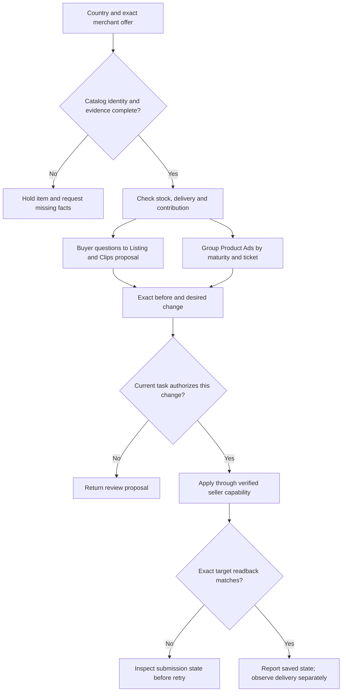

# Mercado Libre operations

Turn the requested store task into a product-specific decision. Check each country and merchant account separately; Brazilian terminology, controls and commercial conditions do not apply across every Latin American site.



## Establish the task and usable evidence

Identify country/site, merchant account, exact item/SKU/variation IDs, requested operation and current capability. Analysis ends in a report; content work ends in a draft; apply changes only when the user's current task authorizes those targets and actions. Do not extend an ad review into listing deletion or account configuration.

Use existing merchant exports, authorized ERP/connectors or the current seller interface. Resolve the identity and requested state with read-only checks first. Record time zone, currency and report dates. For lifecycle actions, inspect current listing/catalog association, outstanding orders, stock and fulfillment. An unavailable permission or unclear catalog identity is a blocker for that item, not permission to create a substitute.

**Complete when:** every in-scope item has an exact target and evidence state, or a named missing input. Preserve a draft path for items that cannot be changed.

## Map fields before interpreting performance

Keep the exported header, your normalized field and its meaning side by side. Portuguese names such as `impressões`, `cliques`, `investimento`, `vendas por publicidade` are discovery hints, not a guaranteed schema. Distinguish product listings (“anúncios”) from advertising campaigns.

| Normalized data | Required distinction |
| --- | --- |
| `item_id`, `variation_id`, `catalog_product_id`, merchant | Catalog product and merchant offer are not interchangeable; a SKU label alone is not a safe remote target |
| stock, replenishment date, fulfillment mode, delivery promise | Availability and an ad's low performance are different diagnoses |
| impressions, clicks, orders, units | Units are not orders; no delivery is not proof of poor conversion |
| spend, ad-attributed revenue, item total revenue, channel total revenue | ACOS uses ad revenue; TACOS uses the stated total-sales population; campaign-member organic sales are not whole-shop organic sales |
| target ACOS/ROAS, actual ACOS/ROAS | A configured target is not a guaranteed spending or return limit |
| costs, refunds, dates, attribution window | Match population, currency and maturity before profit judgments |

Retain missing values as missing. Identify incomplete samples and newer items separately from mature items. Do not use external market estimates as this merchant's revenue.

## Choose only the requested branch

### Listing and lifecycle

- **Prepare/publish:** confirm item facts, category/catalog relationship, variations, price, image rights, stock and delivery. Return an exact before/desired patch and source for each changed factual claim. A new listing needs a live country-specific capability/policy check before publication.
- **Improve conversion:** use real buyer questions to find missing dimensions, compatibility, contents, use or delivery information. Change the relevant image or passage; show what the evidence supports and what remains unknown. Competitive price means a comparable offer, not necessarily the lowest price.
- **Pause/unpublish:** separate unavailable stock, policy/account problems and commercial underperformance. Review open orders; propose the narrowest reversible action. This skill does not authorize permanent deletion. Recover only after the original cause is resolved and the current task permits it.

### Clips and product media

Write a brief around one buying question: what must be shown, which exact product/variant appears, what evidence supports the claim, and how the viewer can choose correctly. Images and Clips should reduce uncertainty, not decorate an unsupported promise. Check current local upload eligibility/format separately; do not assume a universal Clips specification or video-growth formula. Asset generation and upload require their own requested scope and rights.

### Product Ads

1. Check offer readiness and catalog competitive position before raising spend. Treat historical statements about catalog winners as hypotheses to verify in the current seller interface.
2. Separate mature/high-performing items, developing items and new tests. If high and low ticket items consume very different CPCs, consider separate groups. Use the merchant's own behavior, not a fixed universal number of items per campaign.
3. For an item receiving little exposure, inspect eligibility, stock, offer and budget competition. A separate bounded test is a proposal; “no exposure” alone does not justify deleting the product.
4. If budget is not exhausted, more budget may not address the constraint. If it is repeatedly exhausted and matched, mature results meet the merchant's floor, prepare a bounded increase with a check-back condition.
5. If costs exceed the merchant's limits or the product cannot be fulfilled, issue a stop-review with exact IDs. A loss limit can require attention before the normal observation window; do not treat a learning-period story as permission for unlimited loss.

Choose the cost-versus-volume tradeoff for the product's stage and category. Neither a 3%/5% ACOS nor an 8–15-item group is a default rule. Choose limits from product contribution, test purpose and approved loss budget.

## Optional local checks in this repository

When this repository is available, read `examples.json` and the relevant `scripts/review.py` branch before preparing input. From the repository root:

```sh
python3 scripts/review.py examples.json --example catalog
python3 scripts/review.py examples.json --example paid
python3 scripts/review.py /absolute/path/to/merchant-review.json
```

`catalog` input uses `platform`, `market`, `account`, `intent` (`update|publish|unpublish`) and `items`: `sku`, `remote_id`, `before`, `desired`, `source_refs`, plus verified flags `variant_mapping_checked`, `fulfillment_checked`, `account_permission_checked`; unpublish also needs `open_orders_checked`. Populate flags from evidence, not to make validation pass.

`paid` requires `scope`, operator `policy` and `rows` in the exact example schema. Map matched revenue/costs to `gross_revenue`, `refunds`, `cogs`, `fees`, `fulfillment`, `spend`, `orders`; explicitly check population, complete costs, window maturity and sellability. Its ROI is **contribution after advertising / ad spend**, not marketplace ACOS. Preserve marketplace metrics separately. `REVIEW_SCALE` is a review candidate, not incremental lift or an executed budget change. The tool does no API calls, image analysis or publishing.

If the helper is absent, perform the same checks with available spreadsheet/analysis tools; do not imply that the helper verified merchant permissions or data truth.

## Apply and close the task

For authorized changes, record exact before/after values and approved scope. Use a verified existing integration; do not invent API endpoints or scopes. A timeout or uncertain submission requires reading the exact target before retrying, not creating another campaign/listing.

Reopen the same account/site/item or campaign. Check saved values, review/publication status and buyer-visible price, variations, availability and delivery where relevant. Report separately: drafted, submitted, pending review, saved, buyer-visible. An API receipt is not proof of public availability; an ad enabled is not evidence of delivery or sales.

**Complete when:** every requested target is read back or explicitly listed as blocked/pending, with remaining uncertainty and no fabricated result. Return the decision table, relevant artifact and concise source-backed explanation; omit private customer/account data from public output.
