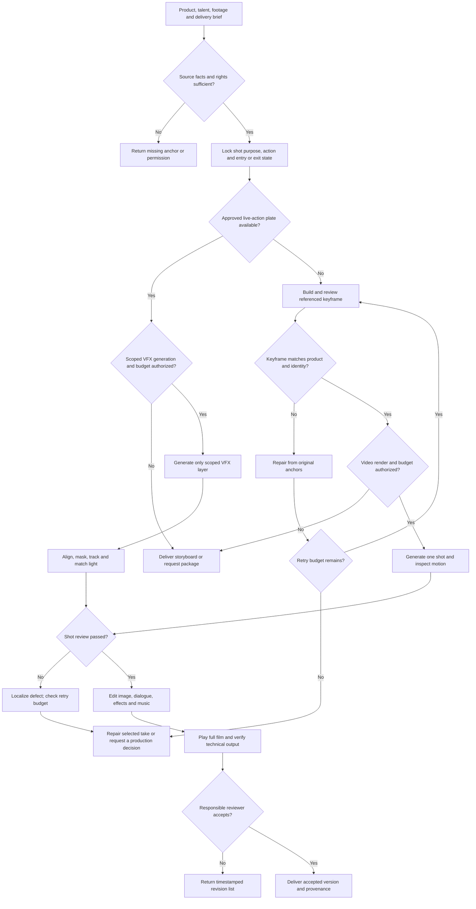

# Multimodal production

让镜头表达明确的内容，并保住真实商品、人物与使用动作。根据已有素材选择「逐镜生成」「实拍加局部合成」「编辑已有视频」，不是每个项目都整段生成。

需要拆解参考片 DNA、选择控制方式、定位像素异常或计算返修依赖时，先读 [算法与实现方法](references/algorithm-method.md)。里面包含切镜/低变化检查、参考角色、单镜控制、质量校准和可运行返修算例；不将人工审核勾选包装成视觉算法。普通脚本/分镜任务仍按下方交付范围执行。

## 1. 确认交付与锁定来源

从用户已经给出的信息确定 SKU、受众、用途、交付类型、时长/比例、语言、目标发布位置、输出目录和允许使用的工具/预算。只缺影响结果的硬输入时询问。

把参考按用途分开：

- **Product**：真实 SKU/变体的形状、色彩、材质、标签、配件、功能与禁止变化项。
- **Talent**：得到授权的人物身份；需要表现用户本人时，读取其选定“记忆形象”，全身镜头同时锁定脸与身材。
- **Interaction**：真实接触、手部姿态、遮挡、尺寸关系和动作。
- **World / previous exit**：场景、光线、相机位置、上一镜的结束状态。
- **Audio**：批准旁白、音乐、现场声和声音授权。

生成的参考可以指导观感，不能覆盖真实商品或身份来源。只凭一张照片不知道的背面、材质成分和隐藏功能保持未知。

完成标准：每个将被生成或修改的对象有来源与作用域，交付范围清楚。请求只到分镜就不消耗视频生成额度。



## 2. 选择最短制作路线

|情形|执行路线|完成合同|
|---|---|---|
|15/30 秒商品创意故事版|环境中有 `jingqiu-DTC` 时完整读取入口及该阶段引用，沿用事实锁、创意角度、五格图与脚本合同。|故事版图片与脚本，不能称作已生成视频。|
|60/90 秒连续品牌片规划|有 `brand-film-product-skill` 时读取入口及 runtime index，沿用一条脚本/18 镜/三张分板；按其协议区分预演与制作级。|默认故事板交付；仅明确要成片才继续编译/提交视频请求。|
|已有好实拍，只改局部|保留原片，截取目标段上下文；定义修改区域、保护区域、接触/阴影/反射以及机位跟踪需求。|局部合成 take 与前后对比，原片可恢复。|
|已有视频要换旁白、拆镜或重排|检查可用编辑器/返修工具的真实功能与默认参数后使用；先做指定片段。|符合要求的编辑版，不改变未授权的比例、原声与素材来源。|
|无可用引擎或权限|继续完成可以执行的事实表、脚本、分镜和请求包。|明确哪些图/视频未生成，不能拿提示词替代成片。|

本仓库不捆绑上述外部 Skill 或视频引擎。先在当前工具/Skill 列表确认存在；不存在就使用当前可用编辑/生图工具完成任务可行部分，不虚构接口或默认安装。

## 3. 固定剧本与每镜任务

1. 从商品和用户目标确定表达顺序；每镜只承担明确任务，如吸引、使用、证明、选择或收尾。不是所有商品都需同样的镜头数或叙事模板。
2. 为每镜记录 `shot_id`、时码/时长、任务、入点状态、主体动作、出点状态、机位/相机动作、产品细节、声音和使用参考。动作要能从上一状态发生，不能靠画面风格掩盖跳变。
3. 沿用已选制作 Skill 的原生 manifest，不另造第二套 run 文件。检查镜头/旁白时长、接触、左右关系与前后依赖。
4. 需要批准创意时给用户实际脚本/分镜；用户已批准的版本锁定。后续返修不自行重选策略。

完成标准：每镜都有用途与可观察动作，交付总时长可实现，真实商品/身份不会被新创意改写。

## 4. 先检查静帧，再生成运动

1. 对照真实来源审查静帧：Logo/标签、结构、部件数量、颜色、人物五官/身材、服装、商品比例与接触。错误静帧退回，不直接投入视频。
2. 将主体动作、相机动作和不可改变项分开写入请求；只给当前镜需要的参考，避免环境图控制商品、人物图进入纯产品镜。
3. 用现有引擎的实际格式提交单镜或已批准批次，记录输入版本、工具、任务 ID、输出路径、成本/额度和错误。没有预算授权时不默认反复抽卡。
4. 连续镜先核对上一真实出口再生成依赖镜。输入、参考或上游出口改变，标记真正受影响的后续镜头，而不是重做整片。
5. 生成返回后实际打开播放并抽查动作转折、头尾与关键商品帧；记录选用 take 和拒绝原因。

完成标准：选中的 take 能完成该镜动作，商品/身份/接触没有已知错误；生成任务成功仅表示收到文件，不表示镜头合格。

## 5. 实拍合成与局部返修

先将问题定位到 `shot_id + take + timecode + region`，附原始参考、当前失败画面和保留内容，再选择：

- **文案/节奏问题**：优先重排、缩短或改旁白，不重生成正确画面。
- **静帧商品/脸错误**：回到真实 Product/Talent 源，修目标区域后重做受影响镜；上采样不能修正事实。
- **动作/机位错误**：简化为一个可观察动作或换合适机位，保留合格部分；只在剩余额度内重试。
- **局部生成层与实拍不贴合**：核对空间/比例、遮罩范围、光影、背景运动跟踪、反射及锐度；尽量保留原主体和背景。遮罩必须覆盖完整动作范围且不吞掉细节。
- **复杂接触始终失败**：提出补拍/真实演示或切镜替代，说明成本与信息损失，等待必要选择。

读取工具说明后再路由 [reframe-ai-video-rebuilder](https://github.com/meowdoone/reframe-ai-video-rebuilder)：当前公开功能是转写/解说重构、换轨、拆镜重排和字幕，不是已验证的局部视觉 inpaint 服务。其 CLI 默认 9:16 裁切、换掉原声；横屏保留原声项目不能直接跑默认命令。元数据修改不作为原创或实拍证明。

完成标准：返修范围、旧版、新版和结果一一对应；受影响前后镜一起检查，未受影响原片不覆盖。失败结果不能进入已验收计数。

## 6. 声音与剪辑

1. 按批准脚本准备对白/旁白，分别记录现场声、音效与音乐使用权。合成声音需要相应授权，不推断“有样本即可克隆”。
2. 先完成可读的粗剪：实际打开时间线和视频，检查动作是否连贯、商品信息是否来得及看、关键句是否被截断。
3. 音轨分开处理，检查旁白可懂、音效对应动作、音乐不过度遮盖信息。自动静音/峰值标记只定位候选问题，不能代替试听。
4. 色调、颗粒与锐度为同一观感服务，不能靠重滤镜隐藏商品变色或人脸漂移；保持用户要求的真实纹理。
5. 输出前核对比例、尺寸、帧率、时长、字幕安全区、音轨与编码，采用用户/目标平台规格，不默认固定 24/30fps 或模型套餐。

完成标准：可播放的剪辑文件与脚本一致，关键声音和商品信息被实际检查；没有声音或缩水时长要明确报告，不能作为自动降级成功。

## 7. 技术审核与人的验收分开

先记录实际观察。仓库的 `scripts/review.py` 不是视觉模型：它只能整理审核者输入的结果。新工具 `scripts/multimodal.py inspect` 会实际解码画面、定位场景变化和低变化候选；`plan` 按输入中已确认的渲染引用图计算待复查范围与一次尝试预算。执行合同、参数及合成算例见 [算法与实现方法，第 6 节](references/algorithm-method.md#6-可以直接运行的两项实现)。它们不识别人脸/SKU，不调用生成模型，也不替代逐镜播放。

以 `examples.json` 的 `shots` 为格式，每镜填 `shot_id/product_ref/character_ref/take/reviewer/timecode` 和 `product_matches/identity_matches/motion_ok/audio_ok/rights_ok`。无人物可填 `character_ref: none`，并在工作记录说明身份项不适用。未知项保持待审，不伪填 `true`；完成真实审核后再提交给脚本。

从仓库根运行：

```bash
python3 scripts/review.py path/to/shot-review.json
```

`REPAIR` 返回具体失败项；`READY_FOR_EDIT` 只表示上述审核项通过，不能宣称算法识别人脸一致，也不能称最终成片通过。

最终验收：

1. 用可用媒体检查工具核对文件可解码、时长、分辨率、音轨；用实际播放器从头看到尾。
2. 核对关键商品镜、人物镜、动作转折、字幕与音轨；检查全部被改镜头和前后接点。
3. 分开报告「技术格式通过」「镜头审核通过」「用户/负责人最终接受」。没有用户最终接受时只交待审成片，不自称已获认可。
4. 给实际文件链接/预览、版本、已知问题与必要制作说明；只要脚本/故事版的任务，不额外交一堆内部 JSON。

当前视频模型能力按实际工具文档验证；制作耗时与生成成功率以本项目记录为准，不作为预先保证。
