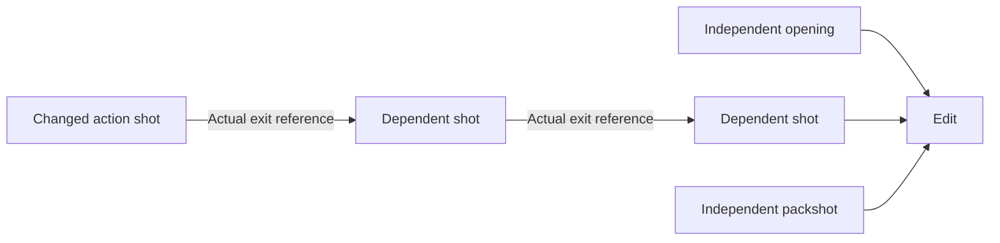

# Multimodal: decomposition, constraints and scoped repairs

用于参考片拆解、商品/身份一致性、生成路线选择和失败定位。这里的算法是媒体分析与制作编排，不是声称训练了视频基础模型。公开实现与需要另接的视觉模型分开。

## 1. 从参考片提取什么

先判定来源用于直接复刻、授权改编还是风格参考。把时间结构和商品事实分开：可以借鉴“问题出现 → 演示 → 证据 → 选择”的信息顺序，不能自动继承人物身份、Logo、商品性能、销量或原作者权利。

1. **时间定位**：先解码，产生场景变化候选；在候选前后和每镜动作转折查看原始帧。快摇、闪光和转场也会产生差异，不能把每个峰值当成切镜。慢溶解可能不越阈值。
2. **声音和文字**：ASR 输出带时码语句，OCR 读取字幕/界面/包装上的可见文字；再人工校对专名、数字与单位。将每条观察绑定到原片时码，不把语音识别的猜测写成商品事实。
3. **镜头任务**：每镜标出 `hook / demonstration / proof / objection / offer` 中实际承担的任务，可以不使用全部类别。记录商品首次出现时间、证明出现时间、停留时长、动作、机位和剪切点。
4. **DNA 保留/替换**：保留节奏或证明形式；用当前 SKU 重新设计能被证据支持的动作。先有被核实的商品事实，再写新的场景。高播放量不是已经知道“爆款原因”。

示例：参考镜用“开盖 → 倒出 → 展示结果”。新 SKU 是不开盖的设备，就不继承开盖动作；可以保留“操作 → 可见变化 → 检查结果”的信息结构。是否能承诺结果，由当前产品证据决定。

工具路线：FFmpeg 先定位候选；机位运动误报很多时可另接 PySceneDetect 的 AdaptiveDetector；ASR/OCR/VLM 负责语义观察。当前仓库只有 FFmpeg 候选检查，未捆绑后面三个模型。

## 2. 参考图为什么要分角色

每个输入记录来源版本或哈希、允许控制的对象、当前镜使用的区域。Product 控制外形/标识/结构，Talent 控制指定人物，Interaction 控制接触与尺度，World 控制环境；上一镜真实出口控制声明的连续性。不要把包含人物的商品广告图同时当成身份、商品和场景的全能参考。

|问题|技术选择|不能据此保证|
|---|---|---|
|商品结构漂移|核对 SKU 多视角事实；分离商品 ROI；用批准关键帧做 image-to-video。需要文字清晰时用真实标签合成。|同 seed 或同提示词不能保证同一个 SKU。|
|人物忽然变脸/变身材|使用已批准身份参考；全身镜必须另有身材/比例来源；不同角度分别比对。|脸部相似度高不代表身材、服装、年龄感或自然度正确。|
|动作与商品接触错误|保留真实演示，或限制为可观察的简单动作；姿态/深度控制仅在后端支持时使用。|骨架正确不代表手指、接触力和物理功能正确。|
|需要局部替换|标注目标与保护区域，视频分割/跟踪传播遮罩，遮挡后人工修正，再做边缘、阴影与反射匹配。|SAM 2 提供分割/传播，不是自动生成新商品或自动补真实阴影。|
|UI、数字、商标文字要准确|保留原始像素并确定性合成；画面中的私人数据另处理。|生成式重绘后不能只凭“看起来像”通过。|

本地品牌片工具已有源哈希绑定、参考角色和连续性状态管理；这些是输入合同，不等于模型已经按合同画对。公开小工具不携带用户身份文件、模型权重或本地完整制作环境。

## 3. 单镜生成的参数到底怎么定

先选制作路线，再核对当前后端真实支持的参数：文本生成、首帧引导、首尾帧引导、多参考或编辑。首尾帧、姿态、深度、seed 与视频编辑不是每个模型都有，不使用统一伪接口。一个 request 至少留存后端/版本、参考版本、时长/比例、动作、相机动作、禁止变化项与返回任务 ID。

- 文字生成适合没有指定真实身份/商品细节的探索镜；指定 SKU 时优先批准静帧或真实素材。
- 首帧控制初始外观，不保证中段接触和结尾正确。首尾帧控制也不保证插值动作在物理上成立。
- 连续动作镜依赖上一镜实际输出的出口状态；无这种依赖的环境镜、产品静物镜可以在预算内并行。
- 一个失败先归因到事实、参考、静帧、动作、相机或剪辑；不要一次改六个参数后宣称找到了原因。
- 请求状态不明时先查原任务，不能盲重试增加费用；已授权生成也不等于允许无限重抽。

## 4. 质量不能压成一个漂亮分数

先做硬项：SKU/Logo/关键文字、人物身份、产品功能与权利。任一关键项不合格，审美再高也不能抵消。再看动作、时间连续性、光影与声音，最后才比较风格偏好。

可接的测量方法（**当前公开脚本未实现这些模型**）：

- **主体特征相似度**：分割/裁剪主体，再算参考与候选特征的余弦相似度 `dot(a,b)/(norm(a)*norm(b))`；保留视角、遮挡和裁剪条件。它只是复查排序线索，不能识别 Logo 拼错或保证真人身份。
- **时间一致性**：只在同一镜内，用光流对齐相邻帧，对非遮挡区域看残差；切镜、反射变化与真实动作不能套同一阈值。对齐失败也要作为未知，而不是直接判闪烁。
- **文字/结构**：OCR 文本比对已批准字段；部件数和接触关系分别审查。OCR 在低清、弯曲包装和运动模糊时可能漏检，必须回原帧。
- **动作**：静止片可能主体相似度很高，却根本没完成演示；要核实入点、动作转折、出点。VBench 的多维评价可作测量参考，但不能代替精确 SKU、品牌或人物验收。

校准：用本项目已接受和已拒绝的片段标注错误类型，留独立验证片；以漏过关键商品错误为主要风险，检查误放行与误拒绝。阈值按品类/视角/任务建立，不写“相似度 0.8 即通过”。样本不足时保留人工检查。

## 5. 返修范围计算：依赖不是播放顺序

先定位 `shot + take + timecode + region + failed_check`。文字或配音错，先改文字/音轨；镜内局部问题可修且工具支持时局部处理；整镜动作不可用才重做该镜。

用有向无环图表达真正被消费的渲染参考：S3 用 S2 的出口，S4 用 S3 的出口，S5 是独立产品静物镜。S2 变了，待复查集合为 `{S2,S3,S4}`；S1/S5 不因本次改动失效。S3/S4 先检查引用是否受影响，不是必须付费重生成。相邻剪辑点、字幕和总时长另外复查，不自动算成模型重做任务。



先定每镜剩余尝试次数、同一单位的单次成本估算与总剩余额度。按拓扑顺序求依赖闭包，成本超限或有耗尽镜头就返回制作决策；不以“多抽总能成功”作方案。金额以十进制数相加和比较，避免 0.1 × 3 与 0.3 的浮点边界误判。估算是假定全部受影响镜各重试一次的情景估算，不是最终报价。

## 6. 可以直接运行的两项实现

从仓库根目录运行；`plan` 仅需 Python，`inspect` 还需系统现有 FFmpeg（含 scdet/freezedetect/metadata/scale）。不会自动安装模型或调用云端，也不会修改原片。

```bash
python3 scripts/multimodal.py inspect /absolute/path/video.mp4 --seconds 60 --scene-threshold 10 --freeze-seconds 1
python3 scripts/multimodal.py plan /absolute/path/repair.json
python3 -m unittest discover -s tests -v
```

**inspect** 实际解码第一路视频并在最多 640px 宽、原时间采样下，记录切镜候选与低变化区间。默认只扫描开头 60 秒，最大 600 秒，时间戳相对首帧；所有参数进入结果。`scdet` 使用帧差相关的场景变化统计；`freezedetect` 根据平均绝对差与噪声容差判断低变化。检测阈值只是可调参数。慢镜、静物、停格与黑场可能是创意，快速机位运动和闪光可能误报；零候选不证明没有错误。结束值 `null` 表示在本次扫描内没观察到区间结束，不能填成完整片长。最后一帧时码不是媒体总时长。代码不分析音轨、脸、SKU 或语义。

**plan** 输入示例（合成，不是本人项目花费）：

```json
{
  "changed": ["S2"],
  "budget_remaining": 6,
  "shots": [
    {"id": "S1", "depends_on": [], "cost_per_attempt": 2, "attempts_remaining": 1},
    {"id": "S2", "depends_on": [], "cost_per_attempt": 2, "attempts_remaining": 1},
    {"id": "S3", "depends_on": ["S2"], "cost_per_attempt": 2, "attempts_remaining": 1},
    {"id": "S4", "depends_on": ["S3"], "cost_per_attempt": 2, "attempts_remaining": 1},
    {"id": "S5", "depends_on": [], "cost_per_attempt": 2, "attempts_remaining": 1}
  ]
}
```

返回 `recheck_or_rebuild: [S2,S3,S4]`、`unaffected_by_declared_changes: [S1,S5]`、单次估算 `6`；状态 `READY_FOR_REVIEW`，**不是已获生成批准**。预算改为 5 或其中一镜没有剩余尝试，状态为 `NEEDS_PRODUCTION_DECISION`。依赖环、未知镜头、重复 ID、非法成本会报错。上游事实变化先由 Agent 映射到 changed；代码不自动读懂商品变化。

## 7. 机制出处与实现范围

- [FFmpeg scdet / freezedetect](https://ffmpeg.org/ffmpeg-filters.html#scdet)：本仓库 inspect 实际调用的媒体过滤器，不是原创视觉模型。
- [PySceneDetect detectors](https://www.scenedetect.com/docs/latest/api/detectors.html)：运动误报较多时的可选拆镜方案，未接入。
- [SAM 2](https://github.com/facebookresearch/sam2)：可选视频分割与遮罩传播，未捆绑/未调用，不是自动 inpaint。
- [VBench](https://github.com/Vchitect/VBench)：可选多维视频评价参考，未运行；分数不代表广告销量或精确 SKU 合格。

这些链接用于核对具体技术边界，不是学习视频列表。本人方法是把素材事实、镜头控制、后端选择和返修范围接起来；第三方算法保留来源。
