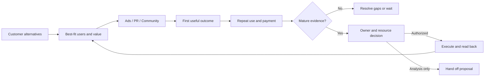

# North America user growth

先确定用户想完成什么和增长阻塞，后选工具。不要从“开多少渠道”开始，也不要把本 Skill 当作用户历史业绩证明。



## 1. 最小输入

确认产品、目标国家/语言、用户还是团队为统计单位、阶段目标、预算/人员、允许接触的数据和本次允许动作。用户只要分析时，不触达用户、不发 PR、不修改账户。没有访谈/行为资料先给最小研究任务，不生成虚构画像。

按需要查看 [付费获客](../paid-acquisition/SKILL.md) 或 [GEO](../geo-distribution/SKILL.md)，不把两者合并成同一个结果指标。

## 2. 根据证据选瓶颈

|观察|先核什么|交付给谁|
|---|---|---|
|点击/销售对话中反复解释不清|客户原先如何解决问题；产品差异是否是客户关心的价值；承诺是否一致|定位材料：替代办法、区别、证据、适合谁、为什么现在换；产品/营销/销售共同确认|
|注册多，首次任务少|来源是否匹配、移动/桌面、权限、素材输入、任务步骤、错误日志|产品与设计：一个可复现阻塞、截图/日志、复测步骤；内容：对应上手材料|
|做成一次，不再用|自然使用频率、任务价值、结果质量、再次使用理由；不强行所有产品 D7|社区/产品：按已授权反馈分组的问题与下一次有价值的操作|
|活跃却不付费|个人/团队/采购者是否同一个人、计费与价值单位、试用限制、支付失败|商业化/销售：自助或辅助成交路径；不默认砍免费功能|
|新增合同增加但活跃基础下降|大客户拓展是否挤占原有用户上手与留存资源|增长负责人：两条路径各自负责人、投入和结果，避免只保留大合同 KPI|

不同问题不同处理，不因一个汇总转化率就宣布某渠道无效。模型提出解释，数据与用户证据决定是否成立。

## 3. 分配具体工作

- 广告：人群—承诺—素材—入口—事件—预算，交付一张可执行测试卡。
- PR：从批准事实挑选媒体相关议题，交付事实包、采访提纲和名单理由；发信前确认对象、文本和授权。报道数量与收入分开记录。
- 社区：按未开始、已完成、重复使用、付费、共创分组，交付答疑/共创/回访草稿；不要无同意群发或假扮客户。
- 产品/技术/设计：每项任务包含重现步骤、目标体验、验收事件、负责人和截止点；已有明确错误先修复，不为了证明“提升”强做 A/B。
- 数据：维护事件定义、单位、时间、币种、去重键与来源；给成熟窗口结果，不用生成式模型算账。

每项只设一个负责人，可设协作者。记录交付物、依赖、截止、验收、当前阻塞。用户未授权真实分配任务时只生成建议，不替他联系同事。

## 4. 用本地工具核算

从已授权事件/CRM 导出汇总，不上传个人轨迹、邮箱或私人聊天。先自行按业务字典聚合，保留数据来源与查询条件；本工具不是数据库连接器。

在仓库根目录运行：

```bash
python3 scripts/review.py examples.json --example cohorts
python3 scripts/review.py /absolute/path/to/approved-cohorts.json
```

JSON `kind=cohorts`，字段见 [完整示例](../../examples.json)。`horizon_days` 是这次批准的观察期；`cohort_end` 是分组最后进入日期。`eligible` 为三个率共同分母，`retained` 不意味着一定是 `activated` 的子集，必须在定义中解释。用户与团队不能合并相加，来源重叠不能去重后再猜归属。

输出 WAIT_FOR_WINDOW 时只报告已发生事件与等待日期，不计算最终留存/付费率。人数大于分母、重复 cohort、缺少定义等要退回修正。达到比例不证明因果，需要因果判断时再设计具有足够观察能力的实验。

## 5. 复盘与停止条件

给出：目标 → 事实 → 主要瓶颈 → 本周任务与负责人 → 成本边界 → 验收 → 下次检查时间。把已知事实、本次假设、已完成动作分别标明。对外文案用业务语言；保留必要字段，不堆叠 Agent 术语。

数据不齐输出缺口；发生归因/事件冲突先对账；请求超出权限停止写入。没有真实用户数据时交付研究和可运行示例，不能声称已提高激活/留存。最终检查每个动作对应一个具体问题，每个结果有可回查数据。
