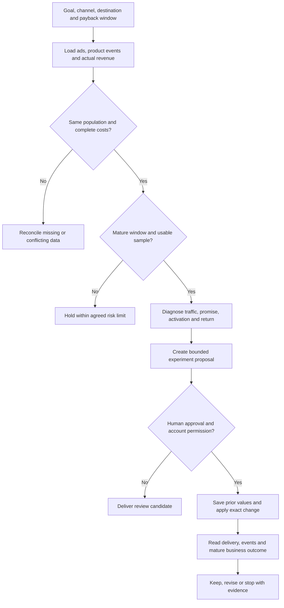

# 付费获客

先确定这次要盈利扩量、降低浪费、修复漏斗，还是花限定预算学习。平台名字不能替代用户路径；按实际入口与最终业务结果工作。

## 最小任务合同

读取：业务类型、渠道/国家/系统、账号、当前转化目标、用户路径、观察期、预算/亏损上限、回收期、请求动作和权限。SaaS 区分自助订阅与销售线索；App 区分安装、首次打开、试用、付款和续订。

未知预算不替用户设定；不能访问账户时接受导出，返回建议。写报告不隐含改出价、预算、事件或支付配置的授权。

## 获取和映射资料

| 数据面 | 工具或来源 | 保留字段 |
| --- | --- | --- |
| Meta | 获授权 Ads 报表或现有连接器 | campaign/adset/ad、placement、creative version、spend、impressions、clicks、result event、attribution window |
| Google 搜索 | Ads 搜索词/关键词、计划、地域和落地页报告 | search term≠keyword，match type、campaign/ad group、cost、conversions、value、impression share、budget/rank loss（如可用） |
| Web | 当前分析系统、订单/退款或 CRM | landing URL/version、event definition、transaction/lead ID、qualified stage、actual revenue、currency |
| App | Apple/Google 商店数据、已接入 SDK/MMP、产品分析及支付系统 | country、OS、app version、media/campaign、attribution type/window、install/first open、activation、trial、paid、renewal、refund |
| 成本 | 账单/订单、商品或服务成本表 | 同群体的实收、退款、平台/支付费、履约或可变服务成本、广告花费 |

字段以当前可读报告为准；没有用户级关联不凭空拼接。外部市场/竞品估算单列，只用于假设。MMP 与平台自归因不一定一致，也不恢复被隐私规则限制的完整轨迹。

检查日期、时区、币种、事件定义、归因窗、延迟、去重与群体。别将同一个订单在 Meta、Google、自有订单三次相加。缺项记未知，不能填零。

## 按渠道决定诊断顺序

### Google 搜索 → Web

先核搜索词与业务可服务范围，再检查广告承诺、页面和有效订单/合格线索。点击高而无合格结果，先排查泛意图、错误地区、表单垃圾或页面问题。

回收达标但搜索覆盖低时，区分预算、排名、资格和目标限制；仅预算限制才适合预算候选。若某地域/商品已有成熟好结果但花费少，可提出隔离测试；不能把一次偶然成交当潜力市场。保留有效旧计划，避免重建导致比较失效。

### Meta → Web

按问题认知、使用场景、商品证明、差异和报价给创意分组。已有客优惠能转化，不等于新客理解产品。创意衰退先同时检查追踪、价格、供给、页面和频次，再考虑信息是否只适合熟悉产品的人。

高 CTR、低 CPC、长观看不等于盈利。将创意版本连接到页面、实际合格行为、退款与成本。新素材先测试实质概念，再细改开头/镜头/字幕；没有对照不声称某画面造成增量。

### 搜索或社交 → App

先核 `广告 → 商店页/合格深链 → 安装或首次打开 → 首次价值 → 试用 → 付费 → 续订`。所有分母和事件要明确；安装并不等于首次打开，试用不等于付款。

Apple 搜索按词意图与商店页面匹配；展示型位置独立分析，不用搜索词的即时回收标准强套。Google App 与 Meta App 按当前可用目标、SDK/MMP 和系统配置读数据；先验证目标事件与付费相关，再考虑事件优化。

安装/试用增加但成熟用户付费没有增加：检查来源质量、上手阻力、付费墙和试用结束，不马上扩量。不同国家、系统、版本和加入时间的批次分开；太新不能判流失。

### Web → App / SaaS

根据入口决定承接：主动品牌搜索、问题搜索、社交演示不必走同一页。网页付款到 App 激活、团队开通或核心工作完成之间要单独追踪。

自助 SaaS 看首次价值、付费与留存；销售驱动业务看合格线索→机会→成交及销售周期。页面保存、演示预约或试用注册不能直接记收入。Web 支付取舍要同时核费用、付款信任、转化、退款和后续使用，不承诺降低费率就更赚钱。

## 判断与行动边界

| 条件 | 状态 / 交付 |
| --- | --- |
| 口径/群体不匹配、成本缺失、追踪断流 | RECONCILE：列出无法比较的字段与修复责任 |
| 观察窗口未成熟或数据稀疏 | HOLD：说明何时重新看、要补什么；达到预算/损失硬上限仍可停止复核 |
| 商品/页面不可用、超出已定风险边界 | REVIEW_STOP：明确目标和原因，实际暂停仍需授权 |
| 成熟匹配结果低于业务底线 | REVIEW_CHANGE：在流量、创意、承接、激活和回收中提出可检验解释 |
| 达到所定回收且有可承接空间 | REVIEW_SCALE：限定对象和增量预算候选，不保证加钱仍达标 |

不固化所有账户通用的最少转化数、加预算百分比或观察天数。平台花费最多的素材只是分配结果，非统计赢家。整体经营趋势与平台明细并行：自然流量可能掩盖付费亏损；同时变化的渠道、价格、版本和季节要记入干扰项。

## 使用已有离线脚本

从仓库根目录运行：

```sh
python3 scripts/review.py examples.json --example paid
python3 scripts/review.py examples.json --example cohorts
```

真实任务先读取 examples.json 和 scripts/review.py 的当前合同，再将已核资料映射成输入：

- `scope`：account/market/currency/start/end/revenue_basis/attribution_window。
- `policy`：min_orders/max_spend/loss_limit/min_contribution_roi，均由运营者按业务明确，不当作显著性门槛。
- 每个 row：entity_id、同窗口字段、population_matched/costs_complete/window_mature/sellable、gross_revenue/refunds/cogs/fees/fulfillment/spend/orders。费用按约定计入且不重复扣。SaaS 的 COGS 可映射实际可变服务成本，缺乏成本证据不能填 0 过关。
- `cohorts`：as_of/horizon_days、activation_definition/retention_definition，及 cohort_id/cohort_end/source/unit/eligible/activated/retained/paid。脚本三率都用 eligible，不是逐层漏斗转化率；结果可以重叠，禁止相加。

脚本只算匹配数据的广告后贡献与固定窗口 cohort；不会抓报表、读创意、做统计显著性/因果估计、预测 LTV、执行账户改动或检查真实身份。证据标志由已核资料决定，不是模型猜测。

## 交付一张能执行的实验卡

写明：问题及证据、竞争解释、测试对象、主改动、成功结果与分母、预算/亏损边界、观察窗、干扰因素、批准人、当前值和回退办法。明确是观察对比还是有对照实验。

批准写入后，只用已获授权工具改准确对象，留原值和返回 ID；再读状态、真实投放与事件回流。保存配置、开始消耗、收到事件和形成成熟收入是四个状态，不合并成“跑通”。

身份/权限不符、目标 ID 改变、报表截断、提交结果不确定时停止相关写入。超时先查已存在对象与当前值，不复制计划或盲重试扣费动作。



## 方法来源

搜索预算与细分诊断、信息与用户认知匹配、App 订阅和整体经营分别核查。B2B SaaS CRM 链路是待按具体业务验证的执行方案，不代表已在真实账户跑通。
