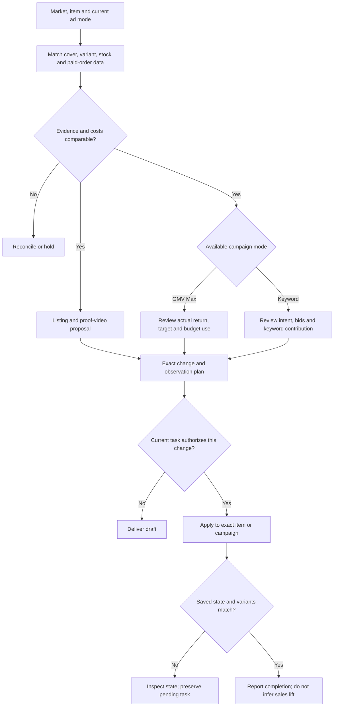

# Shopee operations

Begin with what the merchant needs: a correct offer, a product to test, a specific content improvement, or a spending decision. The source research is Brazilian; check the selected country and account rather than applying Brazilian fees, budgets or interface controls worldwide.



## Establish scope and current mode

Resolve market, account, exact item/model/SKU identities, language, currency, current listing state and requested action. Use the merchant's existing exports, ERP/connector or seller interface. Record report dates and attribution definitions. Analysis or a draft does not authorize publication, budget changes or account setup.

Read current available advertising modes. Caue Oliveira's 2024 product-search keyword workflow and Vitor Miranda's 2025 GMV Max workflow are not one combined interface. Route to the actual mode; an unsupported control is a blocked operation, not something to emulate through another account.

**Complete when:** each requested target and its available operation is identified, or missing evidence is listed. Research/current-policy checks are scoped to the selected country and task.

## Normalize inputs without losing meaning

| Source evidence | Mapping and check |
| --- | --- |
| Seller item/model identifiers and SKU | Preserve item vs variation granularity; confirm the variant shown by the cover can actually be bought |
| Listing images/title/price/options | Compare the promise in search results with the purchasable item, contents and final price; avoid cheap accessory variants standing in for the main item |
| Product performance export | Keep original columns and denominator; paid orders, units, visitors, clicks and page views are different fields |
| Ads export | Preserve mode, campaign/product ID, dates, spend, clicks, impressions, attributed orders/revenue and target vs actual ROAS |
| Stock/delivery | Include the main advertised variants and replenishment, not only total stock across variants |
| Cost and offer terms | Use current merchant fees, cost of goods, shipping, discounts, refunds and other variable costs; a video example is not a current fee schedule |

Portuguese terms like `taxa de conversão de pedido pago`, `investimento`, `GMV`, `ROAS alvo` help locate columns but do not define their denominator. Confirm export definitions before mapping. External extension estimates and platform forecasts remain separate from merchant results.

## Run the relevant operating branch

### Listing, variants and lifecycle

- When impressions fail to become clicks, inspect cover clarity, search intent, price and delivery. State one primary hypothesis and an exact image/text change, rather than changing title, cover and price simultaneously.
- When clicks fail to become paid orders, check dimensions, voltage/compatibility, contents, real product evidence, available variations, shipping and checkout offer. A high CTR produced by a misleading low price or image is not a win.
- Before publish/update, create a fact-backed before/desired diff for the exact item/model. Resolve category, supported variants and current country requirements. Unclear product evidence stays in draft.
- For unpublish, check open orders and variant scope. Keep stock failure separate from poor advertising. Use a reversible pause when requested; permanent deletion is outside this skill's implied authority. For recovery, verify the original issue is fixed before proposing reactivation.

### Product video

Create a brief that answers a real buying objection using the exact SKU: question, proof shot, key detail, supported statement and desired product-page location. Check every depicted option against current inventory. The evidence supports video as purchase clarification, not a guaranteed Shopee Video/affiliate growth system. Verify country/account video upload capability and format before making files or publishing. Use approved footage/product facts; unsupported performance claims stay out of the brief.

### Product selection and advertising

1. Prefer comparable complete observation windows. Use paid-order conversion to find candidates, then check stock and contribution. A tiny-sample high rate is a test candidate, not a scale decision.
2. In **GMV Max**, keep forecast, target and actual ROAS separate. A high target may constrain delivery; a lower target may permit spend but reduce contribution. Assess current performance and the merchant's objective before adjusting it.
3. If actual economics meet requirements and budget is repeatedly used, propose a bounded increase only if fulfillment can support more orders. If budget is not used, inspect offer and target constraints before proposing a budget change.
4. If contribution is the objective, evaluate higher return targets or product/price changes and state the potential volume tradeoff. Advertising decisions and pricing decisions require their respective requested scope.
5. In an available **keyword mode**, keep terms tied to the actual product and user intent; reject irrelevant auto-suggestions. Review comparable keyword cost and contribution. Historical 2% CTR, seven days and cent-level bid increments are context, not universal defaults.
6. Respect the operator's spend/loss limits even while the normal observation window is immature. Output `hold`, `reconcile`, `change review` or `stop review` with a reason; do not call a campaign profitable from ROAS alone.

**Complete when:** each in-scope product has a specific action or a reason to wait, tied to current mode, evidence, stock, economics and an observation condition.

## Optional repository tools

If working in this repository, read the relevant schema in `examples.json` and `scripts/review.py`, then run from its root:

```sh
python3 scripts/review.py examples.json --example catalog
python3 scripts/review.py examples.json --example paid
python3 scripts/review.py /absolute/path/to/merchant-review.json
```

For `catalog`, set real `platform`, `market`, `account`, permitted `intent`, and per-item `sku`, `remote_id`, `before`, `desired`, `source_refs`. The checked flags must represent actual variant, fulfillment and permission checks; `unpublish` additionally needs an open-order check.

For `paid`, map matched dates/currency/revenue basis/attribution in `scope` and each row. Fill actual `gross_revenue`, `refunds`, `cogs`, `fees`, `fulfillment`, `spend`, `orders`; set evidence flags `population_matched`, `costs_complete`, `window_mature`, `sellable`. Operator policy chooses `min_orders`, `max_spend`, `loss_limit`, `min_contribution_roi`; these are business limits, not significance thresholds. The calculated ROI is contribution after ads divided by spend, **not** GMV Max target ROAS. The helper checks supplied facts and returns proposals only; it neither validates platform access nor changes an account.

If the helper is unavailable, use existing analysis tools with these same distinctions. Never insert fake values or true flags just to obtain a favorable status.

## Execution and failure handling

Apply only the user's authorized changes to resolved item/campaign IDs through a verified integration or current seller UI. On unknown submission state, read the target before retrying. For permissions, challenge, missing fields or unavailable country functionality, preserve a draft and report the exact blocker.

After a write, reopen the same market/account and verify saved values, review status, relevant variant prices/stock, and buyer-visible state. For ads, distinguish saved configuration, enabled state, actual delivery and matched paid orders. No step implies the next.

**Complete when:** every requested item is read back or explicitly pending/blocked. Deliver the final state, changes and remaining observation needs. Do not claim sales or return improvements until the relevant actual results exist.

## Practitioner basis

- [Caue Oliveira, Shopee Ads, 2024-01-09](https://www.youtube.com/watch?v=ECli2Z1iulA): full subtitle reading; intent-specific keywords, bounded tests and contribution costs.
- [Vitor Miranda, updated Shopee Ads guide, 2025](https://www.youtube.com/watch?v=3UEIV-o4FF4): full subtitle reading; cover/promise, paid-order export, stock/contribution, GMV Max volume versus margin. Country and interface are historical context.
- For provenance, limitations or method changes in this repository, read [the evidence note](../../research/expert-mercado-shopee-2026-09-08.md). No source performance claim is the user's own achievement.
