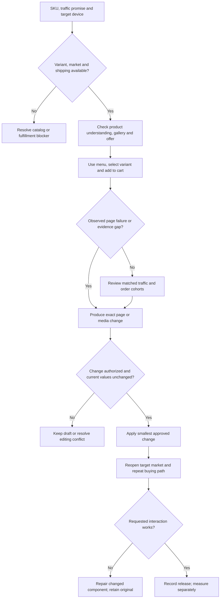

# Shopify operations

以购买路径中的具体问题为入口：目标用户是否能买、能理解、能选择并完成下一步。先诊断业务，再决定是否需要改页面、导入数据或写代码。

## 1. 锁定范围

记录商店、市场/语言、SKU 与变体、入口页面、问题、允许动作和交付。选择「建站/改版」「上下架」「商品页面」「商品媒体」「广告承接」之一；用户只要诊断就不改线上。明确的已有授权不重复询问。

若用户要下单，转到订单任务。**建站/整站改版、Figma 落地或抽取建站方法时，必须先完整读取本 Skill 自带的 [建站方法](references/storefront-design.md)**，按品牌目标 → 定位/竞品/购买路径 → 页面/交互/数据 → 实现/验收执行；这是公开、独立可用的分支，不需要私有本地 Skill。环境中若另有 `dtc-storefront-design` 或 `jingqiu-shopify-design-method`，可在确有需要时读取作更细的工具适配，仍以本次权威设计为准。

完成标准：目标对象与操作范围唯一。不要扩成全店优化或安装一组插件。

## 2. 取得真实资料

按本次分支读取：

- 商品：商品/变体 ID、当前字段、状态、渠道和市场可见性、库存、配送/退换，以及拟改动。
- 页面：目标设备、进入页面前的广告/搜索承诺、商品事实、用户疑问、当前页面与已批准设计。
- 媒体：原商品图、套装/规格、演示素材、人物/音乐授权和实际文件。
- 广告承接：匹配的来源、设备、落地页、事件、订单/退款、折扣、成本与观察窗口。

可先用当前授权后台、商品 CSV、库存资料、订单导出和浏览器完成。商品 CSV 不含图片本体，多地点库存应单独核对；保留商品/变体/图片行关系，不能直接排序后导入。

若需要 API，使用当前环境的 Shopify 专用能力，按所需权限读取；实际编写 Admin GraphQL 时先读取对应 Shopify Admin skill、查当前文档并验证查询。没有连接时交离线差异，不声称已接通账户。

## 3A. 上下架与发布准备

1. 读取同一商品/变体在后台和目标市场页面的当前值。区分商品状态、渠道发布、市场可售、库存和配送；一个 Active 标记不是全部验收。
2. 检查请求涉及的变体、商品图片和现有订单；停售前确认未完成履约是否受影响。保持历史数据，删除不属于普通下架。
3. 对指定字段生成最小差异。按仓库 `examples.json` 的 `catalog` 建输入：`kind/platform/market/account/intent/items`，每项包含 `sku/remote_id/before/desired/source_refs`，以及真实核对后的变体、履约、权限布尔字段；下架另含 `open_orders_checked`。
4. 从仓库根运行 `python3 scripts/review.py <input.json>`。修复 `BLOCKED` 缺项；`APPROVAL_REQUIRED` 是差异输出，不是自动执行。
5. 在用户授权的字段和对象内，用已有连接或后台应用改动；写入前再次比对当前值，发生冲突则暂缓，不覆盖他人刚修改的数据。
6. 回读后台结果及目标市场/设备页面，选规格、加购并检查购物车商品和价格。不能为验收自行创建真实付款订单。

完成标准：每个目标 SKU 有写入状态、买家可见状态和残留问题；部分成功分开记录。

## 3B. Listing / PDP

1. 先问页面承担的决策任务：低解释成本/复购/已被说服的访客，还是需要演示、比较、教育的新客？用已知来源与商品复杂度判断；未知时列假设，不把所有商品做成长页。
2. 核对主要购物路径：商品能否找到，菜单是否把购买埋到次要内容后，规格/价格/套装/配送是否在需要时可见。
3. 按「商品是什么—适合谁—怎么选—有什么证据—购买下一步」标记缺口。保留已有有效设计；文字不能弥补错误规格、缺库存或失灵按钮。
4. 输出精确模块/字段的旧值、新值、依据、设备与验证方法。测试一次只改一个主要问题，避免同步改价格、页面和投放后强推因果。
5. 若任务包含实施，按既有设计与技术栈做最小改动，保留原有交互；再实际检查菜单、画廊、变体、加购、购物车及响应式布局。

完成标准：请求的页面问题得到证据支持的草稿或已回读改动；尚未有实验结果时只说修复/上线，不说转化提升。

## 3C. 商品图片与视频

1. 建媒体覆盖表：商品正背面/细节、实际套装、尺寸/规格、材质证据、使用动作、场景和购买疑问。记录照片中道具是否包含在售卖范围。
2. 把缺口分为补资料、补拍、重新编排、加说明、制作视频。生成图不能成为隐藏结构/成分的事实来源。
3. 将媒介任务写成 brief：该素材解释什么、固定哪一 SKU/变体、必须保留哪些细节、如何核对。需要短片故事版时可路由可用的 `jingqiu-DTC`；明确要成片时可路由本仓库 `multimodal-production`，先读取所选 Skill。
4. 在目标移动端逐图滑动、播放视频，核对首屏裁切、文字可读性、媒体尺寸、变体切换与加载；图像文件可读不等于用户能看懂。

完成标准：交付实际素材或清楚标明的 brief；素材与商品事实对应，发布改动有回读，授权缺口未被隐藏。

## 3D. 广告到购买的诊断

1. 将来源/设备/落地页分开：先验证广告承诺与入口匹配，再检查理解、选规格、加购、结账各段。聊天、积分、评价等悬浮控件是否遮挡，必须用真实交互确认。
2. 对照事件与订单，确认时区、币种、去重、退款与归因窗口。不把总会话当买家，不把购买事件收到一次当持续收入核对完成。
3. 判断是流量不匹配、商品解释不足、offer 不合适、技术阻塞还是样本不足；每项给具体证据和可反驳条件。
4. 可用 `examples.json` 的 `paid` 输入与 `scripts/review.py` 核对匹配订单贡献。`policy` 由经营者确定，`population_matched/costs_complete/window_mature/sellable` 来自真实核对，不由模型推填。输出的回报是广告后贡献/花费，不是平台 ROAS。
5. `RECONCILE/HOLD` 先补证或等窗口；`REVIEW_STOP/CHANGE/SCALE` 仅为复核候选。实施预算变更需本次授权，不能因页面修了就自动加预算。
6. 观察相同来源/设备口径下的订单、退款、贡献和每次访问价值；新老客、短期成交与复购分开，不只追全站 CVR。

完成标准：建议指出改什么、为什么、看哪个窗口以及何时停止；没有足够结果就不编增长结论。

## 异常处理与回读

- CSV 字段/变体关系失配：保留原导出，停止导入并列出受影响 SKU。
- 页面和后台不一致：记录市场、设备、时间及状态；重新读取，不默认缓存问题。
- 更新部分成功：只核对、重做失败项；未知响应先读回，避免重复。
- 付款、验证码、权限或依赖安装超出范围：停在具体环节，交代恢复入口。
- 用户看到的交互退化：把它记为未完成，修复该交互再宣布交付。

最终回复包含改动/诊断、证据、可访问产物、尚未完成项；不输出无关全店建议。研究出处与适用限制见 [专家研究](../../research/expert-tiktok-shopify-2026-09-08.md)，需要解释依据时读取；专家案例不等于当前商店的实验成绩。
