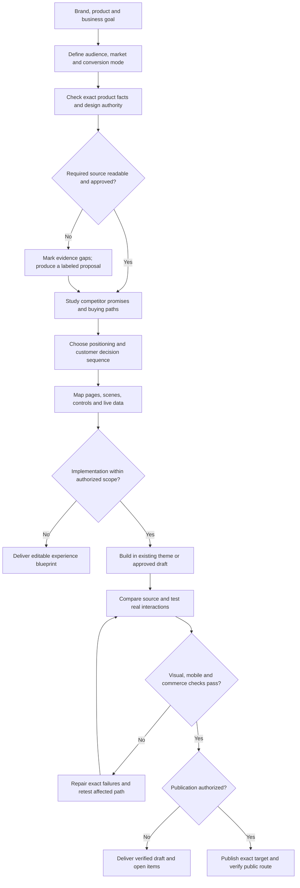

# Jingqiu storefront design method

从品牌、商品和商业目标出发，先确定用户为什么来、需要怎样被说服、下一步做什么，再形成完整页面和实际购买路径。方法可以跨品牌使用；色彩、字体、人物、素材和具体参数必须为当前品牌重新确定。

本文件包含独立执行所需的流程，不依赖未公开文件、历史客户 Figma 或私人素材。只做单点运营时不必加载。只要求分析时输出方法与草稿，不写入商店。

## 1. 将目标变成一页可执行 brief

从用户资料、现有商品和项目记录提取，不把表格空模板丢给用户。记录：品牌/店铺、目标市场与语言、目标顾客、商品/服务、来访场景、当前阻力、商业目标、页面范围、已有主题/技术栈、负责人及允许的动作。

先选主要转化模式：

|模式|用户主要决定|页面必须交付的下一步|
|---|---|---|
|`direct_purchase`|商品/规格/价格是否适合|选择 → 加购 → 核对购物车 → 结账交接；有错误可恢复|
|`lead_generation`|是否值得留下资料|最少必要字段 → 可感知的提交结果 → 明确后续联系|
|`request_quote`|范围/数量/条件是否匹配|保留商品与范围 → 询价 → 确认与回复预期|
|`catalog_only`|哪一对象值得继续研究|筛选/比较 → 联系、渠道或内容下一步|
|`hybrid`|当前访客应走哪条路径|购买与询价/留资分别明确，不混用状态与成功指标|

完成标准：每页有一个主要决定与主要行动；没有已确认的商城能力，不默认加入订阅、B2B、预售或组合包。

## 2. 确定事实和设计权威

**视觉权威：** 当前用户明确选定的 exact Figma frame / 确认导出优先，其次当前实现；历史稿和参考站只作为标注来源的参考。先读取真实页面节点、尺寸、素材及可见状态，不能用相邻版本、page 根节点或图片库补成“已读当前设计”。

**行为权威：** 用户本次明确要求、设计交互标注、实际 prototype 反应、当前实现实测分别记录。静态 selected 按钮、箭头、时间线或展开 FAQ 只能证明视觉，不证明切换、加购、自动播放或动画。

对每个重要合同项分别记录以下字段；尚未读取的值保留未知：

- `source_status`：`SOURCE_NOT_PROVIDED`、`SOURCE_PROVIDED_UNREAD`、`SOURCE_ACCESS_BLOCKED`、`OBSERVED_LIVE_FIGMA`、`OBSERVED_AUTHORITATIVE_EXPORT`、`OBSERVED_LIVE_REFERENCE`、`OBSERVED_IMPLEMENTATION`。
- `visual_evidence`：`USER_CONFIRMED_METHOD`、`OBSERVED_VISUAL_STATE`、`INFERRED_METHOD`、`PROPOSED_APPLICATION`、`UNVERIFIED`、`NOT_APPLICABLE`。
- `behavior_evidence`：`USER_CONFIRMED_METHOD`、`ANNOTATED_INTERACTION_INTENT`、`OBSERVED_PROTOTYPE_BEHAVIOR`、`OBSERVED_IMPLEMENTATION`、`PROPOSED_APPLICATION`、`UNVERIFIED`、`NOT_APPLICABLE`。
- `parameter_evidence`：`OBSERVED_LIVE_FIGMA`、`OBSERVED_LIVE_REFERENCE`、`OBSERVED_IMPLEMENTATION`、`PROPOSED_APPLICATION`、`UNVERIFIED`、`NOT_APPLICABLE`。
- `asset_truth`：`CONFIRMED_TARGET_TRUTH`、`USER_SUPPLIED_UNVERIFIED`、`PROPOSED_APPLICATION`、`UNVERIFIED`、`NOT_APPLICABLE`。

真实商品资料另锁定 SKU/变体、包装与可见结构、规格/使用方法、允许卖点、价格与库存来源、配送/退换、评价与素材授权。视觉稿里的价格、评价和认证不自动成为线上事实；缺资料可以做标明状态的版式方案，不能发布虚构证明。

完成标准：能区分看过什么、推测什么、拟实现什么；事实和设计冲突单列，未确认的内容不会悄悄进公开页面。

## 3. 定位与竞品：研究购买决策，不复制皮肤

从用户指定或与当前市场/价格带直接可比的少量品牌入手，实际读取对应官网和购买路径。每个样本记录 URL、日期、目标人群、主承诺、证据、商品/规格表达、价格机制、主 CTA、信任与配送安排，以及用户需要几次选择才能到达下一步。竞品销量、转化和利润没有数据就不写。

把观察变成当前品牌的决定：

1. 对谁说：明确人群、使用场景与购买时机。
2. 说什么：用商品证据支持的差异，而不是泛化“高端、科技、健康”。
3. 用什么让人相信：实物、演示、材料/工艺、真实数据与授权评价；没有就列资料任务。
4. 用户先做哪一步：入口来源、需解决疑问、比较/选项、主要行动、确认和恢复。
5. 哪些不用：列出不适合当前品牌的竞争者手法及原因。

若从旧案例抽方法，交简短的去品牌化记录：移除哪些品牌、SKU、价格、claims、人物、配色与专属素材；保留哪些决策顺序、场景职责、状态与数据责任。不要在公开记录里复述私人源值。

完成标准：得到一个能解释选择的定位与购买路径，不是一串参考站名字。缺市场研究时明确为假设，不声称已验证定位。

## 4. 页面与场景：先安排问题，再选画面

按本次范围生成完整页面初版，而不是只画首页。常见页面职责如下，按商品和模式取舍：

- **Home**：识别品牌/对象，进入使用场景，理解机会，找到主要行动；强视觉要服务信息，不遮掉商品和入口。
- **商品详情**：商品、选项、真实价格/可售性与主行动先可用；之后按疑问补比较、使用、材料、政策与证明。低解释成本/复购流量不必套冗长叙事。
- **Proof / Science**：证据是什么、支持哪项表达、有哪些限制；不自动生成实验室、医生、成品功效或“科学背书”。
- **About**：为什么做这个品牌、服务谁、怎样选择产品与做事；不把人物情绪图当品牌事实。
- **支持/内容**：解决风险和中断，让内容回到相关商品或下一步，而不是堆文章卡。

每区块形成一行场景合同：`用户问题 → 主体/前中后景 → 图像职责 → 允许事实 → 文案 → CTA/目标 → 桌面布局 → 移动裁切 → 状态与验收`。

场景变化来自职责、尺度、角度、材质和信息密度：品牌感受、商品识别、使用、机制/工艺、结果、证明和风险消除互相接续。只换图片但重复同一意思，不算更丰富。不存在的工厂、人物或证据不拿来补满模块。

完成标准：每区块回答一个真实问题，邻接关系自然；没有主行动被藏到所有长内容之后。

## 5. 视觉变量与有限磨砂层

为当前品牌定义色彩、字体、栅格、留白、形态、图像距离/光线、材质和动效强度，沿用权威设计中已确认的值。未提供精确 alpha、blur、radius 或 timing 时标为待校准，不冒充 Figma 原值。**本方法不固定银色、黑色或任何客户的审美。**

磨砂只在背景语境值得保留时用于导航、场景注释、证据短卡或热点。价格、选项、表单、错误和主 CTA 采用稳定可读的表面，不让背景复杂度决定能否看懂，也不做全站玻璃卡墙。

需要磨砂的区块记录：角色、所在背景、填色/透明度、blur、描边/高光、阴影、正文颜色、状态、最复杂背景的可读性、移动位置和无 `backdrop-filter` 的实色降级。尽量保持 blur 稳定，用透明度、描边或轻微位移表达状态。

完成标准：视觉变量属于当前品牌，关键事实和操作可读；没有磨砂支持时仍完整可用。

## 6. 交互合同：把“好看”写成可重复操作

每个控件写清触发、预览/提交、共享状态、移动内容、不动的结构、边界与退出方式、默认/hover/focus/selected/disabled/loading/success/error、触控/键盘/减少动态和失败恢复。

|常见设计|操作要求|验收方式|
|---|---|---|
|场景悬停聚焦|hover/focus 只预览，click/tap 可固定；总容器和主要 CTA 不跳；非焦点内容仍可达。|鼠标离开、键盘切换、触屏点选后能恢复，没有文字被压没。|
|媒体与文案联动|箭头、缩略图、手势都更新同一个 active state。|连续快速切换、反向和手动滑动后，媒体/文案/指示一致。|
|横向作品/商品轨道|保留纵向浏览；边界、是否循环、是否 autoplay 明确，未指定不默认开启。|首尾、拖动中断、移动手势、键盘均可操作。|
|商品选择|真实选项提交后同步 SKU、图片、价格、库存与链接；预览不偷偷改购物车。|测试每个可售/不可售组合，回到上一步状态仍正确。|
|加购/表单|提交中防重复；成功可感知；失败说明原因并保留输入。|实际触发成功/错误，确认用户能继续、重试或联系支持。|
|热点/弹窗/FAQ|使用真实按钮语义与展开状态；关闭后焦点合理返回。|不只用鼠标；必要信息不能仅靠 hover 才出现。|

语义按控件类型选择：只有完整 tabs 模式使用 tablist/tab/tabpanel；导航、轮播、热点和按钮不统一伪装成 tabs。动画优先移动内部媒体而保留结构和点击范围；位置校正与 hover 动画分层，避免 transform 互相覆盖。

完成标准：静态、触发前后、反向、快速重复、键盘/触控均有可观察结果；减少动态时仍保留内容与主要操作。

## 7. 数据与实现

在当前仓库与主题内实现最小完整版本，保留用户已有改动和交互，先用现有 CSS/JS/主题模块，不因基础动效增加大型框架。页面内容保持可运营，不把整页导出成一张大图。

数据职责逐项明确：

- 商品/变体供给真实商品信息、价格、选项与可售状态；库存/配送按当前商店来源核对。
- 页面与主题区块承载可编辑场景、文案和链接；跨页面复用内容由已批准的结构化内容对象管理。
- 订阅、B2B、结账、账号、表单/CRM 各自核实当前账户能力、界面归属与权限；主题能改不代表结账同样能改。
- 记录每个触点的 `surface_owner / plan_requirement / checkout_upgrade_state / tracking_source`，不明写 `UNVERIFIED`。实际写 Shopify 自定义数据、主题或 API 时读取可用的相应官方工具/Skill 文档并验证，不凭示例推断接口。
- 分清预览与提交事件；媒体悬停不能计为选购或转化。事件命名、同意、去重和目标系统映射使用实际追踪来源，页面触发一次不等于已持续对上收入。

实现顺序：数据合同 → 静态结构与主要路径 → 选择/提交/错误状态 → 场景与细节动效 → 响应式与降级。每阶段测试命中的路径；依赖不可用时保持内容与主要动作可用，不用空白页面掩盖异常。

完成标准：真实数据与界面状态连接，内容可维护，改动范围明确；只读分析不执行上述写入。

## 8. 视觉、交互和发布分别验收

1. **视觉**：以权威 frame 的相同 viewport 对比排版、主体裁切、留白和层次；技术检查通过不等于设计还原。
2. **移动**：有权威移动稿则对比；没有则标为响应式适配，不声称 pixel-exact。检查实际常用手机宽度以及内容的中间断点。
3. **行为**：逐个完成导航、媒体、选择、提交、成功、错误和恢复；桌面/触控/键盘分别测试。购买分支还核对购物车和结账交接，不自行下真实付费订单。
4. **韧性**：断图/加载失败、缺库存/不可售、无磨砂支持、减少动态、复杂背景、焦点和横向溢出；主题编辑器重载后没有重复监听或重播错误。
5. **状态**：分别记录本地完成、草稿保存、远端上传、远端回读、主题/路由实际发布、匿名公开可访问。上传成功不能代替上线。
6. **发布**：只在授权覆盖 exact store/theme/route 与动作时发布；提交后回读真实入口、主要路径与权限/密码状态。失败保留可恢复版本和精确阻塞，不重复全量覆盖。

最少交付一个可编辑 blueprint（brief、事实与来源、定位/竞品、购买路径、页面/场景、交互/数据、未知项），实现任务另交实际预览/文件、桌面与移动截图、已改/未改清单及验收结果。可以复用同一份 Markdown 或既有项目文件，不为目录好看拆成大量空文件。

## 应保留的方法

有限磨砂层、场景承担不同问题、主要转化前置，是从既有建站方法保留的核心。所有品牌变量与证据重新确认；当前项目缺设计源时依然可提出方案，但只能标为 `PROPOSED_APPLICATION`。同时检查购买理解成本、移动遮挡和媒体能否解释商品；模板在当前品牌的效果须由实际结果验证。
