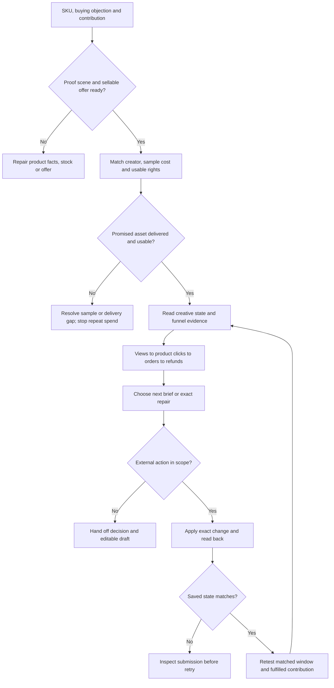

# TikTok Shop operations

围绕一个 SKU 做经营判断：什么画面能证明它值得买，谁能拍出来，寄样能换回什么，观看之后在哪里流失，下一轮具体改什么。按本次问题进入相应分支，不默认把所有工作执行一遍。本文中的示例与判断方法不是用户业绩。

## 1. 确定本次任务

记录平台区域、店铺、SKU/变体、目标、时间范围与允许的动作。先明确当前要拿到可用素材、验证商品需求、提高净成交，还是控制损失；这些目标不能只用同一个 GMV 数字评价。已有价格、目标和授权直接记录，缺关键条件才询问。

选一个入口：

- **商品上下架**：确认可售状态或实施指定上架、停售、更新。
- **Listing**：让页面与商品事实、视频承诺、购买问题一致。
- **视频/合作**：制作 brief，或排查达人、样品、授权、发布中的断点。
- **广告诊断**：判断当前应补数据、继续观察、调整素材/承接或复核预算。

完成标准：指出确切 SKU、市场、本次经营问题及交付，不输出无关全店建议。执行权限与回读统一按末节处理。

## 2. 从现有资料形成判断底稿

优先使用当前已授权的商家工具、报表与浏览器，不为一次审核新建连接层。

|本次分支|必需资料|缺少时怎么办|
|---|---|---|
|商品|商品 ID、变体映射、当前状态、目标状态、SKU 实物/批准资料；库存/履约；停售时未完成订单|精确页面和已授权后台补查。查不到列缺项，不能用猜测填 `checked=true`。|
|Listing|当前页面、实物证据、允许卖点、售卖套装/规格、关联视频与用户问题|只改已被证据支持的字段，未确认功效/材质/认证留空或标未知。|
|视频/合作|原始商品素材、购买问题、达人近期同场景内容、受众市场、交付/寄样日期、费用/佣金、使用权及到期日、素材与订单记录|缺成交记录的达人作为待测试对象；缺授权的内容不计入可投素材，不用粉丝数补缺失证据。|
|广告|Product / LIVE / 普通广告类型、素材状态与原因、video/product/creator ID；各层曝光/观看/商品点击/订单/退款；账户/币种/日期/归因窗口和完整成本|保留原字段与分母；付费点击不能除以自然与付费混合订单。缺素材粒度就保留在商品/活动层，不强行分摊。|

每项结论附来源、读取时间、SKU/市场及证据状态。公开达人内容能说明表达方式，不能证明其后台成交、履约或广告授权。

## 3. SKU 应该用什么场景卖

输入实物/批准规格、买家问题、价格与替代品、库存和退货原因。先选一个需要消除的购买顾虑，再选能证明它的场景：

|商品的购买阻力|可证明的演示|不能凭画面得出的结论|
|---|---|---|
|不知道是否解决具体麻烦|展示真实使用前的任务、操作过程及可见结果；如桌面配件的安装与空间变化|剪辑后的结果不自动证明节省多少时间或长期效果|
|担心尺寸、接口、容量或配件不适合|同框比例尺/实物参照、接口连接、装载或开箱清点；指出不适配条件|一个适配成功样本不代表所有设备/体型通用|
|价格高于替代品，不理解差别|同条件比较能被核实的材质、结构、操作或套装内容|不伪造竞品缺点、耐久测试和最低价|
|看不出质感或使用方式|可复现光线下的细节、穿戴/摆放/操作和不同角度；描述真实感受的来源|不能把生成画面当真人体验、成品功效或安全证明|

先交 `购买问题 → 证明动作 → 必须露出的细节 → 视频承诺 → 商品页证据位置`。若商品差异无法展示或验证，列补拍/测量任务，改讲已知结构与用法，不用虚构前后对比填空。可售主变体缺货、演示配件不随货或净贡献无测试空间时，先修商品/报价，不用更多达人掩盖问题。

完成标准：每个候选场景有真实证据和正确变体，说明为什么适合这个 SKU；“镜头好看”不能独立成为选品理由。

## 4. 达人和寄样：买的是可用产出，不是粉丝数

先分清合作目标是可复用素材、联盟成交，还是两者兼有。逐个读取候选的近期同场景内容，核受众国家/语言、演示能力、评论里的购买问题、交付可靠性及真实成交资料。粉丝、报价、播放量只作背景；没有后台资料时成交能力保留未知，先做有上限的小样本合作。

用同一观察批次记录：`creator_id / sample_id / SKU / sample_cost / shipping / fixed_fee / usage_rights / rights_expiry / agreed_deliverable / due_date / accepted_asset_id / linked_post / orders / refunds`。保留实际节点：同意 → 寄出 → 签收 → 交稿 → 验收 → 授权可用 → 发布 → 结果。

- **可用素材单位成本** = 该批次样品实耗 + 物流 + 固定合作/授权费 + 实际返修成本，除以验收通过且在约定用途/期限内可用的独立素材数。无可用素材时记“投入已有、产出 0”，不填 0 成本；同片的重复导出不算多份独立创意。广告费与销售佣金另进成交成本，避免混分母。
- **成交质量**看匹配窗口内的付费订单、取消/退款原因、履约及扣除货本、佣金、促销、广告和合作投入后的贡献。联盟归因订单不等于新增订单；样品费按明确批次规则分摊，不能重复扣除。
- **续投判断**：素材便宜但挂车错误/授权短/无法投放，不算合格产出；有大量订单但退款或贡献恶化，先修承诺与商品；订单尚少但证明动作清楚、授权可用且成本在上限内，可列下一轮受控测试，不能提前称为高转化达人。

|寄样断点|判断与动作|再次投入前检查|
|---|---|---|
|未签收|查物流和收件问题，先确定丢件、退件还是在途；不反复寄同一件|签收证据或经批准的补寄方案|
|已签收、约定日期未到|确认对方能否完成约定演示，保留交稿日|交付定义与时间仍明确|
|已过约定日期、无稿/无回复|发本次范围内的跟进草稿，确认新日期；暂停追加样品/付费，单列未产出成本|收到可验收稿或有依据的新约定；不把失联当履约完成|
|交稿但不可用|按时码指出错 SKU、缺证明、挂车/披露或授权问题，只要求对应补拍/修正|修正版验收与使用权齐全后才计入可用素材|
|已发但无成交|先确认有无曝光、商品点击及足够观察，再按下一节诊断|不因“寄样没成交”直接淘汰；也不只凭高播放续约|

完成标准：每位候选有选/不选/待测试理由，每笔寄样能追到产出或具体断点；下一笔费用有上限和明确交付。

## 5. 观看、商品点击、订单、退款分别找问题

先对齐 video/product/creator ID、市场、日期、自然/付费/联盟口径与素材上线时间。观看不等于商品曝光，商品点击不等于全部视频点击，订单数也不等于销量。GMV Max 的 Gross revenue / ROI 可包含自然与付费订单；不能用混合订单除以付费点击，也不能将面板 ROI 当广告后利润。

|观察到的断点|先验证什么|下一动作与复测|
|---|---|---|
|没得到展示或消耗|素材状态、可用授权、挂车商品可售性、预算/目标及同批次探索机会|先修资格或供给；还没被测试的素材不判“开头差”|
|有展示，早段观看较弱|同长度/位置的观看指标和实际时码；商品/问题是否过晚出现、画面难懂或承诺不相关|只改开头问题、主体出现顺序或一个证明镜；看早段观看及后续商品点击，不能只追停留|
|观看尚可，商品点击弱|是否吸来非购买人群、商品价值是否清楚、挂车/指引是否正确|补一个购买理由、可见证据或挂车指引；看商品点击及成交质量，保留原演示对照|
|商品点击后少订单|主变体、实付价格、运费时效、信任与视频承诺是否一致；有效点击样本和支付窗口|修对应商品页/报价/履约问题，不先重剪整片；复测同来源的可比点击到付费表现|
|订单后取消/退款增加|成熟订单批次的理由：错规格、夸大效果、物流、质量或冲动购买|按原因修承诺、变体指引或履约；严重失配先停用该版本复核，看退款与净贡献而非毛 GMV|

一个样本既可能是素材问题，也可能是商品或分发问题。列证据支持的主假设及尚未排除的原因；只报有明确分母的比率，小样本与未成熟退款窗口单列。自然与付费不能直接当作对照实验。

## 6. Product GMV Max：先看素材状态，再谈预算

以下判断针对 **Product GMV Max 的素材状态**。先记录当前页面、状态原文与原因，不套到 LIVE 或普通 Ads Manager 的同名状态；界面和可用功能以当前国家/账户为准。

|状态|能说明什么|经营动作与复测|
|---|---|---|
|In Queue|尚待系统探索，不是已经测失败|核挂车/授权/上架时间及全活动消耗；同批次观察是否开始探索。只有已有证据支持值得测试、当前功能可用且预算获批，才提定向加速测试方案，不自动切 Max Delivery|
|Learning|素材正在测试，尚不能凭短时波动定输赢|保留当前版本与设置，记录已花预算、样本、等待窗口；触及损失上限或商品不可售时优先处理风险，不借学习期无限等|
|Delivering|素材持续获得推广，不代表盈利或因果增量|拆其购买问题、证明动作和承接条件；结合成交、退款、贡献与库存复核投入，再做相邻场景测试，不只是批量换字幕复制|
|Not Delivering|在 Product 素材语境下，可能已探索但未持续消耗；不是普通广告账户失败的通用原因|对照具体原因、历史探索和当前商品条件。若错配可修，给局部修正；若未看到足够有效样本，标证据不足。只有明确新假设及预算边界才复测，不批量删除/反复重传碰运气|

若显示 Unavailable、Rejected、Excluded 或具体账户/预算错误，按真实原因另行处理，不强行归入上述四类。缺展示与高退款是不同任务；投入不会平均分给每条视频，也不能用“上传了更多视频”证明应扩大总消耗。

预算增加的条件写成具体判断：可比窗口内结果满足经营者的贡献底线、数据完整、退款影响已考虑、可售库存与履约支持增长，且现有预算确实构成限制。预算未用完则先看目标、商品、素材与分发限制。目标 ROI、实际平台 ROI、广告后贡献分别保留；不预置所有商品通用的预算增幅、订单数或学习天数。

完成标准：每条候选动作对应一个素材/活动、一个状态证据及观察条件；“可以复核增加投入”不是自动调预算。

## 7. 下一轮 brief 和局部返修

交付一张能开工的 brief：`SKU/变体 → 本轮发现 → 目标观看者/购买问题 → 主承诺与事实依据 → 镜头顺序及证明动作 → 挂车/商品页对应位置 → 素材版本/使用范围 → 主要变更 → 观察指标、窗口、费用和停止条件`。指标要跨过当前断点，例如开头测试同时看早段观看与商品点击；成交测试继续看退款，不把局部指标替代经营结果。

返修单写 `原片/时码 → 可观察问题 → 保留什么 → 仅重做什么 → 验收证据`。商品外观、颜色、规格与已通过镜头锁定；改 CTA 不自动重生人物，商品漂移只隔离并返修失败版本。修后核前后接点、声音、挂车和事实一致性。

例：收纳商品观看正常但商品点击弱，若画面没说明容量，下一稿补“同框实物装载与尺寸”镜头，保持开头、价格与目标商品不变；复测商品点击和付费表现。这是演示方案，不是已证实的收益或当前商品事实。

需要生成故事版且环境提供 `jingqiu-DTC` 时，先读其入口再使用事实锁与输出合同；没有生成能力就交 brief/脚本，不声称图片或视频已生成。复测保留原版本、上线时间与同期变化；观察期由业务决定，不把一次变化当因果证明。

## 8. Listing、上下架与现有工具

- **Listing**：按视频承诺与买家问题定位到具体字段，给旧值/新值及事实来源；优先修错 SKU、错规格、套装缺项、主变体不可买、价格/运费矛盾。正确内容保留，关键词不套未经验证的排名公式。
- **上下架**：读取精确商品/变体、审核/可售状态、库存与未完成订单；商品缺货、政策问题、经营效果差分别处理。给最小状态/字段差异；普通停售不扩展成永久删除。
- **`catalog`**：按仓库 `examples.json` 的真实结构准备 `platform/market/account/intent/items`；每 item 含 `sku/remote_id/before/desired/source_refs` 和已核实的变体、履约、权限布尔字段，停售另有 `open_orders_checked`。`BLOCKED` 补缺项，`APPROVAL_REQUIRED` 是待执行差异，`NO_CHANGE` 不重复写。
- **`paid`**：按当前示例为 `scope` 和每 row 填同一账户/市场/币种/日期/收入与归因口径；映射实际收入、退款、货本、费用、履约、花费、订单与核对标志。佣金、样品、返修和促销用明确规则计入适当成本，避免重复。`policy` 是经营者的样本/花费/损失/贡献边界，不是平台规则。缺值保留缺失，不用 0 填平。

在仓库根运行 `python3 scripts/review.py <input.json>`。`RECONCILE` 对账，`HOLD` 等待/补证，`REVIEW_STOP/CHANGE/SCALE` 均为复核候选；独立风险提示不能被对账任务覆盖。报错不等于已生成完整诊断。

现有 `review.py` 在 TikTok 工作中提供通用数据/差异检查，不读取视频、识别画面、打分达人、计算寄样产出、抓取 GMV Max 状态或执行投放。上文运营判断由现有资料、人工/可用模型审核和明确计算完成；未实现的专用功能不能说成已有代码能力。

## 9. 执行权限、失败与回读

报告/诊断/建议停在可编辑输出。寄样、联系达人、承诺费用/授权、上传、改商品和改预算分别按本次明确对象与动作执行，不默认批量私信或新建账号接口。

1. 使用已核实的现有连接器或商家界面；写前重读目标当前值，冲突先更新差异。公开资料不是后台权限证明。
2. 接口权限不足或人工校验时保留草稿、说明阻塞，不换账号绕过；未知提交先查同一对象，不盲重发消息、寄样、上架或重调预算。
3. 写后回读同店铺/市场/商品/素材/活动：保存值、审核状态、主变体价格可购性、配送、挂车、内容版本、商业披露与使用权。部分成功逐项记，别重放整批。
4. 「样品签收」「稿件验收」「授权可用」「已发布」「正在投放」「成熟净成交」分别报告；没有订单/完整成本就给等待或补数条件，不填预测利润。

最终交付：具体经营判断、证据、已做/未做、下一 brief 或精确改动、负责人及复测条件。每个请求对象都有结果或明确阻塞；接口与经营成效只按真实回读和实际结果表述。
