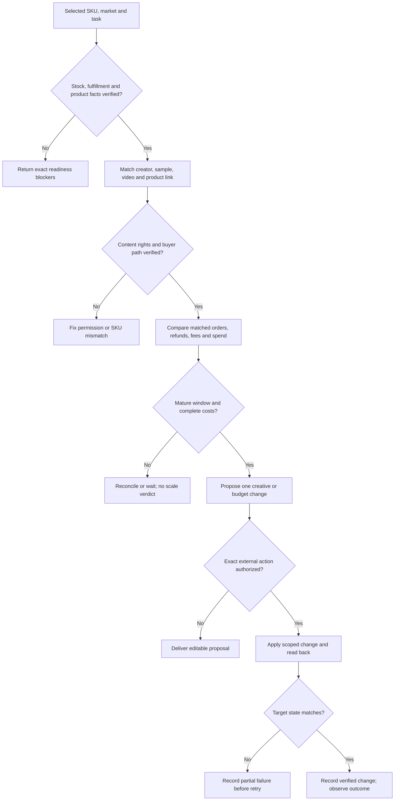

# TikTok Shop operations

把一个 SKU 的可售条件、商品表达、创作者素材与投放结果接起来。先回答本次要解决哪个断点，再选工具；不要因为有四个分支就默认全部执行。

## 1. 确定本次任务

记录平台区域、店铺、SKU/变体、目标、时间范围与允许的动作。用户已经给定的价格、目标和授权直接记录；只有会改变结果或权限的歧义才询问。

选一个入口：

- **商品上下架**：确认可售状态或实施指定上架、停售、更新。
- **Listing**：让页面与商品事实、视频承诺、购买问题一致。
- **视频/合作**：制作 brief，或排查达人、样品、授权、发布中的断点。
- **广告诊断**：判断当前应补数据、继续观察、调整素材/承接或复核预算。

完成标准：能指出确切 SKU、市场及本次交付；多 SKU 仅处理用户选定范围。报告、诊断和建议请求停在只读输出。

## 2. 建立有来源的工作底稿

优先使用当前已授权的商家工具、报表与浏览器，不为一次审核新建连接层。

|本次分支|必需资料|缺少时怎么办|
|---|---|---|
|商品|商品 ID、变体映射、当前状态、目标状态、SKU 实物/批准资料；库存/履约；停售时未完成订单|精确页面和已授权后台补查。查不到列缺项，不能用猜测填 `checked=true`。|
|Listing|当前页面、实物证据、允许卖点、售卖套装/规格、关联视频与用户问题|只改已被证据支持的字段，未确认功效/材质/认证留空或标未知。|
|视频/合作|原始商品素材、目标人群、达人内容样本、样品状态、费用/佣金、内容使用授权|没有授权先停在候选与草稿；寄样/私信/发布各自需要任务内授权。|
|广告|账户/币种/日期/归因窗口；素材与 SKU；花费、订单、退款、成本、费用/佣金、履约；可售状态|口径混合或成本不齐先对账；不能用平台总 GMV 或外部估算代替对应订单收入。|

每项结论附来源、读取时间、SKU/市场及证据状态。公开网页只能说明公开信息；广告账户、达人资料和商家信息的 API 权限分别核实。

## 3A. 商品上下架

1. 在同一账户/市场读取目标商品、变体、当前审核/可售状态，检查现有订单和履约影响。
2. 做最小差异：保留原字段，只列请求的新增或修改；商品下架与永久删除分开，本 Skill 的离线工具不支持删除。
3. 需要结构审核时，以仓库 `examples.json` 的 `catalog` 为准确结构，准备 `kind/platform/market/account/intent/items`。每 item 包含 `sku/remote_id/before/desired/source_refs` 和已真实核对的 `variant_mapping_checked/fulfillment_checked/account_permission_checked`；`unpublish` 另需 `open_orders_checked`。
4. 在仓库根运行 `python3 scripts/review.py <input.json>`。`BLOCKED` 先补具体缺项；`APPROVAL_REQUIRED` 是待执行差异，不是自动发布；`NO_CHANGE` 不重复写。
5. 用户授权已涵盖确切改动时，用当前可用的正式接口或商家 UI 实施；提交前重读当前值，变化冲突则重新生成差异，不覆盖新改动。
6. 回读同一商品 ID、审核状态和目标市场买家页；检查变体、价格、可购性及配送。部分成功逐项记录，不整批重放。

完成标准：每个请求 SKU 都有已验证结果或明确阻塞；「请求被接受」「待审核」「已可买」分别报告。

## 3B. Listing

1. 建立 `卖点/视频承诺 → 商品证据 → 页面位置` 对应关系，先找错 SKU、错规格、配件遗漏、价格/配送矛盾。
2. 根据真实问题写清适合谁、如何使用、实际买到什么和购买前需确认什么；保留正确页面内容，不默认全部重写。
3. 生成字段级旧值/新值、采用依据和待确认问题。只改文案不足以修复缺货、错误挂车或履约问题，另列对应负责人。
4. 获得本次发布授权后走 3A 的最小写入与回读。无写入请求则交付可编辑草稿。

完成标准：每条新承诺有来源，每个关联素材指向正确商品，用户能区分草稿和线上版本。本研究不提供未经验证的关键词排名公式。

## 3C. 视频与创作者

1. 按受众、商品使用场景、过往内容方式和合作条件说明候选为何匹配。观看量仅是一个观察值，不等于目标用户或成交。
2. 用 `候选 → 待联系 → 已同意 → 寄样 → 收样 → 内容提交 → 授权明确 → 发布回读 → 结果` 维护实际存在的阶段。找出断点并生成下一步草稿，不把所有未成交都归因于达人质量。
3. brief 至少写商品事实、观看者问题、真实演示动作、必须出现的细节、允许表达、禁止漂移、交付比例/时长、授权范围。品牌答评论、展示商品来源与使用方式，可与达人内容互补。
4. 需要实际商品故事版时，若环境提供 `jingqiu-DTC`，先完整读取其入口并使用其事实锁与输出合同；没有该能力则交付 brief/脚本并说明图片或视频尚未生成。
5. 人负责关系、寄样费用和合作承诺；Agent 可整理、提醒和起草。只在明确选择的对象与动作内发送，不默认批量私信或调用非官方邀约机器人。
6. 发布后回读内容、商品链接、署名/商业披露及授权范围，记录真实 URL 和时间。

完成标准：脚本/素材版本、授权和阶段有对应记录；「收到样品」不算「交稿」，「交稿」不算「已投广告」。

## 3D. 广告诊断

1. 先分问题：低消耗检查资格、素材授权、商品可售性、预算/目标设置和可用内容；有消耗无购买再核对人群、承诺、价格、配送与页面。把待验证原因写成假设。
2. 只比较同账户、市场、币种、窗口、收入定义及可对应人群的数据。列出自然、付费、联盟内容的来源；平台归因汇总不是广告增量。
3. 需要利润检查时使用 `examples.json` 的 `paid`：`scope` 固定口径，`policy` 由经营者给出最少成熟订单、花费上限、损失上限与贡献回报底线，`rows` 填真实收入/退款/货本/费用/履约/花费和核对状态。佣金、样品及促销成本采用明确口径计入相关成本，不重复扣。
4. `python3 scripts/review.py <input.json>` 仅出离线建议。`RECONCILE` 先对账；`HOLD` 等待或补证；`REVIEW_STOP/CHANGE/SCALE` 都交负责人复核，不能直接改预算。示例数字不是平台规则或显著性标准。
5. 下一测试只选一个主要变更，记录理由、版本、观察窗口、预算边界和停止条件。已授权实施后回读真实投放状态；结果尚未成熟时不宣布成功。

完成标准：每个候选动作能追到事实和经营条件；没有数据就交缺口，不强判放量。

## 失败与交付

- 导出与后台冲突：保留两份时间戳，重新读取目标对象，暂缓写入。
- 接口权限不足/人工校验：报告具体状态，提供商家内的下一步；不换账号或绕过验证。
- 未知执行结果：先回读，不盲目重试发消息、上架或改预算。
- 无成熟订单/成本缺项：不填预测利润，输出等待条件。
- 素材未授权或商品漂移：隔离该版本，只返修失败项。

最终给用户：本次结果、依据、已做与未做、精确链接/文件、阻塞或下一位负责人。不得将这套方法写成用户已经拥有某接口或达到专家收入。

研究来源及阅读边界见 [TikTok Shop 与 Shopify 专家研究](../../research/expert-tiktok-shopify-2026-09-08.md)。需要讲方法出处时读取；当前平台规则另核实官方资料，不把 2023–2025 视频中的旧产品名和数量门槛写进自动化。
